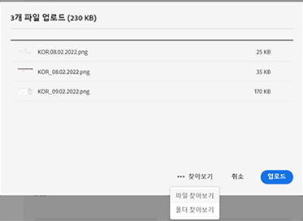
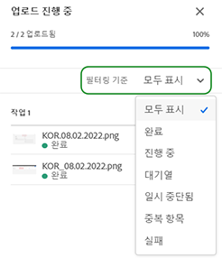
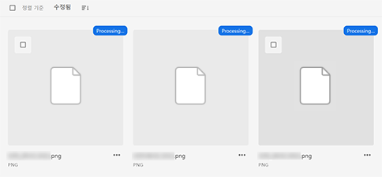
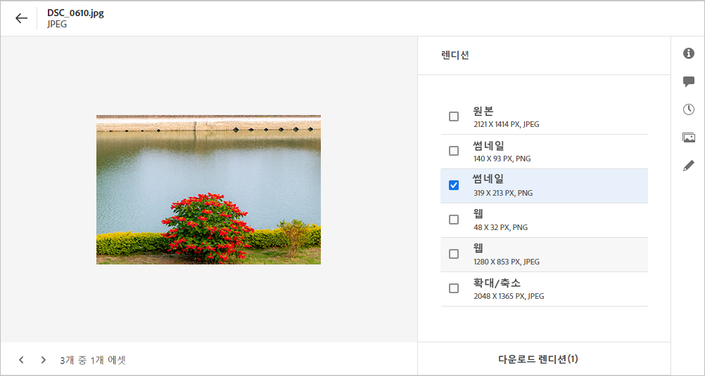
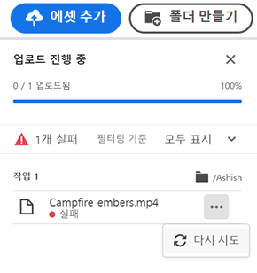
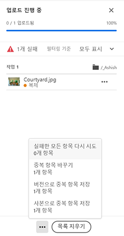

# 자산 업로드 {#add-assets}

작업할 새 자산을 추가하려면 로컬 파일 시스템에서 몇 개의 자산을 업로드합니다.<!-- TBD: Many of the [common file formats are supported](/help/supported-file-formats.md). -->

다음 방법을 사용하여 하나 이상의 자산 또는 자산이 들어 있는 폴더를 업로드할 수 있습니다.

* 사용자 인터페이스에서 자산 또는 폴더를 드래그하고 화면의 지침을 따릅니다.
* 도구 모음에서 **[!UICONTROL Add Assets]** 옵션을 클릭하고 일부 파일을 업로드 대화 상자에 추가합니다.

<!-- TBD: Update this GIF
 -->

폴더를 만든 후 이 방법 중 하나를 사용하여 자산을 업로드할 수 있습니다. 빈 폴더를 만들려면 도구 모음에서 **[!UICONTROL Create Folder]** 를 클릭합니다. [!DNL Assets Essentials]은(는) 강력한 전체 텍스트 검색 기능을 제공하지만, 폴더를 사용하여 자산을 보다 효율적으로 구성할 수도 있습니다.

파일을 선택하면 파일을 더 추가하거나 이미 선택한 파일을 제거하는 확인 대화 상자가 표시됩니다. 선택 영역에 파일을 더 추가하려면 **[!UICONTROL Browse]** 을 클릭하고 **[!UICONTROL Browse files]** 또는 **[!UICONTROL Browse folders]** 을 선택합니다. 동일하거나 다른 폴더에서 파일이나 폴더를 더 추가합니다.

모든 파일이 큐에 있으면 **[!UICONTROL Upload]** 을 클릭합니다.

*그림:선택한 자산을 업로드하기 전에 큐에서 자산을 추가하거나 제거할 수 있습니다.*

>[!CAUTION]
>
>파일 이름에 공백이 없는 자산을 사용합니다. 댓글에 대한 답글이 그러한 자산에 대해 작동하지 않습니다.

## 업로드 진행률 및 상태 보기 {#upload-progress}

많은 자산 또는 중첩된 폴더를 [!DNL Assets Essentials]에 업로드할 때 중복된 자산 및 네트워크 문제와 같은 다양한 이유로 일부 자산을 업로드하지 못할 수 있습니다.

업로드 진행 상황을 추적하려면 도구 모음에서 **[!UICONTROL Upload Progress]** 옵션을 클릭합니다. 패널에 모든 자산의 업로드 진행 상태가 표시됩니다.

업로드 진행률 또는 상태에 따라 자산 하위 집합을 보려면 **[!UICONTROL Upload Progress]** 사이드바의 필터를 사용합니다. 다양한 필터는 모든 자산, 완료된 업로드, 진행 중 업로드, 업로드할 큐에 있는 자산, 일시 중지 업로드, 중복 자산 및 업로드하지 못한 자산을 표시하는 것입니다.

*그림:업로드 상태에 따라 업로드하려는 자산을 필터링하거나 업로드 진행 상태를 기반으로 필터링합니다.*

자산이 업로드되면 바로 [!DNL Assets Essentials] 이 자산을 처리하여 축소판 그림을 생성하고 메타데이터를 처리합니다. 많은 자산의 경우 처리에 시간이 좀 걸립니다. 축소판이 표시되지 않고 자리 표시자 축소판에서 처리 메시지가 표시되면 몇 분 후에 폴더를 다시 확인합니다. 처리하는 동안, 다른 것들 중에서 [!DNL Assets Essentials]은 표현물을 생성하고, 스마트 태그를 추가하고, 검색할 자산 세부 사항을 색인화합니다.

*그림:업로드된 자산 표시 처리 작업이 타일에 처리됩니다.*

## 자산 표현물 {#renditions}

[!DNL Assets Essentials] 업로드된 자산을 거의 실시간으로 그리고 지원되는 다양한 파일 유형에 대해 처리하며 변환을 생성합니다. 이미지용으로 만들어진 표현물은 업로드된 이미지의 버전 크기가 조정됩니다. 자산뿐만 아니라 적절한 버전을 사용하기 위한 표현물도 다운로드할 수 있습니다. [자산을 미리 볼 때 자산의 모든 렌디션을 볼 수 있습니다](/help/navigate-view.md#preview-assets).

*그림:표현물을 보고 다운로드합니다.*

## 실패한 업로드 관리 {#resolve-upload-fails}

어떤 이유로든 지원되는 자산 업로드가 실패할 경우 [!UICONTROL Upload Progress] 창에서 **[!UICONTROL Retry]** 을 클릭합니다.

*그림:지원되는 파일이 어떤 이유로 업로드되지 않으면 다시 시도합니다.*

중복 자산을 업로드하려고 하면 업로드를 명시적으로 확인할 때까지 자산이 업로드되지 않습니다. 처음에는 중복 자산이 업로드 실패로 표시됩니다. 이를 해결하려면 버전을 만들거나, 기존 자산을 삭제 및 교체하거나, 자산 이름을 변경하여 중복 사본을 만들 수 있습니다. 한 번에 하나의 자산에서 이러한 오류를 해결하거나 실패한 모든 중복을 일괄적으로 처리할 수 있습니다.

*그림:기본적으로 업로드되지 않는 중복 자산의 경우 문제를 한 번에 하나의 자산으로 해결하십시오.*

*그림:기본적으로 업로드되지 않는 중복 자산의 경우 모든 자산에 대한 문제를 한 번에 해결하십시오.*

>[!TIP]
>
>[!DNL Creative Cloud] 데스크탑 애플리케이션 내에서 직접 DAM 저장소에 자산을 업로드할 수 있습니다. [[!DNL Assets Essentials] 이 [!DNL Adobe Asset Link]](/help/integration.md)과 통합하는 방법을 참조하십시오.

## 자산 또는 폴더 삭제 {#delete-assets}

사용자는 더 이상 필요하지 않은 개별 자산 또는 폴더를 삭제할 수 있습니다. 자산 또는 폴더를 삭제하려면 다음 중 하나를 수행합니다.

* 자산 또는 폴더의 축소판에서 사용할 수 있는 옵션을 사용합니다.

   

   *그림:파일 및 폴더에 대한 작업은 자산 또는 폴더 타일에서 사용할 수 있습니다.*

* 자산 또는 폴더를 선택하고 도구 모음에서 **[!UICONTROL Delete]** 을 클릭합니다.
