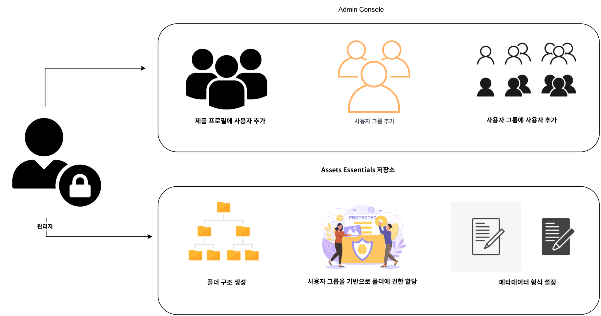

# Experience Manager Assets Essentials 관리 {#administer-assets-essentials}

## 목표

* **Audience**: Assets Essentials 관리자

* **목표**: Admin Console을 사용하여 Assets Essentials 응용 프로그램에 대한 액세스를 구성한 다음 Assets Essentials 응용 프로그램에 로그인한 후 수행할 수 있는 작업을 관리합니다.

## 개요 {#overview}

[!DNL Adobe Experience Manager Assets Essentials]는 Adobe에서 고객을 위해 프로비저닝합니다. 프로비저닝의 일부로 [!DNL Assets Essentials]가 [!DNL Adobe Admin Console]의 고객 조직에 추가됩니다. 관리자는 [!DNL Admin Console] 사용자 권한 관리 [!DNL Assets Essentials] 솔루션 및 응용 프로그램 관리자에게 할당하여 사용 권한 및 메타데이터 양식을 [!DNL Assets Essentials].

다음 데이터 흐름 다이어그램은 관리자가 Assets Essentials을 구성하고 관리하기 위해 수행해야 하는 작업 순서를 보여줍니다.

## Admin Console 액세스 {#access-admin-console}

Assets Essentials 솔루션이 프로비저닝되면 관리자는 Adobe로부터 이메일을 수신합니다. 이메일에는 환영 메시지와 시작 링크가 포함되어 있습니다. 또한 Adobe는 Assets Essentials를 자동으로 배포하는 프로세스를 시작합니다. 배포 프로세스가 완료되기까지 한 시간 정도 소요됩니다.

이메일에 포함된 링크에서 [Admin Console](https://adminconsole.adobe.com)에 액세스하고 로그인합니다. 둘 이상의 조직 계정에 대한 관리자 액세스 권한이 있는 경우 적절한 조직을 선택하거나 [조직 선택기](https://helpx.adobe.com/kr/enterprise/using/admin-console.html). 자동 배포 프로세스가 완료되면 [!DNL AEM Assets Essentials]에 대한 제품 카드가 [!DNL Admin Console]에 표시됩니다.

## Admin Console 작업 관리 {#manage-admin-console-tasks}

Admin Console에서 다음 작업을 수행합니다.

* [제품 프로필에 사용자 추가](#add-users-to-product-profiles)

* [사용자 그룹 추가](#add-user-groups)

* [그룹에 사용자 추가](#add-users-to-user-groups)

### 제품 프로필에 사용자 추가 {#add-users-to-product-profiles}

Assets Essentials 애플리케이션에 액세스할 수 있도록 제품 프로필에 사용자를 추가합니다.

제품 프로필에 사용자를 추가하려면:

1. 액세스 [Admin Console](https://adminconsole.adobe.com) 조직의 경우 **[!UICONTROL 제품]** 상단 막대에서 **[!UICONTROL AEM Assets Essentials]**, 및에 대한 인스턴스를 클릭합니다. [!DNL Assets Essentials]. 인스턴스 이름은 아래 스크린샷과 다를 수 있습니다.
   >[!NOTE]
   >
   >[!DNL Cloud Manager] 인스턴스는 서비스 상태 확인 및 서비스 로그 액세스와 같은 특수 관리자 용도로만 사용되며 제품에 사용자를 추가하는 데 사용할 수 없습니다. 자세한 내용은 [관리 안내서](deploy-administer.md#view-service-status-and-access-logs-view-logs).

   

   [!DNL Assets Essentials]에는 관리자, 일반 사용자 및 소비자 사용자의 액세스를 나타내는 세 가지 제품 프로필이 있습니다.

   

1. 제품에 사용자를 추가하려면 세 Assets Essentials 제품 프로필 중 하나를 클릭하고, **[!UICONTROL 사용자 추가]**&#x200B;를 클릭하고 사용자 세부 사항을 제공한 다음 를 클릭합니다. **[!UICONTROL 저장]**.

   

   사용자를 추가하면 사용자는 시작하라는 이메일 초대를 수신하게 됩니다. [!DNL Admin Console]의 제품 프로필 설정에서 이메일 초대를 비활성화할 수 있습니다.

1. 그룹에서 사용자를 제거하려면 그룹을 클릭하고 기존 사용자를 선택한 다음 **[!UICONTROL 사용자 제거]**&#x200B;를 선택합니다.

   >[!NOTE]
   >
   >Assets Essentials 애플리케이션에서 관리 작업을 수행하려면 사용자를 Admin Console의 Administrator Assets Essentials 제품 프로필에 추가해야 합니다. 이러한 작업은 다음과 같습니다 [폴더 구조 만들기](#create-folder-structure), [폴더에 대한 권한 관리](#manage-permissions-for-folders), 및 [메타데이터 Forms 설정](#metadata-forms).

### 사용자 그룹 추가 {#add-user-groups}

사용자 그룹을 만든 다음 사용자를 사용자 그룹에 지정합니다. 이러한 사용자 그룹은 Assets Essentials 응용 프로그램에서 폴더에 대한 권한을 설정할 수 있습니다.

사용자 그룹에 사용자를 추가(1)하고 [Assets Essentials 제품 프로필에 사용자를 추가(2)](#add-admin-users)할 수 있습니다. 그러나 Assets Essentials 제품 프로필에 사용자 그룹을 바로 추가(3)할 수는 없습니다.

사용자 그룹 관리 방법에 대한 자세한 내용은 [사용자 그룹 관리](https://helpx.adobe.com/kr/enterprise/using/user-groups.html)에서 `Create user groups` 및 `Edit user groups`를 참조하십시오.

>[!NOTE]
>
>Admin Console을 Azure 또는 Google 커넥터, 사용자 동기화 도구 또는 User Management REST API와 같은 내부 시스템을 활용하여 사용자/그룹 할당을 관리하도록 설정한 경우 그룹 및 사용자 할당은 자동으로 구성됩니다. 자세한 내용은 [Adobe Admin Console 사용자](https://helpx.adobe.com/kr/enterprise/using/users.html)를 참조하십시오.

### 그룹에 사용자 추가 {#add-users-to-user-groups}

사용자 그룹을 만든 후에는 사용자 그룹에 사용자를 추가할 수 있습니다.

사용자 그룹에 사용자를 추가하는 방법에 대한 자세한 내용은 [사용자 그룹 관리](https://helpx.adobe.com/kr/enterprise/using/user-groups.html#add-users-to-groups)에서 `Add users to groups`를 추가하십시오.

## Assets Essentials 관리 작업 관리 {#manage-assets-essentials-tasks}

이제 Admin Console 작업을 수행한 후 Assets Essentials 애플리케이션에서 다음 관리 작업을 수행할 수 있습니다.

* [폴더 구조 만들기](#create-folder-structure)

* [폴더 권한 관리](#manage-permissions-for-folders)

* [메타데이터 Forms 설정](#metadata-forms)

>[!NOTE]
>
>이러한 작업(특히 권한 관리)을 관리하려면 사용자에게 애플리케이션 관리 권한이 있어야 합니다. 이 권한을 다음에 추가해야 합니다 [관리자 Assets Essentials 제품 프로필](#add-users-to-product-profiles).

### 폴더 구조 만들기 {#create-folder-structure}

다음과 같은 방법을 사용하여 Assets Essentials 저장소에 폴더 구조를 생성할 수 있습니다.

* 도구 모음에서 **[!UICONTROL 폴더 만들기]**&#x200B;를 클릭하여 빈 폴더를 생성합니다.

* 툴바에서 **[!UICONTROL 에셋 추가]** 옵션을 클릭하여 [로컬 컴퓨터에서 사용할 수 있는 폴더 구조를 업로드](add-delete.md)합니다.

조직의 비즈니스 목표에 적합한 폴더 구조를 생성합니다. 기존 폴더 구조를 Assets Essentials 저장소에 업로드할 때에는 해당 폴더 구조를 검토해 보아야 합니다. 자세한 내용은 [효율적인 권한 관리에 대한 모범 사례](permission-management-best-practices.md)를 참조하십시오.

Assets Essentials 저장소에 폴더 구조를 생성할 때에는 다음 사항을 고려하십시오.

* 향후 거버넌스: 관리자가 제어하는 폴더 및 [다른 사용자에게 소유자로 권한이 위임된](manage-permissions.md##manage-permissions-folders) 폴더

* 확장 가능성: 폴더 구조는 귀사의 향후 요구 사항을 준수해야 하며 확장이 용이해야 합니다.

* 크기: 폴더는 너무 많은 에셋을 포함할 수 없습니다. 그렇지 않으면 가용성 문제가 발생할 수 있으며 관리가 어려워질 수 있습니다.

* 직관성: 폴더 구조는 최종 사용자가 검색하기 쉽고 직관적이어야 합니다. 사용자는 폴더 구조에서 새 에셋을 업로드할 위치를 쉽게 식별할 수 있어야 합니다.

귀사에 사용할 수 있는 폴더 구조 유형에는 여러 가지가 있습니다. 다음은 일반적인 폴더 구조의 몇 가지 예입니다.

### 폴더 권한 관리 {#manage-permissions-for-folders}

Assets Essentials에서 관리자는 저장소에서 사용할 수 있는 폴더에 대한 액세스 수준을 관리할 수 있습니다. 관리자는 사용자 그룹을 만든 다음 해당 그룹에 액세스 수준을 관리하도록 권한을 할당할 수 있습니다. 폴더 수준의 사용자 그룹에 권한 관리 권한을 위임할 수도 있습니다.

>[!VIDEO](https://video.tv.adobe.com/v/341104)

자세한 내용은 [폴더에 대한 권한 관리](manage-permissions.md).

### 메타데이터 Forms 설정 {#metadata-forms}

Assets Essentials는 기본적으로 많은 표준 메타데이터 필드를 제공합니다. 조직에서는 추가 메타데이터가 필요하며 비즈니스별 메타데이터를 추가하려면 더 많은 메타데이터 필드가 필요합니다. 메타데이터 양식을 통해 기업은 에셋의 [!UICONTROL 세부 정보] 페이지에 사용자 정의 메타데이터 필드를 추가할 수 있습니다. 비즈니스별 메타데이터는 에셋의 거버넌스 및 검색 기능을 개선합니다. 양식을 처음부터 만들거나 기존 양식의 용도를 변경할 수 있습니다.

다양한 유형의 에셋(다양한 MIME 유형)에 대한 메타데이터 양식을 구성할 수 있습니다. 파일의 MIME 유형과 동일한 양식 이름을 사용합니다. Essentials는 업로드된 자산 MIME 유형을 양식 이름과 자동으로 일치시키고 양식 필드를 기반으로 업로드된 자산에 대한 메타데이터를 업데이트합니다.

예를 들어 이름이 `PDF` 또는 `pdf` 가 존재하면 업로드된 PDF 문서에는 양식에 정의된 대로 메타데이터 필드가 포함됩니다.

Assets Essentials은 다음 시퀀스를 사용하여 기존 메타데이터 양식 이름을 검색하여 메타데이터 필드를 특정 유형의 업로드된 자산에 적용합니다.

MIME 하위 유형 > MIME 유형 > `default` 양식 > 기본 제공 양식

예를 들어 이름이 `PDF` 또는 `pdf`인 메타데이터 양식이 있는 경우 업로드된 PDF 문서에는 양식에 정의된 메타데이터 필드가 포함됩니다. 이름으로 메타데이터 양식을 만드는 경우 `PDF` 또는 `pdf` 가 존재하지 않으면 Assets Essentials이 이라는 이름의 메타데이터 양식이 있는 경우에 일치합니다 `application`. 이름으로 메타데이터 양식이 있는 경우 `application`업로드된 PDF 문서에는 양식에 정의된 대로 메타데이터 필드가 포함되어 있습니다. Assets Essentials이 여전히 일치하는 메타데이터 양식을 찾지 못할 경우 `default` 양식에 정의된 메타데이터 필드를 업로드된 PDF 문서에 적용하는 메타데이터 양식입니다. 이러한 단계가 작동하지 않으면 Assets Essentials은 기본 양식에 정의된 메타데이터 필드를 업로드된 모든 PDF 문서에 적용합니다.

>[!IMPORTANT]
>
>특정 파일 형식에 대한 새 메타데이터 양식은 [!DNL Assets Essentials]에서 제공하는 기본 메타데이터 양식을 완전히 대체합니다. 메타데이터 양식을 삭제하거나 이름을 변경하면 새 에셋에 대한 기본 메타데이터 필드를 다시 사용할 수 있습니다.

>[!VIDEO](https://video.tv.adobe.com/v/341275)

메타데이터 Forms에 대한 자세한 내용은 [Assets Essentials의 메타데이터 Forms](metadata.md#metadata-forms).

## 다음은 무엇입니까?

이제 Assets Essentials 애플리케이션을 구성하고 관리했으므로, [Experience Manager Assets Essentials 애플리케이션과 Creative Cloud 애플리케이션 통합](integrate-assets-essentials-creative-cloud.md).

