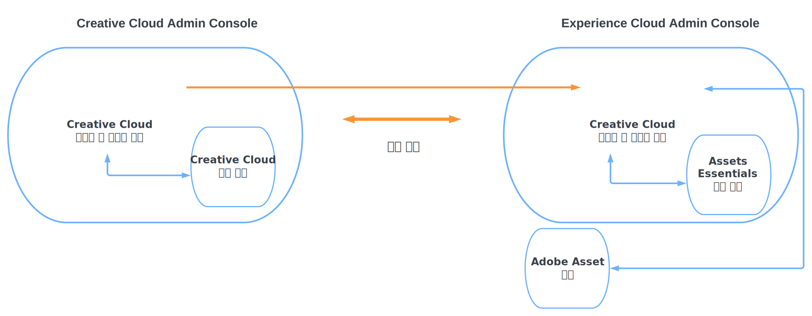

# 작업 관리 솔루션이 포함된 Creative Cloud Pro용 Assets Essentials {#creative-cloud-enterprise-user-journeys}

## 소개 {#introduction}

작업 관리 솔루션이 포함된 Creative Cloud Pro for enterprise는 크리에이티브, 콘텐츠 및 작업 관리 도구를 통합하여 크리에이티브 콘텐츠 제작 능력을 향상하고 비즈니스 목표를 빠르게 달성할 수 있도록 합니다. 솔루션에는 다음 구성 요소가 포함됩니다.

* Creative Cloud Pro

* Adobe Workfront

* Experience Manager Assets Essentials

이 튜토리얼에서는 Assets Essentials 애플리케이션을 Creative Cloud 데스크탑 애플리케이션 및 Adobe Workfront 애플리케이션과 통합할 수 있도록 하는 관리자 여정을 설명합니다. Creative Cloud 데스크탑 애플리케이션에는 Adobe Photoshop, Adobe Illustrator, Adobe InDesign 및 Adobe XD가 있습니다.

## 배포 유형 {#deployment-types}

이 솔루션은 Creative Cloud 및 Adobe Experience Cloud의 애플리케이션과 서비스로 구성되므로 회사의 Adobe Admin Consoles 하나 또는 두 개에 배포할 수 있습니다.

두 개의 Admin Console에 배포하는 경우 추가 구성 단계가 필요합니다.

* Creative Cloud 서비스 및 애플리케이션(Creative Cloud for enterprise Pro 및 선택 모듈)은 [Creative Cloud 배포를 위한 Adobe Admin Console](https://helpix.adobe.com/content/help/en/enterprise/admin-guide.html)에서 관리됩니다.

* Adobe Workfront 및 Adobe Experience Manager Assets Essentials는 [Experience Cloud 솔루션에 대한 Adobe Admin Console](https://experienceleague.adobe.com/docs/core-services/interface/administration/admin-getting-started.html)에서 관리됩니다.

Creative Cloud와 Assets Essentials 애플리케이션을 통합하려면 Creative Cloud용 Admin Console에서 사용 가능한 사용자를 Experience Cloud용 Admin Console에서 사용 가능하도록 해야 합니다. Experience Cloud Admin Console에서 사용자를 사용할 수 있도록 하려면 두 Admin Console 간에 [디렉터리 위임](https://helpx.adobe.com/enterprise/using/set-up-identity.html#directory-trusting)을 설정하는 디렉터리를 만듭니다.

다이어그램에 표시된 것처럼 Creative Cloud 사용자는 두 콘솔 간의 트러스트 관계를 기반으로 Experience Cloud Admin Console에서 자동으로 사용할 수 있게 됩니다. 그런 다음 Asset Essentials 제품 프로필에 사용자를 추가할 수 있습니다. 이에 따라 Creative Cloud 사용자는 Assets Essentials 저장소와 상호 작용할 수 있는 Adobe Asset Link 애플리케이션에 액세스할 수 있습니다. 자세한 내용은 [Assets Essentials를 Creative Cloud 애플리케이션과 통합](integrate-with-creative-cloud.md)을 참조하십시오.

## Experience Manager 설명서 여정 {#documentation-journeys}

Documentation Journey는 Assets Essentials를 처음 접할 수 있는 독자가 최소한의 사전 주제 또는 Assets Essentials 지식을 전제로 비즈니스 문제를 처음부터 끝까지 이해하고 해결하는 데 도움이 되는 묘사를 제공하여 다양하고 복잡한 주제와 기능을 결합합니다.

설명서 여정은 Adobe의 최신 연구, Adobe 컨설턴트의 입증된 구현 경험 및 고객 프로젝트의 피드백을 통해 제공되는 모범 사례 원칙을 중심으로 설계되었습니다.

## 전제 조건

* [Experience Cloud 솔루션에 대한 Adobe Admin Console에 액세스](https://experienceleague.adobe.com/docs/core-services/interface/administration/admin-getting-started.html)

* [Creative Cloud for enterprise 배포용 Adobe Admin Console에 액세스](https://helpx.adobe.com/enterprise/admin-guide.html)

## Experience Manager Assets Essentials 관리 {#administer-assets-essentials}

Adobe Experience Manager Assets Essentials는 Adobe Experience Manager Assets의 가벼운 버전의 새로운 에디션입니다. Assets Essentials는 간소화되고 일관된 사용자 인터페이스로 통합된 에셋 관리 및 공동 작업 기능을 제공합니다. 사용 편의성을 통해 보다 창의적인 작업을 수행할 수 있으며 마케팅 팀에서 디지털 에셋을 저장하고, 검색하고, 배포할 수 있습니다.

Adobe Experience Manager Assets Essentials는 Adobe에서 고객을 위해 프로비저닝합니다. 프로비저닝의 일부로서, Assets Essentials은 Adobe Admin Console에서 고객의 조직에 추가됩니다.

관리자는 Admin Console을 사용하여 Assets Essentials 제품에 대한 사용자 권한을 관리합니다.

* 사용자 그룹 추가

* 사용자 그룹에 사용자 추가

* Assets Essentials 제품 프로필에 사용자 추가

관리자는 Admin Console에서 사용자 권한을 관리한 후 Assets Essentials 애플리케이션을 사용하여 다음과 같은 작업을 수행할 수 있습니다.

* 조직의 요구 사항에 적합한 지원을 제공하는 폴더 구조 만들기

* 폴더 구조에 대한 권한 관리

* 메타데이터 양식 설정

지금까지 Assets Essentials 애플리케이션을 구성하고 관리했으므로 이제 [Creative Cloud 애플리케이션을 Experience Manager Assets Essentials 애플리케이션과 통합](integrate-with-creative-cloud.md)해 보십시오.

## Creative Cloud 애플리케이션을 Experience Manager Assets Essentials와 통합 {#administer-creative-cloud-applications}

[Adobe Asset Link 인앱 패널](https://www.adobe.com/kr/creativecloud/business/enterprise/adobe-asset-link.html)을 통해 크리에이티브 전문가는 지원되는 [!DNL Adobe Creative Cloud] 데스크탑 앱 내에서 [!DNL Assets Essentials] 저장소에 연결할 수 있습니다. 패널은 [!DNL Adobe Photoshop], [!DNL Adobe Illustrator], [!DNL Adobe InDesign] 및 [!DNL Adobe XD]에 사용할 수 있습니다. 에셋에 대한 액세스 단계를 간소화하여 콘텐츠 속도를 높입니다.

이 튜토리얼은 [!DNL Adobe Photoshop], [!DNL Adobe Illustrator], [!DNL Adobe InDesign] 및 [!DNL Adobe XD] 애플리케이션을 Experience Manager Assets Essentials와 통합하는 방법에 대해 안내합니다.

목표:

* Creative Cloud와 Experience Cloud Admin Console 간에 디렉터리 위임 생성

* Assets Essentials 제품 프로필에 Creative Cloud 사용자 추가

* Adobe Asset Link 설치

* Adobe Asset Link 사용

이제 Creative Cloud 애플리케이션과 Assets Essentials의 통합을 완료했으므로 [Adobe Workfront를 Experience Manager Assets Essentials와 통합](integrate-with-workfront.md)해 보십시오.

## Adobe Workfront를 Experience Manager Assets Essentials와 통합 {#administer-adobe-workfront}

[[!DNL Adobe Workfront]](https://www.workfront.com/)는 업무의 전체 라이프사이클을 한 곳에서 관리할 수 있도록 도와주는 작업 관리 애플리케이션입니다. [!DNL Adobe Workfront]와 [!DNL Assets Essentials] 간의 기본 통합을 통해 조직은 작업과 에셋 관리를 본질적으로 연결하여 콘텐츠 제작과 마켓 출시 속도를 개선할 수 있습니다. 작업 관리의 맥락에서 사용자는 동일한 솔루션에서 필요한 문서와 이미지에 액세스할 수 있습니다.

이 튜토리얼에서는 Adobe Workfront를 관리한 다음 이를 Experience Manager Assets Essentials와 통합하도록 안내합니다.

목표:

* Workfront 제품 프로필에 사용자 추가

* Assets Essentials 제품 프로필에 사용자 추가

* Experience Manager Assets Essentials 통합 구성

