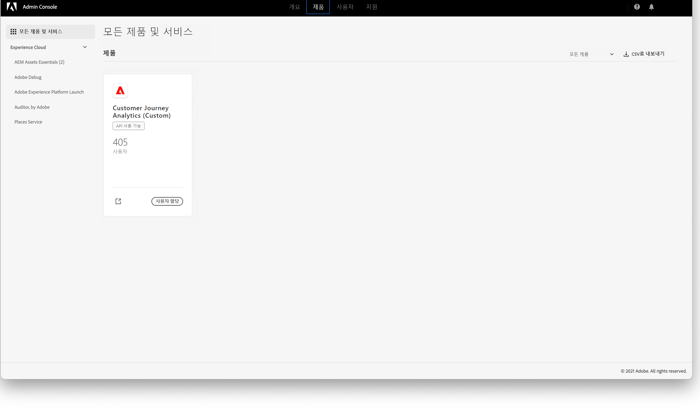

# 관리 [!DNL Assets Essentials] 사용자를 추가하고 {#administer}

[!DNL Adobe Experience Manager Assets Essentials]는 Adobe에서 고객을 위해 프로비저닝합니다. 프로비저닝의 일부로 [!DNL Assets Essentials]가 [!DNL Adobe Admin Console]의 고객 조직에 추가됩니다. 관리자는 [!DNL Admin Console] 사용자 권한 관리 [!DNL Assets Essentials] 솔루션 및 응용 프로그램 관리자에게 할당하여 사용 권한 및 메타데이터 양식을 [!DNL Assets Essentials].

## Assets Essentials 자동 배포 {#automatic-deployment-assets-essentials}

Assets Essentials 솔루션이 프로비저닝되면 관리자는 Adobe로부터 이메일을 수신합니다. 이메일에는 환영 메시지와 시작 링크가 포함되어 있습니다. 또한 Adobe는 Assets Essentials를 자동으로 배포하는 프로세스를 시작합니다. 배포 프로세스가 완료되기까지 한 시간 정도 소요됩니다.

이메일에 포함된 링크에서 [Admin Console](https://adminconsole.adobe.com)에 액세스하고 로그인합니다. 둘 이상의 조직 계정에 대한 관리자 액세스 권한을 보유하고 있다면 적절한 조직을 선택하거나 상단 막대의 전환기를 사용하여 해당 조직으로 전환합니다. 자동 배포 프로세스가 완료되면 [!DNL AEM Assets Essentials]에 대한 제품 카드가 [!DNL Admin Console]에 표시됩니다.

Assets Essentials 솔루션이 정상적으로 배포된 후 관리자는 다음 작업을 수행해야 합니다.

* [사용자 그룹, 폴더 구조 및 권한 할당 설정](manage-permissions.md) 을 참조하십시오. 팔로우 [모범 사례](permission-management-best-practices.md) 간단하고 효과적인 권한 설정을 보장할 수 있습니다.
* [!DNL Assets Essentials]에 대한 조직 구성원의 [사용자 액세스를 관리](#add-users-to-essentials)합니다.
* 필요한 경우 [서비스 상태 및 로그를 봅니다](#view-logs).

>[!NOTE]
>
>Assets Essentials가 2022년 1월 6일 이전에 프로비저닝된 경우 조직 구성원의 사용자 액세스를 관리하기 전에 [Cloud Manager에서 배포 단계](#deploy-essentials)를 수행하십시오.

## 사용자 관리 {#add-users-to-essentials}

관리자는 [!DNL Assets Essentials]에 대한 액세스 권한을 보유하고 있는 사용자를 관리합니다. 관리자는 [!DNL Adobe Admin Console]을 사용하여 사용자 액세스 권한을 추가하거나 제거합니다. [!DNL Assets Essentials]에는 다음 두 가지 유형의 사용자 액세스가 있습니다.

* **[!DNL Assets Essentials]관리자** 애플리케이션에 대한 관리자 액세스 권한이 있습니다. 모든 최종 사용자 기능 외에도 이 그룹의 응용 프로그램 관리자는 전체 응용 프로그램 저장소의 모든 폴더 및 그룹/사용자에 대한 권한을 관리할 수 있습니다.
* **[!DNL Assets Essentials]사용자**&#x200B;는 전체 사용자 인터페이스에 액세스할 수 있습니다. 이들 사용자는 디지털 에셋을 업로드하고, 구성하고, 태그를 지정하고, 찾을 수 있습니다.
* **[!DNL Assets Essentials]소비자 사용자**: [!DNL Adobe Journey Optimizer] 이메일 템플릿 편집기에서 임베드된 에셋 선택 환경에 액세스할 수 있습니다. 자세한 내용은 [ [!DNL Journey Optimizer]에서 [!DNL Assets Essentials] 사용](https://experienceleague.adobe.com/docs/journey-optimizer/using/create-messages/assets-essentials.html?lang=ko-KR)을 참조하십시오.

in [!DNL Admin Console]과 같은 세 가지 액세스 유형은 [!UICONTROL 제품 프로필]. 두 프로필 중 하나에 조직의 구성원을 추가하고 제거하려면 다음 단계를 수행하십시오.

1. 조직의 [!DNL Admin Console]에 액세스하고 상단 막대에서 **[!UICONTROL 제품]**&#x200B;을 클릭하고 **[!UICONTROL AEM Assets Essentials]**&#x200B;를 클릭한 다음 [!DNL Assets Essentials] 환경을 클릭합니다. [!DNL Assets Essentials] 에는 관리자, 일반 및 소비자 사용자에 대한 액세스를 나타내는 세 개의 제품 프로필이 있습니다.

   
   <!-- Need to update screenshot to include 3 profiles -->

   *그림: 세 가지 프로필을 사용하여 세 가지 유형의 사용자를 추가할 수 있습니다.*

1. 그룹에 사용자를 추가하려면 그룹을 클릭하고 **[!UICONTROL 사용자 추가]**&#x200B;를 선택하고 사용자 세부 정보를 입력하고 **[!UICONTROL 저장]**&#x200B;을 클릭합니다. 사용자를 추가하면 사용자는 시작하라는 이메일 초대를 수신하게 됩니다. [!DNL Admin Console]의 제품 프로필 설정에서 이메일 초대를 비활성화할 수 있습니다.

   ![[!DNL Assets Essentials]](assets/adminconsole-add-user.png)에 사용자 추가

   *그림: [!DNL Admin Console]에서 [!DNL Assets Essentials]로 사용자 추가*

1. 그룹에서 사용자를 제거하려면 그룹을 클릭하고 기존 사용자를 선택한 다음 **[!UICONTROL 사용자 제거]**&#x200B;를 선택합니다.

>[!TIP]
>
>[!DNL Admin Console]에서 CSV 파일을 사용하여 사용자를 일괄 관리할 수 있습니다. 자세한 내용은 다음 [[!DNL Admin Console] 문서](https://helpx.adobe.com/kr/enterprise/using/accounts.html)를 참조하십시오.

## 서비스 상태 및 액세스 로그 보기 {#view-logs}

프로비저닝 후 관리자는 [!DNL Assets Essentials]를 한 번만 배포합니다. 초기 배포 후 Adobe는 서비스 유지 관리 및 업데이트를 수행합니다. 관리자는 [!DNL Cloud Manager] 사용자 인터페이스를 사용하여 서비스 상태를 확인하고 최근 액세스 로그를 다운로드합니다.

1. 사용자 문제를 보고하면 **[!UICONTROL 프로그램 개요 인터페이스]**&#x200B;에서 [!DNL Assets Essentials]의 서비스 상태를 확인하십시오. 솔루션이 정상적으로 작동하는 동안 상태는 `Running`입니다. [!DNL Cloud Manager]에서 다른 상태가 표시되는 경우 [!DNL Admin Console] 지원 섹션에서 지원 티켓을 만드십시오.

   ![[!DNL Cloud Manager]](assets/cloudmanager-manage-access-essentials.png)의 [!DNL Assets Essentials] 상태

   *그림: [!DNL Cloud Manager]에서 [!DNL Assets Essentials]의 정상 작동 상태는 `Running`입니다.*

1. 최근 액세스 로그를 다운로드하려면 을 클릭하고 **[!UICONTROL 로그 다운로드]**&#x200B;를 선택한 다음 화면에 표시되는 안내를 따릅니다. 로그를 사용하여 HTTPS 액세스 요청을 감사할 수 있습니다.

   

   *그림: 액세스 로그 다운로드 옵션*

## [!DNL Assets Essentials] 배포 {#deploy-essentials}

>[!NOTE]
>
>Assets Essentials가 2022년 1월 6일 이전에 프로비저닝된 경우에만 이 단계를 수행하십시오.

프로비저닝 후 [!DNL Admin Console]에서 [!DNL Assets Essentials] 권한이 조직에 추가됩니다. 사용자가 솔루션을 사용하려면 조직 관리자가 솔루션을 배포해야 합니다. 관리자는 [!DNL Cloud Manager] 사용자 인터페이스를 사용하여 배포를 한 번 수행합니다. 초기 배포 후 Adobe는 서비스 유지 관리 및 업데이트를 수행합니다. 솔루션이 프로비저닝되면 관리자는 Adobe로부터 이메일을 수신합니다. 이메일에는 환영 메시지와 시작 링크가 포함되어 있습니다. 배포하려면 다음 단계를 따르십시오.

1. 이메일에 포함된 링크에서 [Admin Console](https://adminconsole.adobe.com)에 액세스하고 로그인합니다. 둘 이상의 조직 계정에 대한 관리자 액세스 권한을 보유하고 있다면 적절한 조직을 선택하거나 상단 막대의 전환기를 사용하여 해당 조직으로 전환합니다. [!DNL Assets Essentials]에 대한 제품 카드가 [!DNL Admin Console]에 표시됩니다.

   ![[!DNL Assets Essentials][!DNL Admin Console]](assets/essentials-in-admin-console.png)의 카드

   *그림: [!DNL Admin Console]의 [!DNL Assets Essentials]카드*

   >[!NOTE]
   >
   >제품 섹션에서 **[!UICONTROL AEM Assets Essentials - Cloud Manager]** 카드 대신 **[!UICONTROL AEM Assets Essentials]** 카드가 표시된다면 Assets Essentials 배포가 이미 완료된 것입니다. 나머지 단계는 건너뛸 수 있습니다.

1. [!DNL Admin Console]의 `AEM Assets Essentials - Cloud Manager` 제품 프로필에 자신을 관리자로 추가합니다. 자신 대신 조직의 다른 멤버를 추가하거나 두 명 이상의 관리자를 추가할 수 있습니다.

1. 을 클릭하여 [!UICONTROL 제품 프로필을 선택]한 다음 [!UICONTROL Deployment Manager - Assets Essentials]를 **[!UICONTROL 제품 프로필]**&#x200B;로 선택합니다. 이 단계에서 추가된 사용자는 Adobe로부터 [!DNL Cloud Manager]에 대한 액세스 권한이 포함된 이메일을 수신하며 배포를 수행할 수 있습니다.

   ![관리자 추가 및 [!DNL Admin Console]](assets/adminconsole-user1.png)에서 제품 프로필 선택

   *사진: [!DNL Admin Console]에서 관리자 추가 및 에서 제품 프로필 선택*

1. [!DNL Cloud Manager]에 액세스하려면 [!DNL Cloud Manager]에 대한 액세스 권한이 포함된 이메일의 링크를 클릭합니다. 또는 브라우저에서 [https://experience.adobe.com/#/cloud-manager/](https://experience.adobe.com/#/cloud-manager/)에 액세스합니다.

1. Cloud Manager 사용자 인터페이스의 오른쪽 상단에서 **[!UICONTROL 프로그램 추가]**&#x200B;를 클릭합니다.

1. 원하는 이름을 입력하고 필요한 경우 이미지([!DNL Cloud Manager]의 프로그램을 나타냄)를 업로드한 다음 **[!UICONTROL 만들기]**&#x200B;를 클릭합니다. [!DNL Cloud Manager]에서 프로그램을 설정하는 데 몇 분 정도 소요됩니다.

1. 프로그램이 준비되면 타일에 포인터를 가져다 대고 을 클릭합니다.

1. 조직에 [!DNL Assets Essentials] 서비스를 추가하려면 **[!UICONTROL 환경 추가]**&#x200B;를 클릭하고 이름 및 배포 지역을 선택한 다음 **[!UICONTROL 저장]**&#x200B;을 클릭합니다. 나중에 배포 지역을 변경할 수 없습니다. [!DNL Assets Essentials]의 배포 지역을 [!DNL Assets Essentials]를 사용하고자 하는 다른 솔루션의 배포 지역과 일치시키십시오. 이는 디지털 에셋에 대한 가능한 한 빠른 네트워크 액세스를 보장하고 지연 시간을 최소화하기 위한 것입니다.

   ![[!DNL Cloud Manager]](assets/cloudmanager-add-environment-for-essentials.png)에서 환경 추가

   *그림: [!DNL Assets Essentials]를 사용하려면 [!DNL Cloud Manager]에 환경을 추가하십시오.*

1. 몇 분 후에 환경이 성공적으로 생성되면 [!DNL Admin Console]에 액세스하고 조직의 사용자를 [!DNL Assets Essentials] 솔루션에 추가할 수 있습니다. 을 클릭하고 **[!UICONTROL 액세스 관리]** 옵션을 선택합니다.

   ![[!DNL Cloud Manager]](assets/cloudmanager-manage-access-essentials.png)에서 환경 준비

   *그림: 사용할 준비가 된 [!DNL Cloud Manager] 환경입니다.*

>[!MORELIKETHIS]
>
>* [[!DNL Admin Console] 도움말](https://helpx.adobe.com/kr/enterprise/using/admin-console.html)
>* [[!DNL Cloud Manager] 도움말](https://experienceleague.adobe.com/docs/experience-manager-cloud-manager/using/introduction-to-cloud-manager.html?lang=ko-KR)
>* [Adobe Journey Optimizer 설명서](https://experienceleague.adobe.com/docs/journey-optimizer/using/ajo-home.html?lang=ko-KR)
>* [릴리스 정보](release-notes.md)
>* [사용 시작하기 [!DNL Assets Essentials]](get-started.md)

