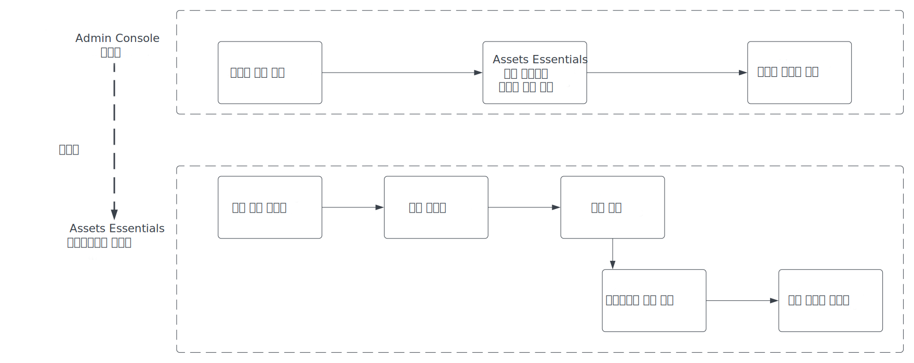
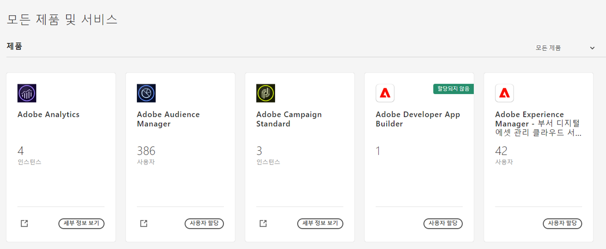
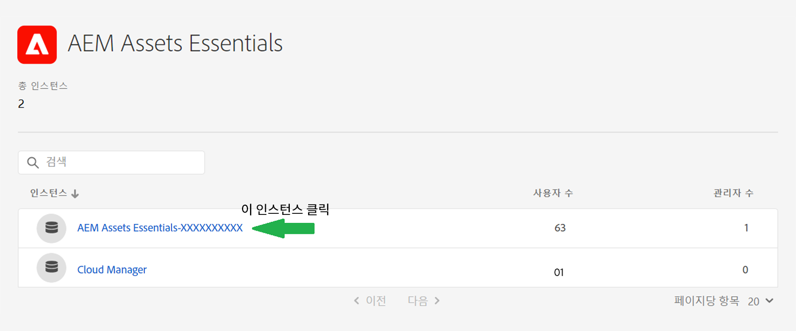
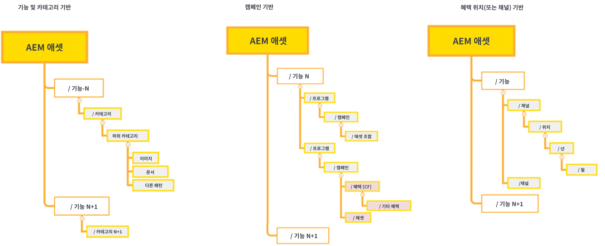
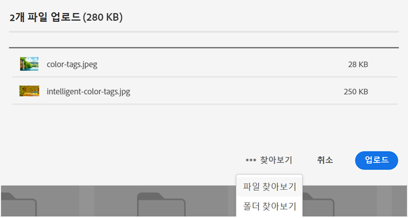
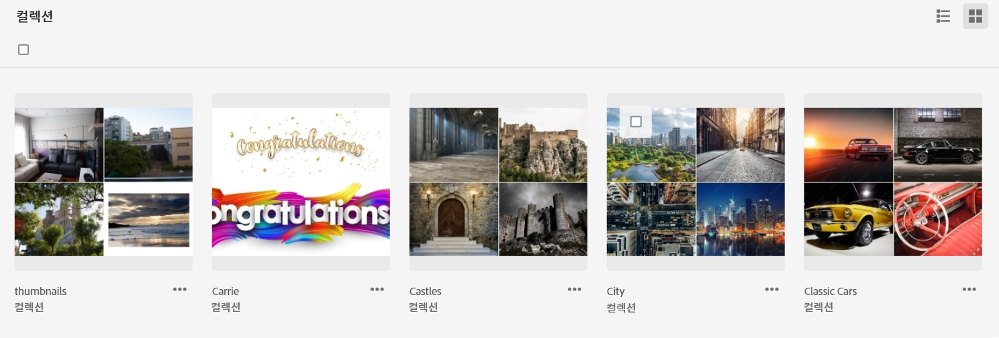

# [!DNL Assets Essentials] 관리 및 사용자 추가 {#administer}

[!DNL Adobe Experience Manager Assets Essentials]는 Adobe에서 고객을 위해 프로비저닝합니다. 프로비저닝의 일부로 [!DNL Assets Essentials]가 [!DNL Adobe Admin Console]의 고객 조직에 추가됩니다. 관리자는 [!DNL Admin Console]을 사용하여 [!DNL Assets Essentials] 솔루션에 대한 사용자 권한을 관리하며 [!DNL Assets Essentials]에서 권한 및 메타데이터 양식을 설정하도록 애플리케이션 관리자를 할당합니다.

다음 데이터 흐름 다이어그램은 Assets Essentials를 구성하고 관리하기 위해 관리자가 수행해야 하는 작업의 순서를 보여 줍니다.

## Admin Console에 액세스 {#access-admin-console}

Assets Essentials 솔루션이 프로비저닝되면 관리자는 Adobe로부터 이메일을 수신합니다. 이메일에는 환영 메시지와 시작 링크가 포함되어 있습니다. 또한 Adobe는 Assets Essentials를 자동으로 배포하는 프로세스를 시작합니다. 배포 프로세스가 완료되기까지 한 시간 정도 소요됩니다.

이메일에 포함된 링크에서 [Admin Console](https://adminconsole.adobe.com)에 액세스하고 로그인합니다. 둘 이상의 조직 계정에 대한 관리자 액세스 권한을 보유하고 있다면 적절한 조직을 선택하거나 [조직 선택기](https://helpx.adobe.com/enterprise/using/admin-console.html)를 사용하여 해당 조직으로 전환합니다. 자동 배포 프로세스가 완료되면 [!DNL AEM Assets Essentials]에 대한 제품 카드가 [!DNL Admin Console]에 표시됩니다.

Admin Console을 사용하여 다음 사용자 자격 작업을 수행합니다.

* [Assets Essentials 응용 프로그램 관리자 만들기](#create-assets-essentials-administrator)

* [사용자 그룹 추가](#add-user-groups)

* [제품 프로필에 사용자 그룹 추가](#add-users-to-product-profiles)

### Assets Essentials 응용 프로그램 관리자 만들기 {#create-assets-essentials-administrator}

Admin Console 관리자는 폴더 구조 만들기, 자산 업로드, 권한 설정, 메타데이터 양식 설정 및 공개 컬렉션 만들기와 같은 작업을 관리하려면 Assets Essentials 애플리케이션 관리자를 추가해야 합니다. 사용자 또는 사용자 그룹을 Assets Essentials 응용 프로그램 관리자 프로필에 할당하는 방법에 대한 내용은 [제품 프로필에 사용자 추가](#add-users-to-product-profiles).

### 사용자 그룹 추가 {#add-user-groups}

사용자 그룹을 만든 다음 사용자를 사용자 그룹에 할당합니다. 이러한 사용자 그룹은 Assets Essentials 애플리케이션에서 폴더에 대한 권한을 설정하는 데 사용할 수 있습니다.

사용자 그룹 관리 방법에 대한 자세한 내용은 [사용자 그룹 관리](https://helpx.adobe.com/kr/enterprise/using/user-groups.html)에서 `Create user groups` 및 `Edit user groups`를 참조하십시오.

>[!NOTE]
>
>Admin Console을 Azure 또는 Google 커넥터, 사용자 동기화 도구 또는 User Management REST API와 같은 내부 시스템을 활용하여 사용자/그룹 할당을 관리하도록 설정한 경우 그룹 및 사용자 할당은 자동으로 구성됩니다. 자세한 내용은 [Adobe Admin Console 사용자](https://helpx.adobe.com/kr/enterprise/using/users.html)를 참조하십시오.

사용자 그룹에 사용자를 추가하는 방법에 대한 자세한 내용은 [사용자 그룹 관리](https://helpx.adobe.com/kr/enterprise/using/user-groups.html#add-users-to-groups)에서 `Add users to groups`를 추가하십시오.

### 제품 프로필에 사용자 그룹 추가 {#add-users-to-product-profiles}

Assets Essentials 애플리케이션에 액세스할 수 있도록 사용자 그룹을 제품 프로필에 추가합니다.

제품 프로필에 사용자 그룹을 추가하려면:

1. 조직의 [Admin Console](https://adminconsole.adobe.com)에 액세스하고 상단 막대에서 **[!UICONTROL 제품]**&#x200B;을 클릭하고 **[!UICONTROL AEM Assets Essentials]**&#x200B;를 클릭한 다음 [!DNL Assets Essentials]의 인스턴스를 클릭합니다. 인스턴스 이름은 아래 스크린샷과 다를 수 있습니다.
   >[!NOTE]
   >
   >[!DNL Cloud Manager] 인스턴스는 서비스 상태를 확인하고 서비스 로그에 액세스하는 것과 같은 특별한 관리자용으로만 사용되며 제품에 사용자를 추가하는 데 사용할 수 없습니다.

   

   [!DNL Assets Essentials]에는 관리자, 일반 사용자 및 소비자 사용자의 액세스를 나타내는 세 가지 제품 프로필이 있습니다.

   * **[!DNL Assets Essentials]관리자**&#x200B;에게는 애플리케이션에 대한 관리 액세스 권한이 있습니다. 이 그룹의 애플리케이션 관리자는 모든 최종 사용자 기능을 사용할 수 있을 뿐만 아니라 전체 애플리케이션 저장소의 모든 폴더 및 그룹/사용자에 대한 권한을 관리할 수 있습니다.

   * **[!DNL Assets Essentials]사용자**&#x200B;는 전체 사용자 인터페이스에 액세스할 수 있습니다. 이들 사용자는 디지털 에셋을 업로드하고, 구성하고, 태그를 지정하고, 찾을 수 있습니다.

   * **[!DNL Assets Essentials]소비자 사용자**: [!DNL Adobe Journey Optimizer] 이메일 템플릿 편집기에서 임베드된 에셋 선택 환경에 액세스할 수 있습니다. 자세한 내용은 [ [!DNL Journey Optimizer]에서 [!DNL Assets Essentials] 사용](https://experienceleague.adobe.com/docs/journey-optimizer/using/create-messages/assets-essentials.html?lang=ko-KR)을 참조하십시오.

   

1. 제품에 사용자 그룹을 추가하려면 세 Assets Essentials 제품 프로필 중 하나를 클릭하고, **[!UICONTROL 사용자 추가]**&#x200B;를 클릭하고 사용자 그룹 세부 정보를 제공한 다음 를 클릭합니다 **[!UICONTROL 저장]**.

   

   사용자를 추가하면 사용자는 시작하라는 이메일 초대를 수신하게 됩니다. [!DNL Admin Console]의 제품 프로필 설정에서 이메일 초대를 비활성화할 수 있습니다.

   >[!NOTE]
   >
   >Assets Essentials 애플리케이션에서 관리 작업을 수행하려면 Admin Console의 Administrator Assets Essentials 제품 프로필에 사용자를 추가해야 합니다. 이러한 작업에는 [폴더 구조 만들기](#create-folder-structure), [폴더 권한 관리](#manage-permissions-for-folders) 및 [메타데이터 양식 설정](#metadata-forms)이 포함됩니다.

## 액세스 Assets Essentials 응용 프로그램 {#access-assets-essentials-application}

Admin Console에서 사용자 권한을 수행한 후 Assets Essentials 애플리케이션에 액세스하여 다음 작업을 수행할 수 있습니다.

* [폴더 구조 만들기](#create-folder-structure)

* [에셋 업로드](#upload-assets)

* [폴더에 대한 권한 관리](#manage-permissions-for-folders)

* [메타데이터 양식 설정](#metadata-forms)

* [공용 컬렉션 만들기](#create-public-collections)

### 폴더 구조 만들기 {#create-folder-structure}

다음과 같은 방법을 사용하여 Assets Essentials 저장소에 폴더 구조를 생성할 수 있습니다.

* 도구 모음에서 **[!UICONTROL 폴더 만들기]**&#x200B;를 클릭하여 빈 폴더를 생성합니다.

* 툴바에서 **[!UICONTROL 에셋 추가]** 옵션을 클릭하여 [로컬 컴퓨터에서 사용할 수 있는 폴더 구조를 업로드](add-delete.md)합니다.

조직의 비즈니스 목표에 적합한 폴더 구조를 생성합니다. 기존 폴더 구조를 Assets Essentials 저장소에 업로드할 때에는 해당 폴더 구조를 검토해 보아야 합니다. 자세한 내용은 [효과적인 권한 관리를 위한 폴더 구조 우수 사례](permission-management-best-practices.md##folder-structure-assets-essentials).

귀사에 사용할 수 있는 폴더 구조 유형에는 여러 가지가 있습니다. 다음은 일반적인 폴더 구조의 몇 가지 예입니다.

>[!NOTE]
>
>이러한 작업(특히 권한 관리)을 관리하려면 사용자에게 애플리케이션 관리 권한이 있어야 합니다. 이 권한은 [Administrator Assets Essentials 제품 프로필](#add-users-to-product-profiles)에 추가되어야 합니다.

### 에셋 업로드 {#upload-assets}

작업할 새 에셋을 추가하려면 로컬 파일 시스템에서 몇 가지 에셋을 업로드하십시오. 사용자 인터페이스에서 자산 또는 폴더를 드래그하고 화면의 지침을 따르거나 를 클릭할 수 있습니다 **[!UICONTROL 자산 추가]** 옵션을 선택하고 업로드 대화 상자에 일부 파일을 추가합니다. [!DNL Assets Essentials]는 강력한 전체 텍스트 검색 기능을 제공하며 폴더를 사용하여 에셋을 보다 효율적으로 구성할 수도 있습니다. 자세한 내용은 [자산 업로드](add-delete.md).

### 폴더에 대한 권한 관리 {#manage-permissions-for-folders}

Assets Essentials에서 관리자는 저장소에서 사용할 수 있는 폴더에 대한 액세스 수준을 관리할 수 있습니다. 관리자는 사용자 그룹을 만든 다음 해당 그룹에 액세스 수준을 관리하도록 권한을 할당할 수 있습니다. 또한 폴더 수준에서 사용자 그룹에 권한 관리 권한을 위임할 수도 있습니다.

>[!VIDEO](https://video.tv.adobe.com/v/341104)

자세한 내용은 [폴더 권한 관리](manage-permissions.md)를 참조하십시오.

### 메타데이터 양식 설정 (선택 사항입니다) {#metadata-forms}

Assets Essentials는 기본적으로 많은 표준 메타데이터 필드를 제공합니다. 조직에서는 추가 메타데이터가 필요하며 비즈니스별 메타데이터를 추가하려면 더 많은 메타데이터 필드가 필요합니다. 메타데이터 양식을 통해 기업은 에셋의 [!UICONTROL 세부 정보] 페이지에 사용자 정의 메타데이터 필드를 추가할 수 있습니다. 비즈니스별 메타데이터는 에셋의 거버넌스 및 검색 기능을 개선합니다. 양식을 처음부터 만들거나 기존 양식의 용도를 변경할 수 있습니다.

다양한 유형의 에셋(다양한 MIME 유형)에 대한 메타데이터 양식을 구성할 수 있습니다. 파일의 MIME 유형과 동일한 양식 이름을 사용합니다. Essentials는 업로드된 에셋 MIME 유형을 양식 이름과 자동으로 일치시키고 양식 필드를 기반으로 업로드된 에셋의 메타데이터를 업데이트합니다.

예를 들어 이름이 `PDF` 또는 `pdf`인 메타데이터 양식이 있는 경우 업로드된 PDF 문서에는 양식에 정의된 메타데이터 필드가 포함됩니다.

자세한 내용은 [메타데이터 양식](metadata.md#metadata-forms).

>[!VIDEO](https://video.tv.adobe.com/v/341275)

메타데이터 양식에 대한 자세한 내용은 [Assets Essentials의 메타데이터 양식](metadata.md#metadata-forms)을 참조하십시오.

### 공개 컬렉션 만들기(선택 사항) {#create-public-collections}

컬렉션은 Experience Manager Assets Essentials 내의 에셋 세트입니다. 컬렉션을 사용하여 사용자 간에 에셋을 공유합니다.

폴더와 달리 컬렉션에는 서로 다른 위치의 에셋이 포함될 수 있습니다. 사용자와 여러 컬렉션을 공유할 수 있습니다. 각 컬렉션에는 에셋에 대한 참조가 포함되어 있습니다. 에셋의 참조 무결성은 컬렉션에 간에 유지됩니다. 자세한 내용은 [컬렉션 관리](manage-collections.md).

## 다음 단계 {#next-steps}

* [Assets Essentials의 에셋 배포에 대한 비디오 보기](https://experienceleague.adobe.com/docs/experience-manager-learn/assets-essentials/provisioning.html?lang=en)

* Assets Essentials 사용자 인터페이스에서 사용 가능한 [!UICONTROL 피드백] 옵션을 사용하여 제품 피드백 제공

* 오른쪽 사이드바에서 사용 가능한 [!UICONTROL 이 페이지 편집], , [!UICONTROL 문제 기록] 또는 을 사용하여 설명서 피드백 제공

* [고객 지원 센터](https://experienceleague.adobe.com/?support-solution=General#support) 문의

>[!MORELIKETHIS]
>
>* [[!DNL Admin Console] 도움말](https://helpx.adobe.com/enterprise/using/admin-console.html)
>* [[!DNL Cloud Manager] 도움말](https://experienceleague.adobe.com/docs/experience-manager-cloud-manager/using/introduction-to-cloud-manager.html?lang=ko-KR)
>* [Adobe Journey Optimizer 설명서](https://experienceleague.adobe.com/docs/journey-optimizer/using/ajo-home.html?lang=ko-KR)
>* [릴리스 정보](release-notes.md)
>* [사용 시작하기 [!DNL Assets Essentials]](get-started.md)

