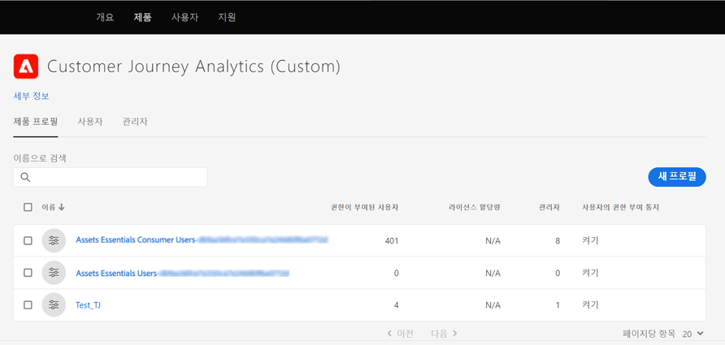

# [!DNL Assets Essentials] 배포 및 사용자 추가 {#administer}

[!DNL Adobe Experience Manager Assets Essentials] 은 해당 고객에 대해 Adobe이 프로비저닝합니다. 프로비저닝의 일부로, [!DNL Assets Essentials]이 고객의 조직(Adobe 조직)에 추가됩니다. 또한 고객은 배포 도구로서 [!DNL Experience Manager Cloud Manager] 및 사용자 관리 도구로서 [!DNL Admin Console]에 액세스할 수 있습니다.

관리자는 다음 작업을 수행합니다.

* [ [!DNL Assets Essentials]](#deploy-essentials) 조직에 배포합니다.
* [조직 구성원의 사용자 ](#add-users-to-essentials) 액세스 권한을  [!DNL Assets Essentials]관리합니다.
* 원할 경우 [서비스 상태와 로그](#view-logs)를 봅니다.

## [!DNL Assets Essentials] 배포 {#deploy-essentials}

프로비저닝 후 [!DNL Assets Essentials] 권한 부여가 Adobe 조직에 추가되고 조직의 관리자가 권한을 배포합니다. 조직의 관리자는 [!DNL Cloud Manager] 사용자 인터페이스를 사용하여 1회 배포를 수행합니다. 초기 배포 후 Adobe은 서비스 유지 관리 및 업데이트를 수행합니다. 배포하려면 다음 단계를 수행합니다.

1. 관리자가 Adobe에서 이메일을 수신하는지 확인합니다. 이메일에 시작할 수 있는 시작 메시지와 링크가 포함되어 있습니다.

1. 이메일의 링크에서 [Admin Console](https://adminconsole.adobe.com)에 액세스하여 로그인합니다. 둘 이상의 조직 계정에 대한 관리자 액세스 권한이 있는 경우 상단 막대에서 적절한 조직을 선택하거나 전환기를 사용하여 해당 조직으로 전환합니다. [!DNL Assets Essentials]에 대한 제품 카드가 [!DNL Admin Console]에 표시됩니다.

   ![[!DNL Assets Essentials] 카드 로그인  [!DNL Admin Console]](assets/essentials-in-admin-console.png)

1. [!DNL Cloud Manager]에서 `AEM Assets Essentials - Cloud Manager` 제품에 관리자로 자신을 추가하십시오. 대신 조직의 다른 구성원을 추가하거나 두 명 이상의 관리자를 추가할 수 있습니다.

1. 을 [!UICONTROL Select product profiles]에 클릭한 다음 [!UICONTROL Deployment Manager - Assets Essentials]을 **[!UICONTROL product profile]**(으)로 선택합니다. 이 단계에 추가된 사용자는 [!DNL Cloud Manager]에 액세스할 수 있는 Adobe의 이메일을 수신하고 배포를 수행할 수 있습니다.

   ![관리자를 추가하고 의 제품 프로필을 선택합니다  [!DNL Admin Console]](assets/adminconsole-user1.png)

1. [!DNL Cloud Manager]에 액세스하려면 [!DNL Cloud Manager]에 액세스할 수 있는 이메일의 링크를 클릭하십시오. 또는 브라우저에서 `https://experience.adobe.com/#/cloud-manager/`에 액세스합니다.

1. Cloud Manager 사용자 인터페이스의 오른쪽 위 모서리에서 **[!UICONTROL Add Program]** 을 클릭합니다.

1. 원하는 이름을 입력하고 선택적으로 이미지를 업로드합니다([!DNL Cloud Manager]에 있는 프로그램을 나타남). 그런 다음 **[!UICONTROL Create]**&#x200B;을 클릭합니다. [!DNL Cloud Manager] 프로그램을 설정하는 데 몇 분 정도 걸립니다.

1. 프로그램이 준비되면 타일 위에 포인터를 놓고 를 클릭합니다.

1. [!DNL Assets Essentials] 서비스를 조직에 추가하려면 **[!UICONTROL Add Environment]** 을 클릭하고 이름 및 배포 영역을 선택한 다음 **[!UICONTROL Save]** 를 클릭합니다. 나중에 배포 영역을 변경할 수 없습니다. [!DNL Assets Essentials]의 배포 영역을 [!DNL Assets Essentials]을 사용하려는 다른 솔루션의 배포 영역과 일치시키려고 합니다. 일치하는 것은 디지털 자산에 대해 가능한 가장 빠른 네트워크 액세스 및 가능한 가장 낮은 지연을 보장하는 것입니다.

   ![에서 환경 추가  [!DNL Cloud Manager]](assets/cloudmanager-add-environment-for-essentials.png)

1. 환경이 만들어지면 [!DNL Admin Console]에 액세스하고 조직의 사용자를 [!DNL Assets Essentials] 솔루션에 추가할 수 있습니다. 을 클릭하고 **[!UICONTROL Manage Access]** 옵션을 선택합니다.

   ![준비 환경  [!DNL Cloud Manager]](assets/cloudmanager-manage-access-essentials.png)

## 사용자 관리 {#add-users-to-essentials}

관리자는 [!DNL Assets Essentials]에 액세스할 수 있는 사용자를 관리합니다. 관리자는 [!DNL Adobe Admin Console] 을 사용하여 사용자 액세스를 추가하거나 제거합니다. [!DNL Assets Essentials] 에는 다음과 같은 두 가지 유형의 사용자 액세스 권한이 있습니다.

* **[!DNL Assets Essentials]** 사용자는 전체 사용자 인터페이스에 액세스할 수 있습니다. 이러한 사용자는 디지털 자산을 업로드, 구성, 태그 지정 및 찾을 수 있습니다.
* **[!DNL Assets Essentials]소비자 사용자**:전자  [!DNL Adobe Journey Optimizer] 메일 템플릿 편집기에서 포함된 자산 선택 경험에 액세스할 수 있습니다. 자세한 내용은 [Use [!DNL Journey Optimizer]](https://experienceleague.adobe.com/docs/journey-optimizer/using/create-messages/assets-essentials.html)을 참조하십시오. [!DNL Assets Essentials] 

[!DNL Admin Console]에서 이 두 액세스 유형은 두 개의 [!UICONTROL Product Profiles]로 표시됩니다. 두 프로필 중 하나에 조직 구성원을 추가하고 제거하려면 다음 단계를 수행합니다.

1. 조직의 [!DNL Admin Console]에 액세스하여 맨 위 막대에서 **[!UICONTROL Products]**&#x200B;을 클릭하고 **[!UICONTROL AEM Assets Essentials]**&#x200B;를 클릭한 다음 [!DNL Assets Essentials] 환경을 클릭합니다. [!DNL Assets Essentials] 에는 일반 사용자와 소비자 사용자에 대한 액세스를 나타내는 두 개의 제품 프로필이 있습니다.

   

1. 사용자를 그룹에 추가하려면 그룹을 클릭하고 **[!UICONTROL Add User]** 을 선택한 다음 사용자 세부 정보를 제공한 다음 **[!UICONTROL Save]** 를 클릭합니다. 사용자를 추가하면 사용자는 시작할 이메일 초대를 받습니다. [!DNL Admin Console]의 제품 프로필 설정에서 이메일 초대를 해제할 수 있습니다.

   ![사용자를  [!DNL Assets Essentials]](assets/adminconsole-add-user.png)

1. 그룹에서 사용자를 제거하려면 그룹을 클릭하고 기존 사용자를 선택한 다음 **[!UICONTROL Remove User]** 을 선택합니다.

>[!TIP]
>
>[!DNL Admin Console]에서는 CSV 파일을 사용하여 사용자를 일괄 관리할 수 있습니다. 자세한 내용은 [[!DNL Admin Console] 설명서](https://helpx.adobe.com/enterprise/using/accounts.html)를 참조하십시오.

## 서비스 상태 및 액세스 로그 보기 {#view-logs}

프로비저닝 후 관리자는 [!DNL Assets Essentials]을 한 번만 배포합니다. 초기 배포 후 Adobe은 서비스 유지 관리 및 업데이트를 수행합니다. 관리자는 [!DNL Cloud Manager] 사용자 인터페이스를 사용하여 서비스 상태를 확인하고 최근 액세스 로그를 다운로드할 수 있습니다.

1. 사용자가 문제를 보고할 때 **[!UICONTROL Program Overview]** 인터페이스에서 [!DNL Assets Essentials]의 서비스 상태를 확인합니다. 솔루션의 일반적인 작업 중에 상태는 `Running`입니다. [!DNL Cloud Manager]에 다른 상태가 표시되면 [!DNL Admin Console] 지원 섹션에서 지원 티켓을 만듭니다.

   ![의 실행  [!DNL Assets Essentials] 상태  [!DNL Cloud Manager]](assets/cloudmanager-manage-access-essentials.png)

1. 최근 액세스 로그를 다운로드하려면 을 클릭하고 **[!UICONTROL Download Logs]**&#x200B;를 선택한 다음 화면에 나타나는 지침을 따르십시오. 로그를 사용하여 HTTPS 액세스 요청을 감사할 수 있습니다.

   

>[!MORELIKETHIS]
>
>* [[!DNL Admin Console] 도움말](https://helpx.adobe.com/enterprise/using/admin-console.html)
>* [[!DNL Cloud Manager] 도움말](https://experienceleague.adobe.com/docs/experience-manager-cloud-manager/using/introduction-to-cloud-manager.html?lang=ko-KR)
>* [Adobe Journey Optimizer 설명서](https://experienceleague.adobe.com/docs/journey-optimizer/using/ajo-home.html)
>* [릴리스 노트](release-notes.md)
* [ [!DNL Assets Essentials] 사용 시작](get-started.md)

