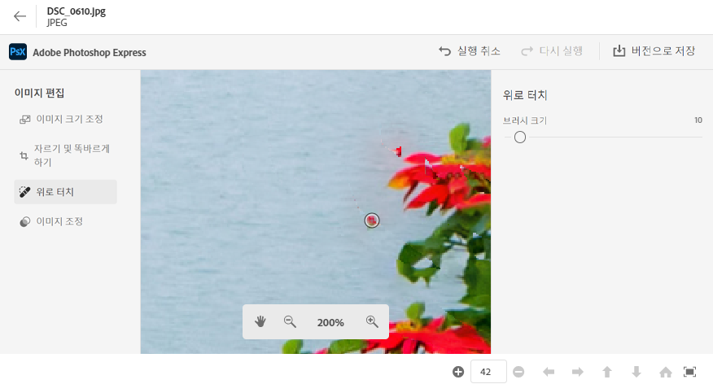
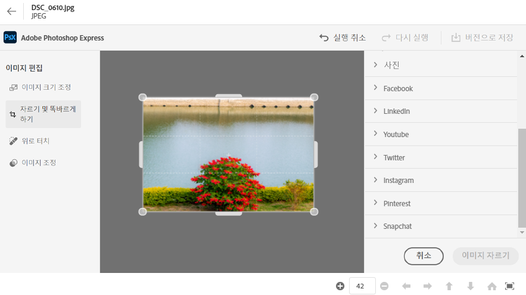
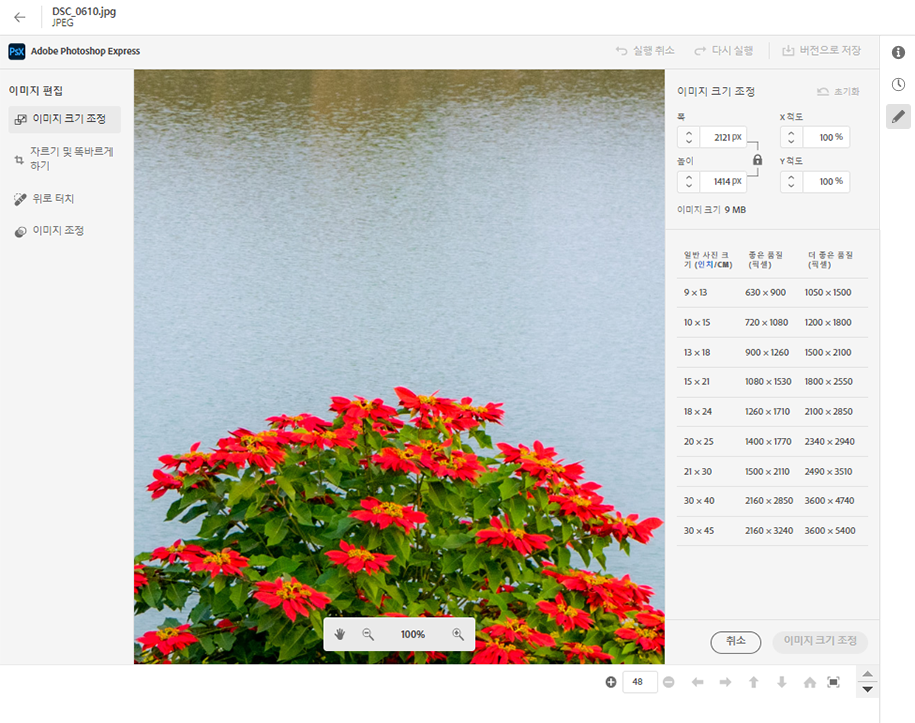
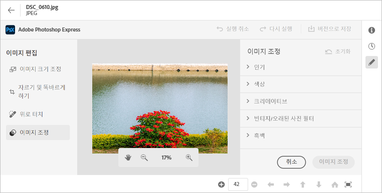

# [!DNL Assets Essentials]에서 이미지 편집 {#edit-images}

[!DNL Assets Essentials]는 [!DNL Adobe Photoshop Express]에서 제공하는 사용자 친화적인 편집 옵션을 제공합니다. 사용할 수 있는 편집 작업에는 얼룩 제거, 자르기 및 펴기, 이미지 크기 조정 및 이미지 조정이 있습니다.

이미지를 편집한 후 새 이미지를 새 버전으로 저장할 수 있습니다. 필요한 경우 버전 관리를 통해 나중에 원본 에셋으로 되돌릴 수 있습니다. 이미지를 편집하려면 [미리 보기 열기](/help/navigate-view.md#preview-assets) 을(를) 클릭합니다. **[!UICONTROL 이미지 편집]**  오른쪽 레일에서

*그림: 이미지 편집 옵션은 [!DNL Adobe Photoshop Express]에서 제공됩니다.*

## 얼룩 제거 이미지 {#spot-heal-images}

이미지에 작은 얼룩이나 작은 오브젝트가 있는 경우 Adobe Photoshop에서 제공하는 얼룩 제거 기능을 사용하여 이를 편집하고 제거할 수 있습니다.

브러시는 수정된 영역을 샘플링하고 복구된 픽셀이 이미지의 나머지 부분에 매끄럽게 혼합되도록 합니다. 수정하려는 지점보다 약간만 더 큰 브러시 크기를 사용합니다.

<!-- TBD: See if we should give backlinks to PS docs for these concepts.
For more information about how Spot Healing works in Photoshop, see [retouching and repairing photos](https://helpx.adobe.com/photoshop/using/retouching-repairing-images.html). -->

## 이미지 자르기 및 펴기 {#crop-straighten-images}

자르기 및 바로 가기 옵션을 사용하여 기본 자르기를 수행하고, 이미지를 회전하고, 가로 또는 세로 방향으로 뒤집고, 자주 사용하는 소셜 미디어 웹 사이트에 적합한 크기로 자를 수 있습니다.

편집 내용을 저장하려면 **[!UICONTROL 이미지 자르기]**. 편집한 후 새 이미지를 버전으로 저장할 수 있습니다.

많은 기본 옵션을 사용하면 다양한 소셜 미디어 프로필 및 게시물에 적합한 비율로 이미지를 자를 수 있습니다.

## 이미지 크기 조정 {#resize-image}

이미지 크기를 특정 크기로 조정하는 것이 일반적인 사용 사례입니다. [!DNL Assets Essentials]를 사용하면 특정 사진 크기에 대해 미리 계산된 새로운 해상도를 제공하여 일반적인 사진 크기에 맞게 빠르게 이미지 크기를 조정할 수 있습니다. 일반적인 사진 크기를 cm(센티미터) 또는 in(인치) 단위로 보고 치수를 알 수 있습니다. 기본적으로 크기 조정 방법은 가로 세로 비율을 유지합니다. 가로 세로 비율을 수동으로 오버라이드하려면 를 클릭하십시오.

차원을 입력하고 을(를) 클릭합니다 **[!UICONTROL 이미지 크기 조정]** 이미지 크기를 조정하려면 변경 사항을 버전으로 저장하기 전에 를 클릭하여 저장하기 전에 수행한 모든 변경 사항을 실행 취소할 수 있습니다 [!UICONTROL 실행 취소] 또는 을 클릭하여 편집 프로세스의 특정 단계를 변경할 수 있습니다 [!UICONTROL 되돌리기].

## 이미지 조정 {#adjust-image}

[!DNL Assets Essentials]를 사용하면 몇 번의 클릭만으로 색상, 톤, 대비 등을 조정할 수 있습니다. 클릭 **[!UICONTROL 이미지 조정]** 편집 창에서 클릭합니다. 오른쪽 사이드바에서 사용할 수 있는 옵션은 다음과 같습니다.

* **인기 항목**: [!UICONTROL 높은 대비 및 세부 정보], [!UICONTROL 채도가 낮은 대비], [!UICONTROL 오래된 사진], [!UICONTROL B&amp;W 소프트], 및 [!UICONTROL B&amp;W 세피아 톤].
* **색상**: [!UICONTROL 자연어], [!UICONTROL 밝은], [!UICONTROL 높은 대비], [!UICONTROL 높은 대비 및 세부 정보], [!UICONTROL 생생한 화면], 및 [!UICONTROL 매트].
* **Creative**: [!UICONTROL 채도가 낮은 대비], [!UICONTROL 냉각 조명], [!UICONTROL 청록색 및 빨간색], [!UICONTROL 부드러운 안개], [!UICONTROL 빈티지 인스턴트], [!UICONTROL 따뜻한 대비], [!UICONTROL 플랫 및 녹색], [!UICONTROL 빨강 리프트 매트], [!UICONTROL 따뜻한 그림자], 및 [!UICONTROL 오래된 사진].
* **B&amp;W**: [!UICONTROL B&amp;W 가로], [!UICONTROL B&amp;W 고대비], [!UICONTROL B&amp;W 펀치], [!UICONTROL B&amp;W 낮은 대비], [!UICONTROL B&amp;W 플랫], [!UICONTROL B&amp;W 소프트], [!UICONTROL B&amp;W 적외선], [!UICONTROL B&amp;W 셀레늄 톤], [!UICONTROL B&amp;W 세피아 톤], 및 [!UICONTROL B&amp;W 분할 톤].
* **비네팅**: [!UICONTROL 없음], [!UICONTROL 라이트], [!UICONTROL Medium], 및 [!UICONTROL 무겁게].

<!--
TBD: Insert a video of the available social media options.
-->

>[!MORELIKETHIS]
>
>* [에셋의 버전 내역 보기](/help/navigate-view.md)

