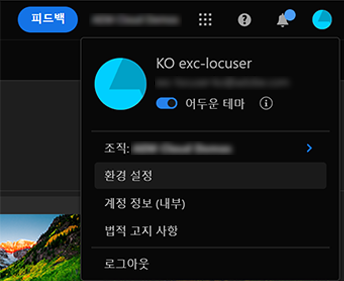
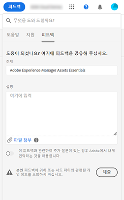

# [!DNL Experience Manager Assets Essentials] 사용 시작 {#assets-essentials-get-started}

<!-- TBD: Make links for these steps. -->

[!DNL Assets Essentials]을 사용하여 디지털 자산을 관리하려면 다음 세 단계만 필요합니다.

* **1단계**:  자산을 업로드하고   봅니다.
* **2단계**:  자산 검색 및   다운로드.
* **3단계**: [자산을 관리하고 ](/help/manage-organize.md) 구성합니다.

[!DNL Assets Essentials]을 사용하려면 [https://experience.adobe.com/#/assets](https://experience.adobe.com/#/assets)에 로그인합니다. 액세스 권한을 받으려면 조직의 관리자에게 문의하십시오.

또한 [사용자 인터페이스에 대한 이해](/help/navigate-view.md), [사용 사례 목록](#use-cases), <!-- TBD: [supported file types](/help/supported-file-formats.md), --> 및 [알려진 문제](/help/release-notes.md#known-issues)가 도움이 될 수 있습니다.

## [!DNL Assets Essentials]에 대한 액세스 수신 {#get-access}

Adobe은 솔루션을 프로비저닝하고 조직의 지정된 개인을 관리자로 추가합니다. 관리자는 [[!DNL Admin Console]](https://helpx.adobe.com/enterprise/admin-guide.html/enterprise/using/welcome.ug.html)을 사용하여 조직의 다양한 사용자에게 액세스 권한을 제공할 수 있습니다. 액세스와 관련된 요청은 조직의 관리자에게 문의하십시오.

## 구성 [!DNL Assets Essentials] {#configuration}

기본 설정을 열려면 사용자 인터페이스의 오른쪽 위 모서리에 있는 아바타를 클릭합니다. 솔루션 환경 설정에서 빛과 어두운 테마 간을 전환할 수 있습니다.

다른 조직에 속해 있는 경우 조직을 변경하고 다양한 조직의 계정에 액세스할 수도 있습니다.

[!UICONTROL Experience Cloud preferences]을 변경하려면 [!UICONTROL Preferences]을 클릭하십시오.

<!-- TBD: What can admins configure? What more can users configure? Any doc that describes Exp Cloud preferences? 
Metadata forms is out of the scope of 6/17 GA. When the functionality is added, link to it from here. It is about configuring metadata UI. -->

<!-- TBD: This section contains beta-specific video that will be updated post-GA.

## Login experience {#login-experience}

When logging in, after providing the credentials, you can be prompted to select an account. In this case, select `Company or School Account` to proceed.

-->

## [!DNL Assets Essentials] 사용 사례 {#use-cases}

[!DNL Assets Essentials]을 사용하여 수행할 수 있는 다양한 DAM(디지털 자산 관리) 작업은 아래에 나와 있습니다.

| 사용자 작업 | 기능 및 방법 정보 |
|-----|------|
| 자산을 추가하려면 어떻게 해야 합니까? | <ul> <li> [자산 업로드](/help/add-delete.md) </li> <li> [표현물](/help/add-delete.md#renditions) </li> </ul> |
| 자산 또는 관련 정보를 업데이트하려면 어떻게 해야 합니까? | <ul> <li>기존 자산 변경</li> <li>[버전 ](/help/manage-organize.md#create-versions) 및  [보기 버전 만들기](/help/navigate-view.md#view-versions)</li> <li>[이미지 편집](/help/edit-images.md)</li> </ul> |
| 자산을 검색하려면 어떻게 합니까? | <ul> <li>[저장소 찾아보기](/help/navigate-view.md#view-assets-and-details) </li> <li> [자산 ](/help/navigate-view.md#preview-assets) 미리 보기 및  [자산 다운로드](/help/manage-organize.md) </li> <li>[자세한 메타데이터 보기](/help/metadata.md) </li> <li>[자산 검색](/help/search.md)</li></ul> |
| 저장소에서 자산을 편집하려면 어떻게 해야 합니까? | <ul> <li>[Adobe Photoshop Express를 사용한 브라우저 내 편집](/help/edit-images.md)</li> <li>[소셜 미디어 프로필용 자르기](/help/edit-images.md#crop-straighten-images)</li> <li>[버전 보기 및 관리](/help/manage-organize.md#create-versions)</li> <li>[자산 링크 Adobe](/help/integration.md#integrations) 사용</ul></ul> |
| 저장소에서 자산을 검색하려면 어떻게 합니까? | <ul> <li>[특정 폴더 내에서 검색](/help/search.md)</li> <li>[저장된 검색](/help/search.md)</li> <li>[최근에 본 자산 검색](/help/search.md)</li> <li>[전체 텍스트 검색](/help/search.md) |
| 새 자산을 추가하려면 어떻게 해야 합니까? | <ul> <li>[새 자산 및 폴더 업로드](/help/add-delete.md#add-assets)</li> <li>[업로드 진행 모니터링 및 업로드 관리](/help/add-delete.md)</li> <li>[중복 해결](/help/add-delete.md#resolve-upload-fails)</li> </ul> |
| [!DNL Assets Essentials]을 다른 솔루션과 통합할 수 있습니까? | <ul> <li>[에서 자산 선택기 사용 [!DNL Adobe Journey Optimizer]](/help/integration.md)</li> <li>[[!DNL Adobe Asset Link] 대상 [!DNL Creative Cloud]](/help/integration.md)</li> <li>[!DNL Creative Cloud Team] 라이브러리와 통합</li> </ul> |

<!--TBD: Merge in above table when these use cases are documented/available.
| How do I delete assets? | <ul> <li>[Delete assets](/help/manage-organize.md)</li> <li>Recover deleted assets</li> <li>Permanently delete assets</li> </ul> |
| How do I share assets or find shared assets? | <ul> <li>Shared by me</li> <li>Shared with me</li> <li>Share for comments and review</li> <li>Unshare assets</li> </ul> |
| How do I collaborate with others and get my assets reviewed | <ul> <li>Share for review</li> <li>Provide comments. Resolve and filter comments</li> <li>Annotations on images</li> <li>Assign tasks to specific users and prioritize</li> </ul> |
-->

##  아이콘제품 피드백 제공 {#provide-feedback}

Adobe은 솔루션에 대한 피드백을 환영합니다. 작업 애플리케이션을 전환하지 않고 피드백을 제공하려면 사용자 인터페이스에서 [!UICONTROL Feedback] 옵션을 사용합니다. 또한 스크린샷 또는 문제 비디오 녹화 등의 파일을 첨부할 수도 있습니다.

문서에 대한 피드백을 제공하려면 [!UICONTROL Edit this page]  또는 [!UICONTROL Log an issue] 를 만드십시오. 다음 중 하나를 수행할 수 있습니다.

* 컨텐츠를 업데이트하고 GitHub 가져오기 요청을 제출합니다.
* GitHub에서 문제 또는 티켓을 만듭니다. 문제를 만들 때 자동으로 채워진 문서 이름을 유지합니다.

>[!MORELIKETHIS]
>
>* [사용자 인터페이스를 이해합니다](/help/navigate-view.md).
>* [릴리스 노트 및 알려진 문제](/help/release-notes.md).

<!-- TBD: 
>* [Supported file types](/help/supported-file-formats.md).
-->
