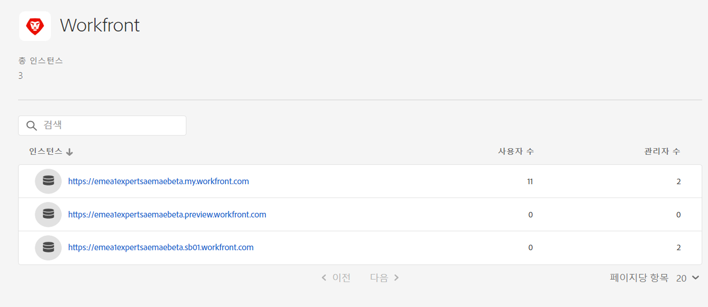
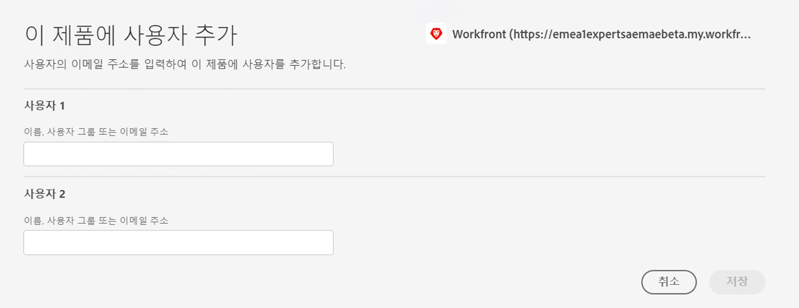

# Adobe Workfront와 Assets Essentials 통합 {#integrate-assets-essentials-workfront}

[[!DNL Adobe Workfront]](https://www.workfront.com/)는 업무의 전체 라이프사이클을 한 곳에서 관리할 수 있도록 도와주는 작업 관리 애플리케이션입니다. [!DNL Adobe Workfront]와 [!DNL Assets Essentials] 간의 기본 통합을 통해 조직은 작업과 에셋 관리를 본질적으로 연결하여 콘텐츠 제작과 마켓 출시 속도를 개선할 수 있습니다. 작업 관리의 맥락에서 사용자는 동일한 솔루션에서 필요한 문서와 이미지에 액세스할 수 있습니다.

Workfront를 Experience Manager Assets Essentials와 통합하려면 다음 작업을 수행하십시오.

* [Workfront 제품 프로필에 사용자 추가](#add-users-to-product-profiles)

* [Assets Essentials 제품 프로필에 사용자 추가](#add-workfront-users-assets-essentials-product-profiles)

* [Experience Manager Assets Essentials 통합 구성](#configure-assets-essentials-integration)

## Workfront 제품 프로필에 사용자 추가 {#add-users-to-product-profiles}

Workfront 제품 프로필에 사용자를 추가하려면:

1. 조직의 [Admin Console](https://adminconsole.adobe.com)에 액세스하고 상단 막대에서 **[!UICONTROL 제품]**&#x200B;을 클릭하고 **[!UICONTROL Workfront]**&#x200B;를 클릭한 다음 목록에서 첫 번째 인스턴스를 클릭합니다. 목록에서 두 번째 및 세 번째 인스턴스를 클릭하지 마십시오.

   

   Admin Console에는 사용 가능한 제품 프로필만 표시됩니다.

1. 제품 프로필에 사용자를 추가하려면 프로필을 클릭하고 **[!UICONTROL 사용자 추가]**&#x200B;를 클릭한 다음 사용자 세부 정보를 입력하고 **[!UICONTROL 저장]**&#x200B;을 클릭합니다.

   

   사용자를 추가하면 사용자는 시작하라는 이메일 초대를 수신하게 됩니다. [!DNL Admin Console]의 제품 프로필 설정에서 이메일 초대를 비활성화할 수 있습니다.

1. 그룹에서 사용자를 제거하려면 그룹을 클릭하고 기존 사용자를 선택한 다음 **[!UICONTROL 사용자 제거]**&#x200B;를 선택합니다.

Adobe Admin Console을 사용하여 Workfront에서 사용자 및 시스템 관리자를 생성하는 방법에 대한 자세한 내용은 [Adobe Admin Console에서 사용자 관리](https://one.workfront.com/s/document-item?bundleId=the-new-workfront-experience&amp;topicId=Content%2FAdministration_and_Setup%2FAdd_users%2FCreate_and_manage_users%2Fadmin-console.htm&amp;_LANG=enus)를 참조하십시오.

## Assets Essentials 제품 프로필에 사용자 추가 {#add-workfront-users-assets-essentials-product-profiles}

다음 Assets Essentials 제품 프로필 중 하나에 Workfront 사용자를 할당합니다.

* **[!DNL Assets Essentials]사용자**&#x200B;는 전체 Assets Essentials 사용자 인터페이스에 액세스할 수 있습니다. 이들 사용자는 Assets Essentials 애플리케이션에서 디지털 에셋을 업로드하고, 구성하고, 태그를 지정하고, 찾을 수 있습니다. 또한 사용자는 [!DNL Adobe Workfront] 애플리케이션에서 임베드된 에셋 선택 환경에 액세스할 수 있습니다.
* **[!DNL Assets Essentials]소비자 사용자**: [!DNL Adobe Workfront] 애플리케이션에서 임베드된 에셋 선택 환경에 액세스할 수 있습니다.

또한 애플리케이션에 대한 관리 액세스를 제공하는 **[!DNL Assets Essentials]관리자** 제품 프로필도 있습니다.

Assets Essentials 제품 프로필에 사용자를 할당하는 방법에 대한 자세한 내용은 [Assets Essentials 제품 프로필에 사용자 할당](deploy-administer.md#add-users-to-product-profiles)을 참조하십시오.

## Experience Manager Assets Essentials 통합 구성 {#configure-assets-essentials-integration}

Admin Console을 사용하여 Workfront 및 Assets Essentials 제품 프로필에 사용자를 추가한 후 [Adobe Workfront와 Experience Manager Assets Essentials 통합을 구성](https://one.workfront.com/s/document-item?bundleId=the-new-workfront-experience&amp;topicId=Content%2FDocuments%2FAdobe_Workfront_for_Experience_Manager_Assets_Essentials%2F_workfront-for-aem-asset-essentials.htm)할 수 있습니다.

통합을 설정한 후 다음과 같은 작업을 수행할 수 있습니다.

* [Experience Manager Assets Essentials에서 에셋 및 폴더 연결](https://one.workfront.com/s/document-item?bundleId=the-new-workfront-experience&amp;topicId=Content%2FDocuments%2FAdobe_Workfront_for_Experience_Manager_Assets_Essentials%2Flink-to-aem.htm&amp;_LANG=enus)

* [Adobe Experience Manager Assets Essentials로 문서 전송](https://one.workfront.com/s/document-item?bundleId=the-new-workfront-experience&amp;topicId=Content%2FDocuments%2FAdobe_Workfront_for_Experience_Manager_Assets_Essentials%2Fsend-to-aem.htm&amp;_LANG=enus)

* [Experience Manager Assets Essentials에 대해 연결된 에셋 증명](https://one.workfront.com/s/document-item?bundleId=the-new-workfront-experience&amp;topicId=Content%2FDocuments%2FAdobe_Workfront_for_Experience_Manager_Assets_Essentials%2Fproof-linked-asset-aem.htm)

* [Experience Manager Assets Essentials에서 연결된 에셋 조회 또는 다운로드](https://one.workfront.com/s/document-item?bundleId=the-new-workfront-experience&amp;topicId=Content%2FDocuments%2FAdobe_Workfront_for_Experience_Manager_Assets_Essentials%2Fview-download-asset.htm)
