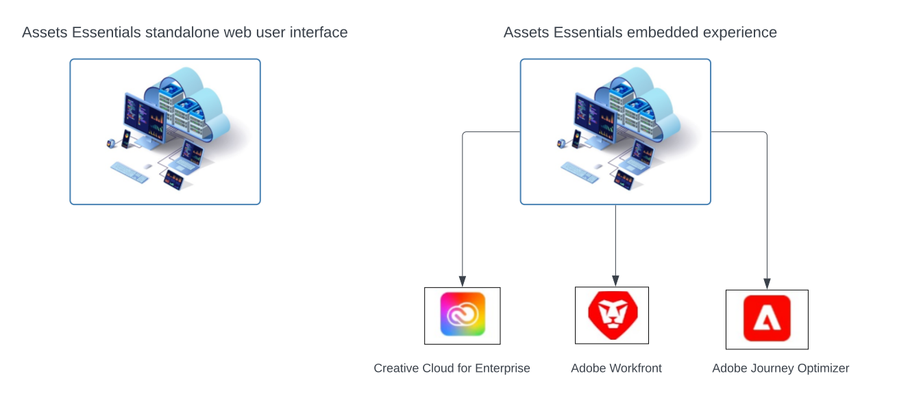

# [!DNL Adobe Experience Manager Assets Essentials] 개요 {#assets-essentials}

<!-- TBD: Update this banner to remove Beta label. 

-->

Adobe은 디지털 자산을 최대한 활용할 수 있는 강력한 DAM(디지털 자산 관리) 솔루션을 제공합니다. Adobe Experience Manager Assets Essentials은 디지털 자산을 저장, 관리, 검색 및 사용할 수 있는 Adobe의 경량 자산 관리 솔루션입니다.

## Assets Essentials 소개 {#assets-essemtials-overview}

Experience Manager Assets Essentials는 Adobe Experience Manager Assets Cloud Service의 경량 에디션입니다. Assets Essentials은 간소화된 최신 사용자 인터페이스를 통해 통합된 자산 관리 및 공동 작업을 제공합니다. 사용하기 쉬운 솔루션을 사용하면 보다 창의적인 마케팅 팀이 디지털 자산을 저장, 검색 및 배포할 수 있습니다.

Assets Essentials을 사용하면 다음 작업을 수행할 수 있습니다.

* 중앙 위치에서 자산을 관리, 구성 및 관리합니다.

* 팀 간의 컨텐츠 개발에 대한 공동 작업

* 승인된 최종 자산에 액세스하고 검색하고 찾습니다.

* 다운스트림 전달을 위해 자산을 공유 및 다운로드합니다.

## Assets Essentials에 액세스하는 방법 {#access-options}

Assets Essentials은 최종 사용자와 관리자를 위한 독립형 웹 사용자 인터페이스를 제공하여 모든 솔루션의 기능에 액세스할 수 있도록 합니다. 다른 Adobe 솔루션 사용자는 엔터프라이즈, Adobe Journey Optimizer 및 Adobe Workfront 애플리케이션의 Creative Cloud에서 사용할 수 있는 포함된 경험을 통해 Assets Essentials의 자산에 액세스하고 작업할 수도 있습니다.

## Assets Essentials 이유 {#assets-essentials-features}

Assets Essentials은 다음과 같은 이점을 제공합니다.

* **빠르게 시작** 기본 자산 관리 도구 사용.

* 자산을 더 많은 팀에 확장하여 **간소화된 자산 관리**.

* 컨텐츠 라이프사이클과 네이티브 통합 **다른 Adobe 솔루션과 통합**.

* 활용 **클라우드 기반 플랫폼**&#x200B;언제 어디서나 확장 가능

* 필수적인 DAM 기능 및 **성장** 엔터프라이즈 DAM에 연결할 수도 있습니다.

**빠르게 시작**

Assets Essentials 솔루션은 Adobe으로 고객에게 제공되며 프로비저닝 프로세스가 완료된 후 사용할 수 있습니다. 관리자는 Adobe Admin Console에서 제품에 액세스할 수 있으며 시스템 구성 및 사용자 온보딩을 즉시 시작할 수 있습니다.

Assets Essentials에 대해 자세히 알아보기 [관리 및 사용자 온보딩](deploy-administer.md).

**간소화된 자산 관리**

Assets Essentials 간소화된 사용자 인터페이스를 통해 디지털 자산을 쉽게 관리, 검색 및 배포할 수 있습니다. 크리에이티브, 마케팅 및 사업 부문 팀을 포함하여 다양한 기능에서 온 광범위한 사용자 집합은 자산에 대해 협업할 수 있고 필요할 때 승인된 적합한 자산에 액세스할 수 있습니다.

자세한 내용은 [Assets Essentials을 사용하여 자산 관리 요구 시작](get-started.md).

**다른 Adobe 애플리케이션과의 통합**

Assets Essentials은 지원되는 Adobe 솔루션과 통합되며 이러한 애플리케이션의 인터페이스 내에서 포함된 경험을 제공합니다. 사용자가 애플리케이션에서 직접 필요한 자산에 쉽게 액세스할 수 있도록 해줍니다. 모든 사용자는 친숙한 도구와 애플리케이션에서 동일한 중앙 집중식 관리 자산으로 작업할 수 있습니다.

포함된 Assets Essentials 경험은 엔터프라이즈, Adobe Journey Optimizer 및 Adobe Workfront 애플리케이션을 위한 Creative Cloud에 사용할 수 있습니다.

자세한 내용은 [다른 Adobe 솔루션과 통합](integration.md)을 참조하십시오.

**클라우드 기반 플랫폼**

Assets Essentials은 Adobe 클라우드 인프라를 기반으로 디지털 자산 제작, 관리 및 배포에 대한 비즈니스 요구 사항에 집중할 수 있도록 해줍니다. 또한 Adobe은 빈번한 업데이트를 통해 사용자에게 완벽한 제품 혁신적인 기능을 제공함으로써, 솔루션을 사용할 수 있고, 안전하며, 확장 가능하며 항상 최신 상태로 유지할 수 있도록 해줍니다.

**고객의 요구에 맞는 기능 확대**

다양한 팀에서 주요 디지털 자산 관리 기능을 활용할 수 있도록 Assets Essentials을 신속하게 구성하고 실행할 수 있습니다.

비즈니스 요구 사항이 증가하고 사용자 지정, 확장성 및 통합, 자동화, Dynamic Media, Brand Portal과 같은 고급 디지털 자산 관리 요구 사항을 지원해야 하는 경우에도 Adobe에서 이러한 기능을 제공합니다 [Adobe Experience Manager 자산 as a Cloud Service](https://experienceleague.adobe.com/docs/experience-manager-cloud-service/content/assets/home.html?lang=en).

## 다음 단계 {#next-steps}

* Assets Essentials 사용자 인터페이스에서 사용 가능한 [!UICONTROL 피드백] 옵션을 사용하여 제품 피드백 제공

* [!UICONTROL 이 페이지 편집],  또는 [!UICONTROL 문제 기록]을 사용하여 문서 피드백을 제공하고 오른쪽 사이드바에서 사용 가능한 

* [고객 지원 센터](https://experienceleague.adobe.com/?support-solution=General#support) 문의

>[!MORELIKETHIS]
>
>* [[!DNL Assets Essentials] 튜토리얼 페이지](https://experienceleague.adobe.com/docs/experience-manager-learn/assets-essentials/overview.html?lang=en)

