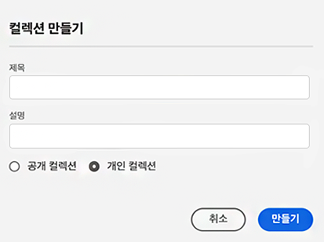
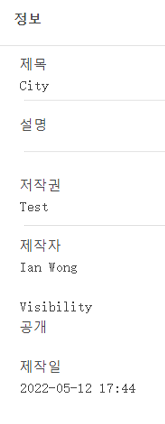
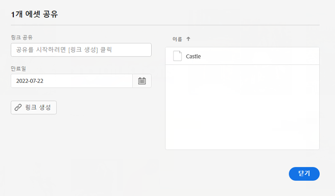

# 컬렉션 관리 {#manage-collections}

컬렉션은 Experience Manager Assets Essentials 내의 에셋 세트입니다. 컬렉션을 사용하여 사용자 간에 에셋을 공유합니다.

폴더와 달리 컬렉션에는 서로 다른 위치의 에셋이 포함될 수 있습니다.

<!--
You can share collections with various users that are assigned different levels of privileges, including viewing, editing, and so on.
-->

사용자와 여러 컬렉션을 공유할 수 있습니다. 각 컬렉션에는 에셋에 대한 참조가 포함되어 있습니다. 에셋의 참조 무결성은 컬렉션에 간에 유지됩니다.

다음 작업을 수행하여 컬렉션을 관리하고 사용할 수 있습니다.

* [컬렉션 생성](#create-collection)

* [컬렉션에 에셋 추가](#add-assets-to-collection)

* [컬렉션에서 에셋 제거](#remove-assets-from-collection)

* [컬렉션 메타데이터 보기 및 편집](#view-edit-collection-metadata)

* [컬렉션 요소 다운로드](#download-collection-elements)

* [컬렉션 삭제](#delete-collection)

## 컬렉션 생성 {#create-collection}

컬렉션을 생성하려면:

1. 왼쪽 레일에서 **[!UICONTROL 컬렉션]**&#x200B;을 클릭한 다음 **[!UICONTROL 컬렉션 생성]**&#x200B;을 클릭합니다.

1. 컬렉션에 대한 제목 및 설명(선택 사항)을 지정합니다.

1. **[!UICONTROL 저장]**&#x200B;을 클릭하여 컬렉션을 생성합니다.

<!--

1. Select if you need to a create a Private collection or a Public collection.

   A Public collection is available for viewing and editing to all users. However, if you are a non-administrator user, a Private collection is available for viewing and editing only to users with the appropriate [permissions](#manage-collection-access). 

-->

## 컬렉션에 에셋 추가 {#add-assets-to-collection}

컬렉션에 에셋을 추가하려면:

1. 왼쪽 레일에서 **[!UICONTROL 에셋]**&#x200B;을 클릭하고 에셋을 선택합니다.

1. **[!UICONTROL 컬렉션에 추가]**&#x200B;를 클릭합니다.

1. [!UICONTROL 컬렉션] 대화 상자에서 선택한 에셋을 추가할 컬렉션을 선택합니다.

1. **[!UICONTROL 추가]**&#x200B;를 클릭하여 선택한 컬렉션에 에셋을 추가합니다.

컬렉션에 에셋을 추가하려면 왼쪽 레일에서 **[!UICONTROL 컬렉션]**&#x200B;을 클릭하고 에셋을 추가할 컬렉션을 클릭하고 **[!UICONTROL 컬렉션에 추가]**&#x200B;를 클릭하고 에셋을 선택하고 **[!UICONTROL 선택]**&#x200B;을 클릭할 수도 있습니다.

## 컬렉션에서 에셋 제거 {#remove-assets-from-collection}

컬렉션에서 에셋을 제거하려면:

1. 컬렉션 목록을 보려면 왼쪽 레일에서 **[!UICONTROL 컬렉션]**&#x200B;을 클릭합니다.

1. 컬렉션을 클릭하고 컬렉션에서 제거해야 하는 에셋을 선택합니다.

1. **[!UICONTROL 제거]**&#x200B;를 클릭합니다.

<!--

## Manage access to a Private collection {#manage-collection-access}

The permission management for collections function in the same manner as folders in [!DNL Assets Essentials]. Administrators can manage the access levels for collections available in the repository. As an administrator, you can create user groups and assign permissions to those groups to manage access levels. You can also delegate the permission management privileges to user groups at the collection-level.

For more information, see [Manage permissions for folders and collections](manage-permissions.md).

-->

<!--

## Search a collection {#search-collections}

Click **[!UICONTROL Collections]** in the left rail and use the Search box to specify a text as the criteria to search for a collection. [!DNL Assets Essentials] uses the specified text to search collection names, metadata including tags defined for a collection and returns appropriate results.

>[!NOTE]
>
>Assets Essentials performs search in collections available at the root level. It does not perform search in assets and folders available in collections.

-->

## 컬렉션 메타데이터 보기 및 편집 {#view-edit-collection-metadata}

컬렉션 메타데이터는 제목 및 설명과 같은 컬렉션에 대한 데이터로 구성됩니다.

컬렉션 메타데이터를 보고 편집하려면:

1. 왼쪽 레일에서 **[!UICONTROL 컬렉션]**&#x200B;을 클릭하고 컬렉션을 선택한 다음 **[!UICONTROL 세부 정보]**&#x200B;를 클릭합니다.
1. **[!UICONTROL 기본]** 탭을 사용하여 컬렉션 메타데이터를 봅니다.
1. 필요에 따라 메타데이터 필드를 수정합니다. [!UICONTROL 제목], [!UICONTROL 설명] 및 [!UICONTROL 작성자] 필드를 수정할 수 있습니다.

## 컬렉션 링크 공유 {#share-collection-links}

[!DNL Assets Essentials]에서 링크를 생성하고 [!DNL Assets Essentials] 애플리케이션에 대한 액세스 권한이 없는 외부 관련자와 컬렉션 내의 컬렉션 및 에셋을 공유할 수 있습니다. 해당 링크에 대한 만료일을 정의한 다음 이메일 또는 메시징 서비스와 같이 선호하는 커뮤니케이션 수단을 사용하여 다른 사용자와 공유할 수 있습니다. 링크 수신자는 에셋을 미리 보고 다운로드할 수 있습니다.

외부 관련자와 컬렉션 링크를 공유하는 방법에 대한 자세한 내용은 [에셋에 대한 링크 공유](share-links-for-assets.md)를 참조하십시오.

## 컬렉션 다운로드 {#download-collection}

컬렉션을 다운로드하려면

1. 왼쪽 레일에서 **[!UICONTROL 컬렉션]**&#x200B;을 클릭합니다.

1. 다운로드할 컬렉션을 선택하고 을 클릭합니다 **[!UICONTROL 다운로드]**.

1. 설정 [!UICONTROL 자산 다운로드] 대화 상자 **[!UICONTROL 확인]**.

컬렉션은 로컬 시스템에서 .ZIP 파일로 다운로드됩니다.

## 컬렉션 삭제 {#delete-collection}

컬렉션을 삭제하려면:

1. 왼쪽 레일에서 **[!UICONTROL 컬렉션]**&#x200B;을 클릭합니다.

1. 삭제해야 하는 컬렉션을 선택합니다.

1. **[!UICONTROL 삭제]**&#x200B;를 클릭합니다.

## 다음 단계 {#next-steps}

* Assets Essentials 사용자 인터페이스에서 사용 가능한 [!UICONTROL 피드백] 옵션을 사용하여 제품 피드백 제공

* [!UICONTROL 이 페이지 편집],  또는 [!UICONTROL 문제 기록]을 사용하여 문서 피드백을 제공하고 오른쪽 사이드바에서 사용 가능한 

* [고객 지원 센터](https://experienceleague.adobe.com/?support-solution=General#support) 문의
