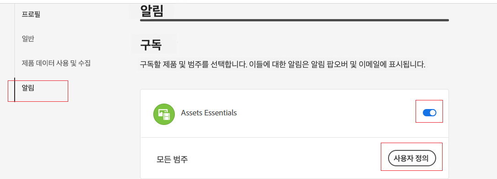
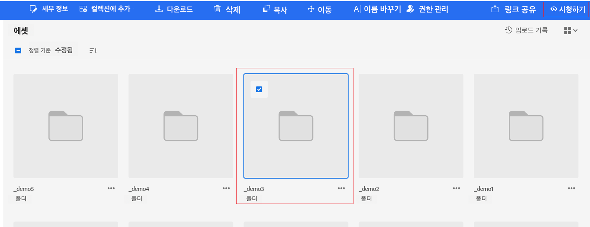

# 알림 관리 {#manage-notifications}

Assets Essentials 알림을 사용하면 저장소에서 사용할 수 있는 자산이나 폴더에서 수행되는 작업을 모니터링할 수 있습니다. 알림을 받을 콘텐츠를 선택하고 구독해야 합니다. 알림을 받을 카테고리를 구성할 수도 있습니다.

## 알림 카테고리 가입 {#subscribe-to-notification-categories}

카테고리 목록에서 알림을 선택하여 구독할 수 있습니다. Assets Essentials은 사용 가능한 옵션에서 선택한 카테고리에 대해서만 알림을 보냅니다.

<table>
    <tbody>
     <tr>
      <th><strong>알림 카테고리</strong></th>
      <th><strong>설명</strong></th>
     </tr>
     <tr>
      <td>요청</td>
      <td>사용자에게 작업을 할당하면 해당 사용자가 해당 작업에 대해 수행한 작업이 있으면 알림을 받게 됩니다.</td>
     </tr>
     <tr>
      <td>지정</td>
      <td>다른 사용자로부터 할당된 작업이 있으면 알림을 받습니다.</td>
     </tr>
     <tr>
      <td>구독 컨텐츠에 대한 댓글</td>
      <td>사용자가 가입한 자산에 대해 댓글을 달면 알림을 받게 됩니다.</td>
     </tr>
     <tr>
      <td>구독한 콘텐츠 삭제</td>
      <td>사용자가 가입한 자산 또는 폴더를 삭제하면 알림을 받게 됩니다.</td>
     </tr>
     <tr>
      <td>구독한 콘텐츠의 외부 공유</td>
      <td>사용자가 구독한 자산 또는 폴더에 대한 공개 링크를 만들면 알림을 받게 됩니다.</td>
     </tr>
     <tr>
      <td>구독한 콘텐츠 수정</td>
      <td>사용자가 구독한 자산에 대한 새 버전을 만들면 알림을 받게 됩니다.</td>
     </tr>
     <tr>
      <td>구독한 콘텐츠 이동/이름 바꾸기</td>
      <td>사용자가 구독한 자산 또는 폴더를 이동하거나 이름을 변경할 때 알림이 표시됩니다.</td>
     </tr>
     <tr>
      <td>구독한 폴더 및 컬렉션에 대한 업데이트</td>
      <td>사용자가 가입 폴더에서 자산을 추가하거나 제거할 때 알림이 표시됩니다.</td>
     </tr>    
    </tbody>
   </table>

통지 범주에 가입하려면

1. 클릭  Assets Essentials 사용자 인터페이스의 메뉴 모음 오른쪽 끝입니다.

1. 클릭  를 클릭하여 [!UICONTROL Experience Cloud 환경 설정] 페이지.

1. 을(를) 클릭합니다. **[!UICONTROL 알림 을 참조하십시오]** 왼쪽 창에서 사용할 수 있는 옵션.

1. 에서 **[!UICONTROL 알림 을 참조하십시오]** 섹션에서 다음 위치로 이동합니다. [!UICONTROL Assets Essentials] 섹션을 통해 전환 옵션이 ON 상태로 전환되었는지 확인합니다.

   

1. 클릭 **[!UICONTROL 사용자 지정]** 통지 범주를 조회하려면
   

1. 알림을 받아야 하는 통지 범주를 선택합니다.

## 폴더 또는 자산 보기 및 잠금 해제 {#watch-unwatch-assets}

후 [알림 카테고리 가입](#subscribe-to-notification-categories), 컨텐츠에 가입하여 알림 수신을 시작해야 합니다.

>[!NOTE]
>
>대상 **[!UICONTROL 요청]** 및 **[!UICONTROL 지정]** 알림 카테고리를 사용하면 알림 카테고리를 구독한 후 컨텐츠에 가입할 필요가 없습니다. 사용자가 만든 요청과 작업이 사용자에게 할당되면 알림이 자동으로 사용자에게 전송됩니다.

컨텐츠에 가입하려면 구독해야 하는 폴더 또는 자산을 선택하고 을(를) 클릭합니다 **[!UICONTROL 보기]**.

Assets Essentials에 성공 메시지가 표시됩니다. 을(를) 클릭합니다 **[!UICONTROL 알림 환경 설정으로 이동]** 성공 메시지에서 사용 가능하여 [알림 카테고리에 대한 구독](#subscribe-to-notification-categories).

이제 Assets Essentials이 구독한 카테고리에 대한 알림을 보냅니다. 여러 자산 또는 폴더를 선택하고 **[!UICONTROL 보기]** 시간을 절약합니다. 그러나 일부 엔티티를 이미 구독한 여러 엔티티를 선택한 경우 **[!UICONTROL 보기]** 옵션이 표시되지 않습니다.

마찬가지로, 가입을 해지하려면 구독한 자산 또는 폴더를 선택하고 을 클릭합니다 **[!UICONTROL Unwatch]**.

## 알림 보기 {#view-notifications}

Assets Essentials 사용자 인터페이스의 메뉴 모음 오른쪽 끝에 알림이 나타납니다.

알림을 클릭하면 Assets Essentials이 알림에서 참조되는 적절한 자산 또는 폴더로 이동합니다.

