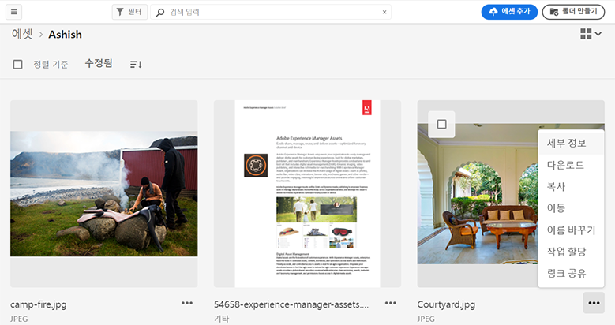
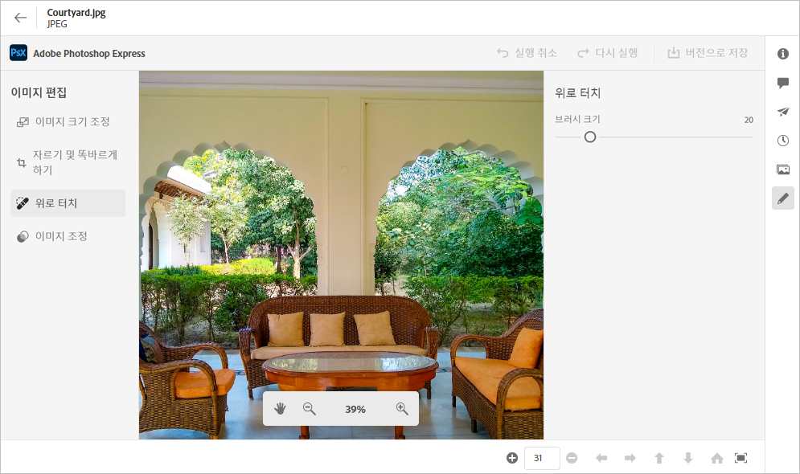
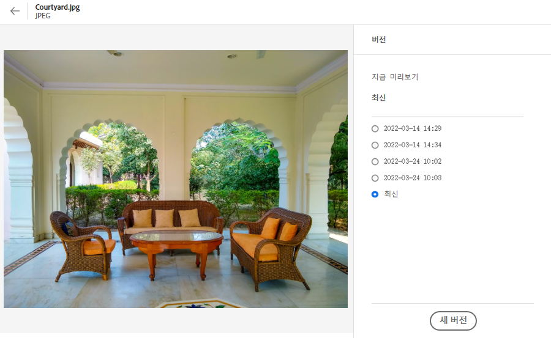
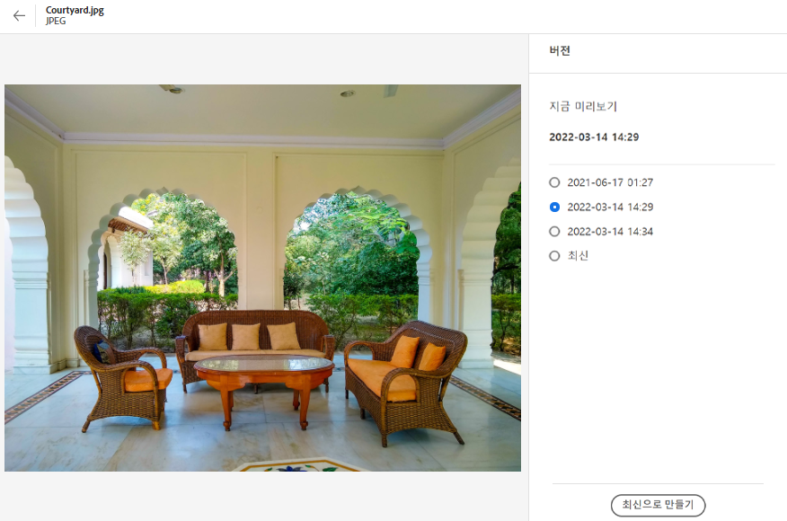

# 자산 관리 {#manage-assets}

[!DNL Assets Essentials]의 사용자에게 친숙한 인터페이스를 사용하여 다양한 DAM(디지털 자산 관리) 작업을 쉽게 수행할 수 있습니다. 자산을 추가한 후에는 자산을 검색, 다운로드, 이동, 복사, 이름 변경, 삭제, 업데이트 및 편집할 수 있습니다.

다음 자산 관리 작업을 수행하려면 [!DNL Assets Essentials] 을 사용하십시오. 자산을 선택하면 맨 위의 도구 모음에 다음 옵션이 표시됩니다.

*그림:선택한 이미지에 대한 도구 모음에서 사용할 수 있는 옵션.*

*  취소선택 항목을 선택 취소합니다.
*  정보 아이콘자산을 미리 보고 세부 메타데이터를 보려면 클릭합니다. 미리 볼 때 버전을 보고 이미지를 편집할 수 있습니다.
*  아이콘선택한 자산을 로컬 파일 시스템에 다운로드합니다.
*  아이콘 선택한 자산 또는 폴더를 삭제합니다.
* 

   <!--  --> Checkout an asset.
*  아이콘선택한 파일이나 폴더를 복사합니다.
*  아이콘선택한 자산이나 폴더를 저장소 계층 구조의 다른 위치로 이동합니다.
*  바꾸기 아이콘선택한 자산 또는 폴더의 이름을 변경합니다. 고유 이름을 사용하지 않으면 경고가 발생하여 이름을 다시 바꿀 수 없습니다. 새 이름으로 다시 시도할 수 있습니다.
* 
   <!--  --> Assign tasks to other users to collaborate on an asset.

자산 축소판에서 동일한 옵션을 볼 수 있습니다.

[!DNL Assets Essentials] 선택한 자산의 유형에 따라 달라지는 관련 옵션만 도구 모음에 표시합니다.

*그림:선택한 폴더의 도구 모음에서 사용할 수 있는 옵션.*

*그림:선택한 PDF 파일의 도구 모음에서 사용할 수 있는 옵션.*

## 자산 다운로드 및 분배 {#download}

하나 이상의 자산 또는 폴더나 두 가지 조합을 선택하고 선택 항목을 로컬 파일 시스템에 다운로드할 수 있습니다. 자산을 편집하고 다시 업로드하거나 [!DNL Assets Essentials] 외부에 자산을 배포할 수 있습니다. 자산의 표현물](/help/add-delete.md#renditions)을 [다운로드할 수도 있습니다.

## 에셋 버전 관리 {#versions-of-assets}

<!-- 
TBD: query for engineering: How many versions are maintained. What happens when we reach that limit? Are old versions automatically removed? -->

[!DNL Assets Essentials] 자산을 다시 업로드할 때 업데이트되거나 편집되는 자산의 버전을 지정합니다. 버전 기록 및 이전 버전을 볼 수 있으며, 필요한 경우 이전 버전으로 복귀한 자산의 이전 버전을 최신 버전으로 복원할 수 있습니다. 자산 버전은 다음 시나리오에서 생성됩니다.

* 기존 자산과 동일한 파일 이름을 사용하고 기존 자산과 동일한 폴더에 있는 새 자산을 업로드합니다. [!DNL Assets Essentials] 이전 자산을 덮어쓰거나 새 자산을 버전으로 저장하라는 메시지가 표시됩니다. [중복 자산 업로드](/help/add-delete.md#resolve-upload-fails)를 참조하십시오.

   

   *그림:기존 자산과 이름이 같은 자산을 업로드할 때 자산의 버전을 만들 수 있습니다.*

* 이미지를 편집하고 **[!UICONTROL Save as Version]** 을 클릭합니다. [이미지 편집](/help/edit-images.md)을 참조하십시오.

   

   *그림:편집된 이미지를 버전으로 저장합니다.*

* 기존 자산의 버전을 엽니다. **[!UICONTROL New Version]** 을 클릭하고 저장소에 있는 자산의 최신 버전을 업로드합니다.

   

### 자산 버전 보기 {#view-versions}

자산의 중복 사본 또는 수정된 복사본을 업로드할 때 해당 버전을 만들 수 있습니다. 버전 관리를 사용하면 내역 자산을 검토하고 필요한 경우 이전 버전으로 되돌릴 수 있습니다.

버전을 보려면 자산의 미리 보기를 열고 오른쪽 사이드바에서 **[!UICONTROL Versions]** 을 클릭하십시오. 특정 버전을 미리 보려면 선택합니다. 되돌릴 방법은 **[!UICONTROL Make Latest]**&#x200B;을 클릭하십시오.

버전 타임라인에서 버전을 만들 수도 있습니다. 최신 버전을 선택하고 **[!UICONTROL New Version]** 을 클릭한 다음, 로컬 파일 시스템에서 자산의 새 복사본을 업로드합니다.

*그림:자산의 버전을 보거나 이전 버전으로 되돌리거나 다른 새 버전을 업로드하십시오.*
