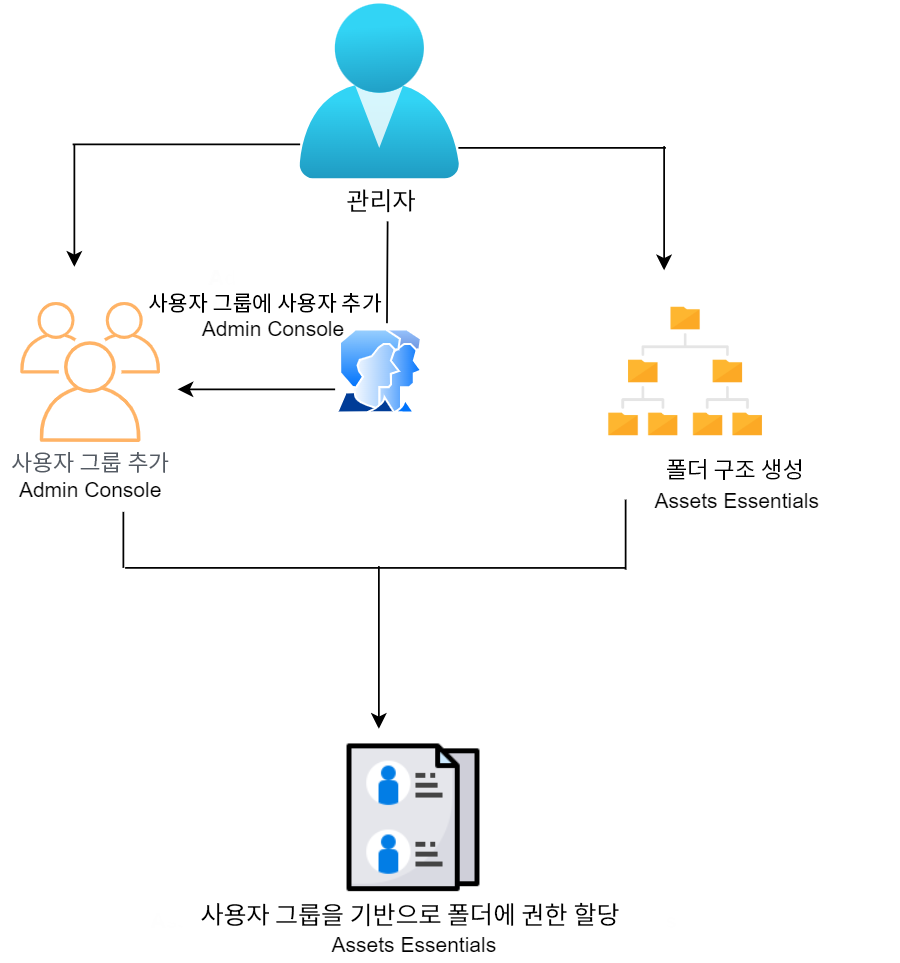
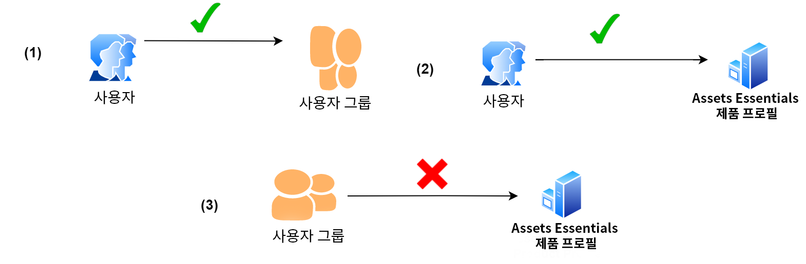
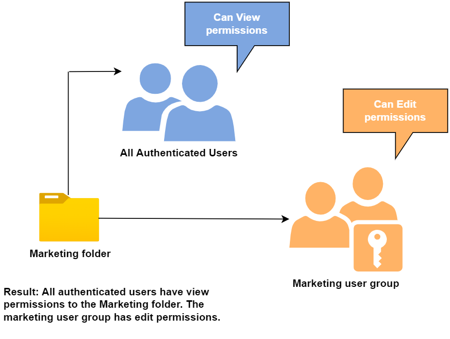

# 폴더에 대한 권한 관리

Assets Essentials을 사용하면 관리자가 저장소에서 사용할 수 있는 폴더에 대한 액세스 수준을 관리할 수 있습니다. 관리자는 사용자 그룹을 만들고 액세스 수준을 관리하기 위해 해당 그룹에 권한을 할당할 수 있습니다. 폴더 수준의 사용자 그룹에 권한 관리 권한을 위임할 수도 있습니다.

다음 데이터 흐름 다이어그램은 Assets Essentials 리포지토리에서 사용 가능한 폴더에 대한 권한을 구성 및 관리하기 위해 수행하는 작업 순서를 보여 줍니다.

## 폴더의 권한을 관리하기 전에 {#before-managing-permissions}

Assets Essentials 리포지토리의 폴더에 대한 권한을 관리하려면 먼저 논리 폴더 구조를 만들고, 사용자 그룹을 만들고, 다양한 사용자 그룹에 대한 폴더 권한을 관리할 수 있는 관리자 추가 등의 특정 작업을 수행해야 합니다.

### 관리자 추가 {#add-admin-users}

다른 사용자 그룹에 대한 폴더 권한을 관리할 수 있도록 Assets Essentials 응용 프로그램에 대한 관리자를 추가합니다.

관리자를 추가하려면 다음을 수행합니다.

1. 액세스 [Admin Console](https://adminconsole.adobe.com) 조직의 경우 **[!UICONTROL 제품]** 상단 막대에서 **[!UICONTROL AEM Assets Essentials]**&#x200B;를 클릭한 다음 [!DNL Assets Essentials] 환경. [!DNL Assets Essentials] 에는 관리자, 일반 및 소비자 사용자에 대한 액세스를 나타내는 세 개의 제품 프로필이 있습니다.

   

1. 사용자를 그룹에 추가하려면 Assets Essentials 관리자 그룹을 클릭하고 **[!UICONTROL 사용자 추가]**&#x200B;를 클릭하고 사용자 세부 사항을 제공한 다음 를 클릭합니다. **[!UICONTROL 저장]**.

   

   사용자를 추가하면 사용자는 시작할 이메일 초대를 받습니다. 의 제품 프로필 설정에서 이메일 초대를 해제할 수 있습니다 [!DNL Admin Console].

1. 그룹에서 사용자를 제거하려면 그룹을 클릭하고 기존 사용자를 선택한 다음 **[!UICONTROL 사용자 제거]**.

### 사용자 그룹 추가 {#add-user-groups}

사용자 그룹을 만들고 해당 그룹에 권한을 할당하여 Assets Essentials 저장소의 폴더 액세스 수준을 관리합니다. 그런 다음 사용자를 사용자 그룹에 할당할 수 있습니다.

사용자 그룹(1)에 사용자를 추가하고 [Assets Essentials 제품 프로필(2)](#add-admin-users). 그러나 Assets Essentials 제품 프로필(3)에는 사용자 그룹을 직접 추가할 수 없습니다.

사용자 그룹을 관리하는 방법에 대한 자세한 내용은 `Create user groups` 및 `Edit user groups` 다음 위치에서 사용 가능 [사용자 그룹 관리](https://helpx.adobe.com/enterprise/using/user-groups.html).

>[!NOTE]
>
>Azure 또는 Google 커넥터, 사용자 동기화 도구 또는 사용자 관리 Rest API와 같은 사용자/그룹 할당을 관리하기 위해 외부 시스템을 활용하도록 Admin Console이 설정된 경우 그룹 및 사용자 할당이 자동으로 구성됩니다. 자세한 내용은 [Adobe Admin Console 사용자](https://helpx.adobe.com/enterprise/using/users.html).

### 그룹에 사용자 추가 {#add-users-to-uesr-groups}

사용자 그룹을 만든 후 사용자 그룹에 사용자 추가를 시작할 수 있습니다.

사용자 그룹에 사용자 추가를 관리하는 방법에 대한 자세한 내용은 `Add users to groups` 다음 위치에서 사용 가능 [사용자 그룹 관리](https://helpx.adobe.com/in/enterprise/using/user-groups.html#add-users-to-groups).

### 폴더 구조 만들기 {#create-folder-structure}

다음 방법을 사용하여 Assets Essentials 리포지토리에서 폴더 구조를 생성할 수 있습니다.

* 을(를) 클릭합니다. **[!UICONTROL 폴더 만들기]** 빈 폴더를 만들기 위해 도구 모음에서 사용할 수 있는 옵션.

* 클릭 **[!UICONTROL 자산 추가]** 도구 모음에서 사용할 수 있는 옵션 [로컬 컴퓨터에서 사용할 수 있는 폴더 구조 업로드](add-delete.md).

조직의 비즈니스 목표에 적합한 폴더 구조를 만듭니다. 기존 폴더 구조를 Assets Essentials 저장소에 업로드하는 경우 구조를 검토해야 합니다. 자세한 내용은 [효과적인 권한 관리를 위한 우수 사례](permission-management-best-practices.md).

## 폴더에 대한 권한 관리 {#manage-permissions-folders}

사용자 그룹 또는 사용자에게 다음 권한을 할당할 수 있습니다. Adobe은 사용자에게 권한을 할당하는 것을 권장하지 않습니다.

| 권한 이름 | 설명 |
|-----|------|
| 볼 수 있음 | <ul><li>폴더를 보고 탐색하기 위한 읽기 액세스 </li><li>자산 미리 보기</li><li>에셋 다운로드</li><li>자산 복사</li><li>자산에 대한 링크 공유</li><ul> |
| 편집 가능 | <ul><li>볼 수 있음 권한에 사용할 수 있는 모든 권한 </li><li>폴더 만들기</li><li>폴더 제거</li><li>폴더 이름 바꾸기</li><li>자산 만들기</li><li>자산 업데이트</li><li>자산 제거</li><li>자산 이동</li><li>자산 이름 변경</li><ul> |
| 소유자 | <ul><li>편집 가능 권한에 사용할 수 있는 모든 권한</li><li>폴더 및 해당 하위 폴더에 대한 권한 관리</li>이 권한을 통해 관리자는 폴더 및 해당 하위 폴더에 대해 다른 사용자에게 관리자 권한을 위임할 수 있습니다.<ul> |
| 액세스 거부 | 폴더 및 해당 하위 폴더에 대한 보기 가능, 편집 가능 및 소유자 권한 제거. |

**기본 권한**

인증되고 Assets Essentials 애플리케이션에 로그인할 수 있는 모든 사용자는 `Can Edit` 처음에는 Assets Essentials 리포지토리에 대한 권한. 관리자는 [전체 Assets Essentials 리포지토리에 대한 권한 편집](#edit-permissions-entire-repository).

**사용자 그룹에 폴더 권한을 할당하는 순서**

규칙을 만들어 사용자 그룹에 폴더 권한을 할당합니다. 폴더에 권한을 할당하는 데 사용하는 시퀀스가 중요하며 사용자 그룹 및 최종 사용자가 사용할 수 있는 액세스를 결정합니다.

예를 들어, `Can View` 폴더에 대한 권한을 수퍼 그룹에 지정한 다음 `Can Edit` 하위 그룹에 대한 사용 권한을 갖는 경우 하위 그룹의 구성원만 해당 폴더에 대한 편집 권한을 갖습니다. 수퍼 그룹 사용자는 폴더에 대한 보기 액세스 권한이 있습니다.

에 편집 권한을 제공해야 하는 경우 `Marketing` 폴더 - 조직의 마케팅 부서에만 할당하고 다른 사용자에게 권한을 봅니다. `Can View` 수퍼 그룹에 대한 권한 `All Authenticated Users` 및 `Can Edit` 하위 그룹에 대한 권한 `Marketing`.

**권한 상속**

Assets Essentials은 권한 상속을 사용합니다. 이 경우 하위 폴더의 상위 폴더에 대한 권한 집합을 상속할 수 있습니다. 예를 들어 상위 폴더에 `Can View` 에 대한 권한 `All Authenticated Users` 그룹 및 하위 폴더가 `Can Edit` 에 대한 권한 `Marketing` 사용자 그룹에서는 인증된 모든 사용자가 하위 폴더 및 하위 폴더에 대한 보기 권한을 가질 수 있습니다 `Marketing` 사용자 그룹에 하위 폴더에 대한 편집 권한이 있어야 합니다. 다음 `Marketing` 사용자 그룹에는 하위 폴더(마케팅) 아래에 있는 추가 수준의 폴더에 대한 편집 권한이 있습니다.

>[!NOTE]
>
> 설정 `Deny Access` 상위 수준 폴더의 그룹에 대한 권한을 가진 후 액세스(`Can view`, `Can edit` 또는 `Owner`) 내의 그룹 또는 해당 구성원이 지원되지 않습니다. 사용 `Deny Access` 제한적으로.

### 사용자 그룹에 권한 추가 {#add-permissions}

폴더에 그룹 권한을 할당하려면

1. 폴더를 선택하고 을(를) 클릭합니다 **[!UICONTROL 권한 관리]**.

1. 설정 **[!UICONTROL 권한 관리]** 대화 상자에서 그룹 또는 사용자의 이름을 **[!UICONTROL 그룹 및 사용자]** 필드.

1. 을(를) 선택합니다 [액세스 수준](#manage-permissions-folders) 에서 **[!UICONTROL 액세스]** 드롭다운 목록.

1. 클릭 **[!UICONTROL 추가]** 를 클릭하여 사용자 또는 사용자 그룹의 권한을 즉시 변경합니다.

1. 1-3단계를 반복하여 규칙에 추가 **[!UICONTROL 권한 관리]** 대화 상자.

   

   >[!NOTE]
   >
   > 폴더에 권한을 할당하는 데 사용하는 순서가 중요하며 사용자 그룹과 그룹에 추가된 사용자가 사용할 수 있는 액세스 권한을 결정합니다.

   여러 폴더에 대한 권한을 관리하는 경우 왼쪽 창에서 다른 폴더를 선택하고 해당 폴더에 대한 권한 관리를 시작할 수도 있습니다.

1. Click **[!UICONTROL Close]**.

>[!CAUTION]
>
> 개별 사용자가 아닌 사용자 그룹의 권한을 관리하는 것이 좋습니다. 설정 `Deny access` 사용 권한은 사용자 그룹에만 지원되지만 개별 사용자는 지원되지 않습니다.

### 사용자 그룹에 할당된 권한 편집 {#edit-permissions}

폴더의 사용자 그룹에 할당된 권한을 편집하려면

1. 폴더를 선택하고 을(를) 클릭합니다 **[!UICONTROL 권한 관리]**.

1. 설정 **[!UICONTROL 권한 관리]** 대화 상자, 편집 [액세스 수준](#manage-permissions-folders) 에서 **[!UICONTROL 액세스]** 드롭다운 목록.

1. [사용자 그룹 또는 사용자 추가](#add-permissions) 필요한 경우 기존 권한 규칙에 연결할 수 있습니다.

1. 사용자 그룹에 할당된 권한을 제거하려면 X 를 클릭하십시오.

### 전체 Assets Essentials 리포지토리의 권한 편집 {#edit-permissions-entire-repository}

응용 프로그램 관리자는 기본값에서 전체 Assets Essentials 리포지토리의 권한을 편집할 수 있습니다 `Can Edit` 다른 액세스 수준에 도달할 수 있습니다.

전체 Assets Essentials 리포지토리의 권한을 편집하려면 다음을 수행하십시오.

1. 폴더를 선택하고 **[!UICONTROL 권한 관리]**.

1. 설정 **[!UICONTROL 권한 관리]** 대화 상자 **[!UICONTROL 모든 자산]** 왼쪽 레일에 있습니다.

1. [권한 편집](#edit-permissions) 대화 상자를 닫습니다.

>[!NOTE]
>
>관리자가 `Deny Access` 전체 Assets Essentials 리포지토리에 대한 권한 수준을 사용하여 사용자가 적어도 응용 프로그램에 대한 읽기 권한을 갖도록 합니다. 마찬가지로 `All Authenticated Users` 관리자가 명시적으로 `Can Edit` 사용 권한 [!UICONTROL 권한 관리] 대화 상자.

## 효과적인 권한 관리에 대한 예 {#example-permission-management}

**사용 사례**

* 모든 인증된 사용자 그룹에는 저장소에 대한 보기 액세스 권한이 있습니다.
* 팀별 사용자 그룹에는 고유한 기능별 폴더에 대한 편집 권한이 있습니다.
* 법률 팀을 제외한 인증된 사용자는 법적 폴더를 볼 수 없습니다.

Admin Console에서 다음 사용자 그룹을 만듭니다.

* 마케팅 팀

* 브랜드 승인자 팀

* 프로젝트 관리자 팀

* 프로젝트 X 팀

* 법률 팀

다음 다이어그램은 폴더 계층 구조 및 각 사용자 그룹에 지정된 권한을 보여줍니다.

다음은 폴더 계층 구조의 모든 사용자 그룹에 대한 액세스 수준입니다.

* /모든 자산: 관리자는 기본값에서 루트 수준의 권한을 수정합니다 `Can Edit` to `Can View`. 모든 사용자는 폴더 및 자산을 볼 수 있지만 편집할 수는 없습니다.

* /marketing: 모든 사용자는 권한 상속을 기반으로 폴더 및 하위 폴더를 볼 수 있지만 마케팅 팀 사용자 그룹은 폴더에 대한 편집 권한을 갖습니다.

* /brand: 모든 사용자는 권한 상속을 기반으로 폴더 및 하위 폴더를 볼 수 있지만 Brand Approvers 팀 사용자 그룹은 폴더에 대한 편집 권한을 갖습니다.

* /projects: 모든 사용자는 권한 상속을 기반으로 폴더 및 하위 폴더를 볼 수 있습니다. 프로젝트 관리자 팀 사용자 그룹은 다음과 같습니다.

   * 권한 편집

   * 소유자 권한: 폴더 및 해당 하위 폴더에 대한 권한을 관리합니다.

* /projects/project-x: 모든 사용자는 폴더 및 하위 폴더를 볼 수 있습니다. 프로젝트 관리자 팀 사용자 그룹은 편집 권한을 가지며 폴더 및 해당 하위 폴더에 대한 권한(소유자 권한)을 관리할 수 있습니다. Project X Team 사용자 그룹에 편집 권한이 있습니다.

* /legal: 어떤 사용자도 `Deny Access` 권한 `All Authenticated Users` 그룹에 속해 있어야 합니다. 법무팀 사용자 그룹에 편집 권한이 있습니다.
