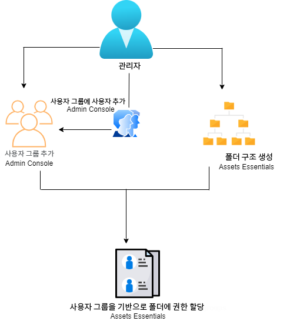
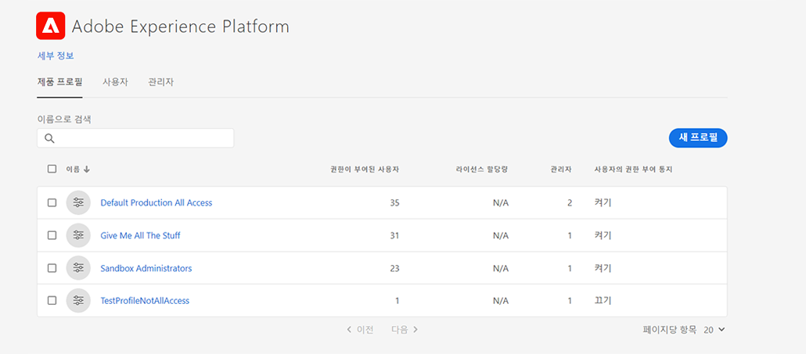
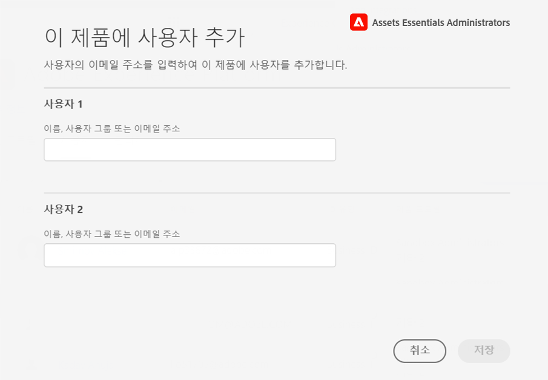
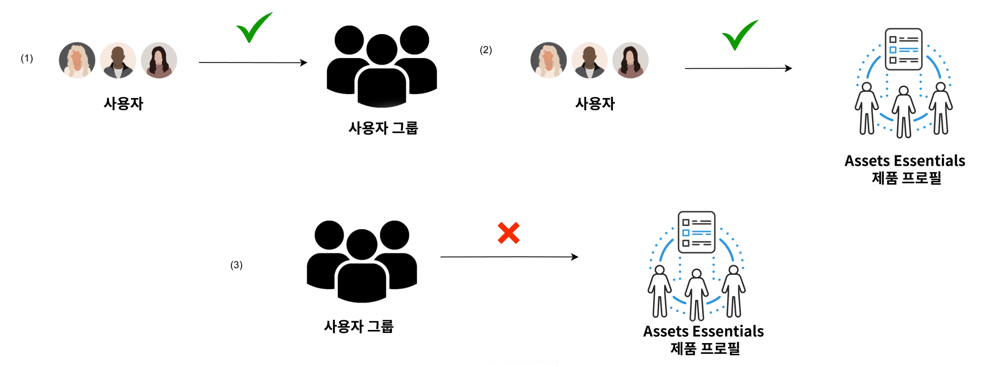
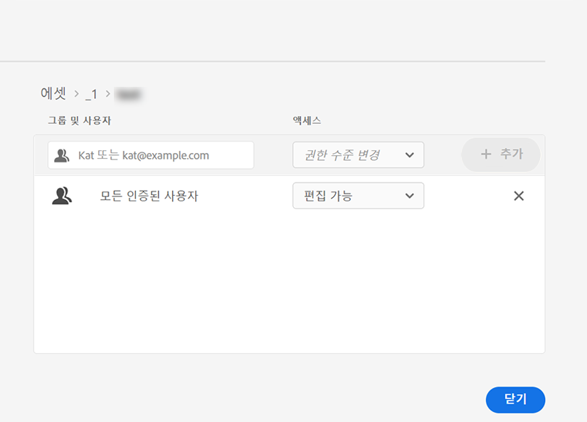
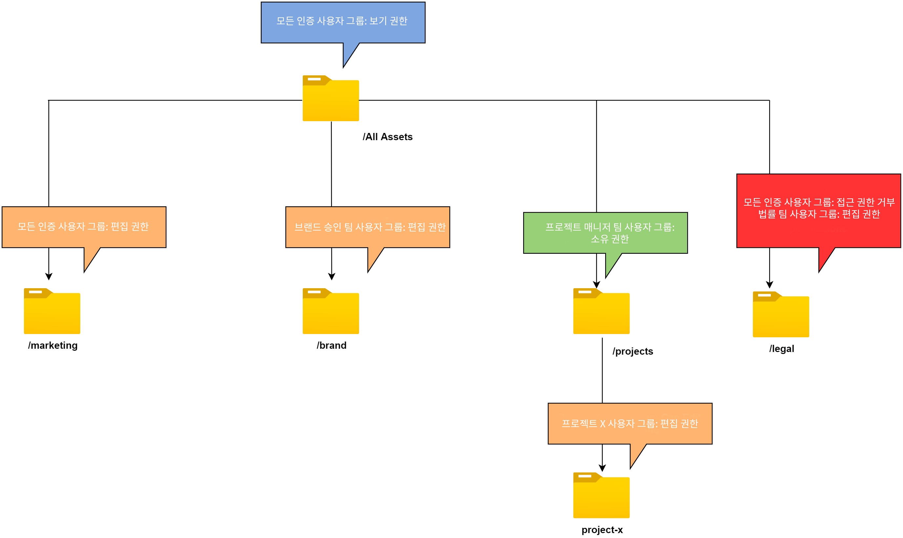

# 폴더 권한 관리 {#manage-permissions}

>[!CONTEXTUALHELP]
>id="assets_workspace"
>title="권한 관리"
>abstract="[!DNL Assets Essentials]를 통해 관리자는 저장소에서 사용할 수 있는 폴더에 대한 액세스 수준을 관리할 수 있습니다. 관리자는 사용자 그룹을 만든 다음 해당 그룹에 액세스 수준을 관리하도록 권한을 할당할 수 있습니다. 또한 폴더 수준에서 사용자 그룹에 권한 관리 권한을 위임할 수도 있습니다."

Assets Essentials에서 관리자는 저장소에서 사용할 수 있는 폴더에 대한 액세스 수준을 관리할 수 있습니다. 관리자는 사용자 그룹을 만든 다음 해당 그룹에 액세스 수준을 관리하도록 권한을 할당할 수 있습니다. 또한 폴더 수준에서 사용자 그룹에 권한 관리 권한을 위임할 수도 있습니다.

다음 데이터 흐름 다이어그램은 Assets Essentials 저장소에서 사용할 수 있는 폴더에 대한 권한을 구성하고 관리할 때 수행하는 작업의 시퀀스를 보여 줍니다.

## 폴더 권한을 관리하기에 앞서 {#before-managing-permissions}

Assets Essentials 저장소의 폴더에 대한 권한을 관리하기에 앞서, 논리적 폴더 구조를 생성하고 다양한 사용자 그룹에 대한 폴더 권한을 관리하는 관리자를 추가하는 등의 특정 작업을 수행해야 합니다.

### 관리자 추가 {#add-admin-users}

다른 사용자 그룹에 대한 폴더 권한을 관리하도록 Assets Essentials 애플리케이션에 관리자를 추가합니다.

관리자를 추가하려면:

1. 조직의 [Admin Console](https://adminconsole.adobe.com)에 액세스하고 상단 막대에서 **[!UICONTROL 제품]**&#x200B;을 클릭하고 **[!UICONTROL AEM Assets Essentials]**&#x200B;를 클릭한 다음 [!DNL Assets Essentials] 환경을 클릭합니다. [!DNL Assets Essentials]에는 관리자, 일반 사용자 및 소비자 사용자의 액세스를 나타내는 세 가지 제품 프로필이 있습니다.

   

1. 그룹에 사용자를 추가하려면 [Assets Essentials 관리자] 그룹을 클릭하고, **[!UICONTROL 사용자 추가]**&#x200B;를 선택하고, 사용자 세부 정보를 입력한 다음 **[!UICONTROL 저장]**&#x200B;을 클릭합니다.

   

   사용자를 추가하면 사용자는 시작하라는 이메일 초대를 수신하게 됩니다. [!DNL Admin Console]의 제품 프로필 설정에서 이메일 초대를 비활성화할 수 있습니다.

1. 그룹에서 사용자를 제거하려면 그룹을 클릭하고 기존 사용자를 선택한 다음 **[!UICONTROL 사용자 제거]**&#x200B;를 선택합니다.

### 사용자 그룹 추가 {#add-user-groups}

사용자 그룹을 만든 다음 해당 그룹에 Assets Essentials 저장소의 폴더 액세스 수준을 관리하도록 권한을 할당할 수 있습니다. 그런 다음 사용자 그룹에 사용자를 할당할 수 있습니다.

사용자 그룹에 사용자를 추가(1)하고 [Assets Essentials 제품 프로필에 사용자를 추가(2)](#add-admin-users)할 수 있습니다. 그러나 Assets Essentials 제품 프로필에 사용자 그룹을 바로 추가(3)할 수는 없습니다.

사용자 그룹 관리 방법에 대한 자세한 내용은 [사용자 그룹 관리](https://helpx.adobe.com/kr/enterprise/using/user-groups.html)에서 `Create user groups` 및 `Edit user groups`를 참조하십시오.

>[!NOTE]
>
>Admin Console을 Azure 또는 Google 커넥터, 사용자 동기화 도구 또는 User Management REST API와 같은 내부 시스템을 활용하여 사용자/그룹 할당을 관리하도록 설정한 경우 그룹 및 사용자 할당은 자동으로 구성됩니다. 자세한 내용은 [Adobe Admin Console 사용자](https://helpx.adobe.com/kr/enterprise/using/users.html)를 참조하십시오.

### 그룹에 사용자 추가 {#add-users-to-uesr-groups}

사용자 그룹을 만든 후에는 사용자 그룹에 사용자를 추가할 수 있습니다.

사용자 그룹에 사용자를 추가하는 방법에 대한 자세한 내용은 [사용자 그룹 관리](https://helpx.adobe.com/kr/enterprise/using/user-groups.html#add-users-to-groups)에서 `Add users to groups`를 추가하십시오.

### 폴더 구조 만들기 {#create-folder-structure}

다음과 같은 방법을 사용하여 Assets Essentials 저장소에 폴더 구조를 생성할 수 있습니다.

* 도구 모음에서 **[!UICONTROL 폴더 만들기]**&#x200B;를 클릭하여 빈 폴더를 생성합니다.

* 툴바에서 **[!UICONTROL 에셋 추가]** 옵션을 클릭하여 [로컬 컴퓨터에서 사용할 수 있는 폴더 구조를 업로드](add-delete.md)합니다.

조직의 비즈니스 목표에 적합한 폴더 구조를 생성합니다. 기존 폴더 구조를 Assets Essentials 저장소에 업로드할 때에는 해당 폴더 구조를 검토해 보아야 합니다. 자세한 내용은 [효율적인 권한 관리에 대한 모범 사례](permission-management-best-practices.md)를 참조하십시오.

## 폴더 권한 관리 {#manage-permissions-on-folders}

사용자 그룹 또는 사용자에게 다음과 같은 권한을 할당할 수 있습니다. Adobe는 사용자에게 권한을 할당하는 것을 권장하지 않습니다.

| 권한 이름 | 설명 |
|-----|------|
| 보기 가능 | <ul><li>읽기 액세스(폴더 보기 및 탐색 가능) </li><li>에셋 미리보기</li><li>에셋 다운로드</li><li>에셋 복사</li><li>에셋으로의 링크 공유</li><ul> |
| 편집 가능 | <ul><li>[보기 가능] 권한에 대해 사용할 수 있는 모든 권한 </li><li>폴더 만들기</li><li>폴더 제거</li><li>폴더 이름 바꾸기</li><li>에셋 만들기</li><li>에셋 업데이트</li><li>에셋 제거</li><li>에셋 이동</li><li>에셋 이름 바꾸기</li><ul> |
| 소유자 | <ul><li>[편집 가능] 권한에 대해 사용할 수 있는 모든 권한</li><li>폴더 및 그 하위 폴더에 대한 권한 관리</li>이 권한을 사용하면 관리자는 폴더 및 그 하위 폴더에 대한 관리자 권한을 다른 사용자에게 위임할 수 있습니다.<ul> |
| 액세스 거부 | 폴더 및 그 하위 폴더에 대한 [보기 가능], [편집 가능] 및 [소유자] 권한을 제거합니다. |

**기본 권한**

Assets Essentials 애플리케이션에 로그인할 수 있는 인증된 모든 사용자는 처음에 Assets Essentials 저장소에 대해 `Can Edit` 권한을 갖게 됩니다. 관리자는 [전체 Assets Essentials 저장소에 대한 권한을 편집](#edit-permissions-entire-repository)하여 기본 권한을 조정 및 변경할 수 있습니다.

**사용자 그룹에 폴더 권한을 할당하는 순서**

사용자 그룹에 폴더 권한을 할당하기 위한 규칙을 만듭니다. 폴더에 권한을 할당하기 위해 사용하는 순서는 사용자 그룹과 결과적으로는 사용자가 사용할 수 있는 액세스 권한을 결정하는 중요한 부분입니다.

예를 들어 상위 그룹에 폴더에 대한 `Can View` 권한을 할당한 다음 그 하위 그룹에 `Can Edit` 권한을 할당하는 경우, 하위 그룹의 멤버만 해당 폴더에 대한 편집 권한을 갖게 됩니다. 상위 그룹 사용자는 폴더에 대한 보기 액세스 권한을 갖게 됩니다.

`Marketing` 폴더에 대한 편집 권한을 귀사의 마케팅 부서에만 제공하며 다른 사용자에게는 보기 권한을 제공해야 하는 경우, 상위 그룹인 `All Authenticated Users`에 `Can View` 권한을 할당하고 그 하위 그룹인 `Marketing`에 `Can Edit` 권한을 할당하면 됩니다.

**권한 상속**

Assets Essentials는 상위 폴더 안의 하위 폴더에 설정된 권한을 상속할 수 있도록 하는 권한 상속을 사용합니다. 예를 들어 상위 폴더에는 `All Authenticated Users` 그룹에 대한 `Can View` 권한이 있고 하위 폴더에는 `Marketing` 사용자 그룹에 대한 `Can Edit` 권한이 있는 경우, 인증된 모든 사용자는 하위 폴더에 대한 보기 권한을 가지며 `Marketing` 사용자 그룹은 하위 폴더에 대한 편집 권한을 갖게 됩니다. `Marketing` 사용자 그룹은 하위 폴더(마케팅) 아래에 있는 추가 수준의 폴더에 대해 편집 권한을 갖게 됩니다.

>[!NOTE]
>
> 더 높은 수준의 폴더에서 그룹에 대한 `Deny Access` 권한을 설정한 다음 해당 그룹 또는 그 멤버에 대한 액세스 권한(`Can view`, `Can edit` 또는 `Owner`)을 복원할 수는 없습니다. `Deny Access`는 제한적으로 사용하십시오.

### 사용자 그룹에 권한 추가 {#add-permissions}

폴더에 그룹 권한을 할당하려면:

1. 해당 폴더를 선택 후 **[!UICONTROL 권한 관리]**&#x200B;를 클릭합니다.

1. **[!UICONTROL 권한 관리]** 대화 상자에서 **[!UICONTROL 그룹 및 사용자]** 필드에 그룹 또는 사용자의 이름을 지정합니다.

1. **[!UICONTROL 액세스]** 드롭다운 목록에서 [액세스 수준](#manage-permissions-folders)을 선택합니다.

1. **[!UICONTROL 추가]**&#x200B;를 선택하여 사용자 또는 사용자 그룹에 대한 권한을 즉시 변경합니다.

1. **[!UICONTROL 권한 관리]** 대화 상자에 더 많은 규칙을 추가하려면 1~3단계를 반복하십시오.

   

   >[!NOTE]
   >
   > 폴더에 권한을 할당하기 위해 사용하는 순서는 사용자 그룹과 결과적으로는 해당 그룹에 추가된 사용자가 사용할 수 있는 액세스 권한을 결정하는 중요한 부분입니다.

   여러 폴더에 대한 권한을 관리하는 경우 왼쪽 창에서 다른 폴더를 선택하여 해당 폴더에 대한 권한을 관리할 수도 있습니다.

1. **[!UICONTROL 닫기]**&#x200B;를 클릭합니다.

>[!CAUTION]
>
> 개인 사용자가 아닌 사용자 그룹에 대한 권한을 관리하는 것이 좋습니다. `Deny access` 권한 설정은 사용자 그룹에 대해서만 지원되며, 개인 사용자에 대해서는 지원되지 않습니다.

### 사용자 그룹에 할당된 권한 편집 {#edit-permissions}

폴더의 사용자 그룹에 할당된 권한을 편집하려면:

1. 해당 폴더를 선택 후 **[!UICONTROL 권한 관리]**&#x200B;를 클릭합니다.

1. **[!UICONTROL 권한 관리]** 대화 상자에서 **[!UICONTROL 액세스]** 드롭다운 목록에 있는 [액세스 수준](#manage-permissions-folders)을 편집합니다.

1. 필요한 경우 기존 권한 규칙에 [더 많은 사용자 그룹 또는 사용자를 추가](#add-permissions)하십시오.

1. [X]를 클릭하여 사용자 그룹에 할당된 권한을 제거합니다.

### 전체 Assets Essentials 저장소에 대한 권한 편집 {#edit-permissions-entire-repository}

애플리케이션 관리자는 전체 Assets Essentials 저장소에 대한 권한을 기본 `Can Edit`에서 다른 액세스 수준으로 편집할 수 있습니다.

전체 Assets Essentials 저장소에 대한 권한을 편집하려면:

1. 원하는 폴더를 선택 후 **[!UICONTROL 권한 관리]**&#x200B;를 클릭합니다.

1. **[!UICONTROL 권한 관리]** 대화 상자에서 왼쪽 레일의 **[!UICONTROL 모든 에셋]**&#x200B;을 클릭합니다.

1. [권한을 편집](#edit-permissions)한 다음 대화 상자를 닫습니다.

>[!NOTE]
>
>사용자가 적어도 애플리케이션에 대한 읽기 액세스 권한을 가져야 하므로 관리자는 전체 Assets Essentials 저장소에 대해 `Deny Access` 권한 수준을 선택할 수 없습니다. 마찬가지로 관리자가 [!UICONTROL 권한 관리] 대화 상자에서 명시적으로 `Can Edit` 권한을 제거해도 `All Authenticated Users`는 적어도 저장소에 대한 읽기 권한을 가져야 합니다.

## 효율적인 권한 관리에 대한 예 {#example-permission-management}

**사용 사례**

* 인증된 모든 사용자 그룹은 저장소에 대한 보기 액세스 권한을 가집니다.
* 팀별 사용자 그룹은 자신의 기능별 폴더에 대한 편집 권한을 가집니다.
* 법률 팀을 제외한 다른 인증된 사용자는 법률 폴더를 볼 수 없습니다.

Admin Console에 다음과 같은 사용자 그룹을 생성합니다.

* 마케팅 팀

* 브랜드 승인 팀

* 프로젝트 관리 팀

* 프로젝트 X 팀

* 법률 팀

다음 다이어그램은 폴더 계층과 각 사용자 그룹에 할당된 권한을 보여 줍니다.

다음은 폴더 계층의 모든 사용자 그룹에 대한 액세스 수준입니다.

* /All Assets: 관리자는 루트 수준에서 권한을 기본 `Can Edit`에서 `Can View`로 수정합니다. 모든 사용자는 폴더 및 에셋을 볼 수 있지만 편집할 수는 없습니다.

* /marketing: 모든 사용자는 권한 상속에 따라 폴더 및 그 하위 폴더를 볼 수 있지만 [마케팅 팀] 사용자 그룹은 해당 폴더에 대한 편집 권한을 가집니다.

* /brand: 모든 사용자는 권한 상속에 따라 폴더 및 그 하위 폴더를 볼 수 있지만 [브랜드 승인 팀] 사용자 그룹은 해당 폴더에 대한 편집 권한을 가집니다.

* /projects: 모든 사용자는 권한 상속에 따라 폴더 및 그 하위 폴더를 볼 수 있습니다. [프로젝트 관리 팀] 사용자 그룹은 다음과 같은 권한을 가집니다.

   * [편집] 권한

   * [소유자] 권한: 폴더 및 그 하위 폴더에 대한 권한을 관리합니다.

* /projects/project-x: 모든 사용자는 폴더 및 그 하위 폴더를 볼 수 있습니다. [프로젝트 관리 팀] 사용자 그룹은 편집 권한을 가지며 폴더 및 그 하위 폴더에 대한 권한([소유자] 권한)을 관리할 수 있습니다. [프로젝트 X 팀] 사용자 그룹은 편집 권한을 가집니다.

* /legal: 모든 사용자는 `All Authenticated Users` 그룹에 대한 `Deny Access` 권한에 따라 폴더에 액세스할 수 없습니다. [법무 팀] 사용자 그룹은 편집 권한을 가집니다.

## 다음 단계 {#next-steps}

* [Assets Essentials의 권한 관리에 대한 비디오 보기](https://experienceleague.adobe.com/docs/experience-manager-learn/assets-essentials/configuring/permissions-management.html)

* Assets Essentials 사용자 인터페이스에서 사용 가능한 [!UICONTROL 피드백] 옵션을 사용하여 제품 피드백 제공

* 오른쪽 사이드바에서 사용 가능한 [!UICONTROL 이 페이지 편집], , [!UICONTROL 문제 기록] 또는 을 사용하여 설명서 피드백 제공

* [고객 지원 센터](https://experienceleague.adobe.com/?support-solution=General#support) 문의
