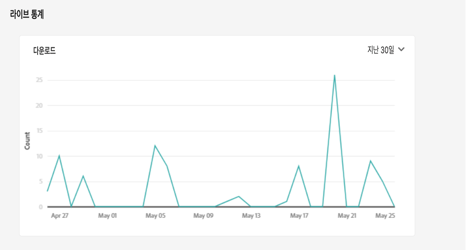
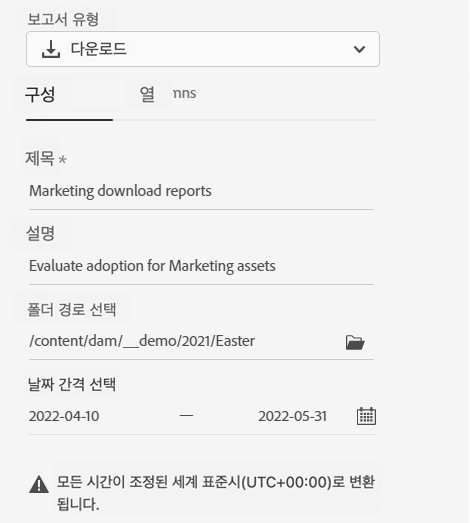

# 보고서 관리 {#manage-reports}

자산 보고는 관리자가 Adobe Experience Manager Assets Essentials 환경의 활동을 볼 수 있도록 합니다. 이 데이터는 사용자가 콘텐츠 및 제품과 상호 작용하는 방법에 대한 유용한 정보를 제공합니다.

## 보고서 액세스 {#access-reports}

에 할당된 모든 사용자 [Assets Essentials 관리자 제품 프로필](deploy-administer.md) 에서는 라이브 통계 대시보드에 액세스하고 Assets Essentials에서 사용자 정의 보고서를 만들 수 있습니다.

## 라이브 통계 보기 {#view-live-statistics}

Assets Essentials을 사용하면 라이브 통계 대시보드를 사용하여 Assets Essentials 환경에 대한 실시간 데이터를 볼 수 있습니다. 지난 30일 동안 또는 지난 12개월 동안 실시간 이벤트 지표를 볼 수 있습니다.

다음으로 이동 **[!UICONTROL 설정]** > **[!UICONTROL 라이브 통계]** 자동으로 생성된 다운로드 데이터를 보려면

## 보고서 만들기 {#create-report}

보고서를 만들려면:

1. 다음으로 이동 **[!UICONTROL 설정]** > **[!UICONTROL 보고서]** 을(를) 클릭합니다. **[!UICONTROL 보고서 만들기]**.

1. 에서 [!UICONTROL 구성] 탭에서 보고서에 대한 제목과 선택적 설명을 지정합니다.

1. 보고서를 실행할 자산을 포함하는 폴더 경로를 을(를) 사용하여 선택합니다 **[!UICONTROL 폴더 경로 선택]** 필드.

1. 보고서의 날짜 간격을 선택합니다.

1. 에서 [!UICONTROL 열] 탭에서 보고서에 표시해야 하는 열 이름을 선택합니다.

1. **[!UICONTROL 만들기]**&#x200B;를 클릭합니다.

   

다음 표에서는 보고서에 추가할 수 있는 모든 열의 사용에 대해 설명합니다.

<table>
    <tbody>
     <tr>
      <th><strong>열 이름</strong></th>
      <th><strong>설명</strong></th>
     </tr>
     <tr>
      <td>제목</td>
      <td>자산의 제목입니다.</td>
     </tr>
     <tr>
      <td>경로</td>
      <td>Assets Essentials에서 자산을 사용할 수 있는 폴더 경로입니다.</td>
     </tr>
     <tr>
      <td>유형</td>
      <td>자산에 대한 MIME 유형입니다.</td>
     </tr>
     <tr>
      <td>크기</td>
      <td>자산의 크기입니다.</td>
     </tr>
     <tr>
      <td>다운로드한 사람:</td>
      <td>자산을 다운로드한 사용자의 이메일 ID입니다.</td>
     </tr>
     <tr>
      <td>다운로드 날짜</td>
      <td>자산 다운로드 작업이 수행되는 날짜입니다.</td>
     </tr>
     <tr>
      <td>작성</td>
      <td>자산의 작성자입니다.</td>
     </tr>
     <tr>
      <td>만든 날짜</td>
      <td>자산이 Assets Essentials에 업로드되는 날짜입니다.</td>
     </tr>
     <tr>
      <td>수정한 날짜</td>
      <td>자산을 마지막으로 수정한 날짜입니다.</td>
     </tr>
     <tr>
      <td>만료됨</td>
      <td>자산의 만료 상태입니다.</td>
     </tr>
     <tr>
      <td>사용자 이름으로 다운로드됨</td>
      <td>자산을 다운로드한 사용자의 이름입니다.</td>
     </tr>           
    </tbody>
   </table>

## 기존 보고서 보기 {#view-report-list}

후 [보고서 만들기](#create-report)기존 보고서 목록을 보고 선택하여 CSV 형식으로 다운로드하거나 삭제할 수 있습니다.

보고서 목록을 보려면 **[!UICONTROL 설정]** > **[!UICONTROL 보고서]**.

각 보고서에 대해 보고서 제목, 보고서 유형, 보고서를 만들 때 지정된 설명, 보고서 상태, 보고서를 만든 작성자의 이메일 ID 및 보고서 생성 날짜를 볼 수 있습니다.

`Completed ` 보고서의 상태는 보고서를 다운로드할 준비가 되었음을 나타냅니다.

## CSV 보고서 다운로드 {#download-csv-report}

보고서를 CSV 형식으로 다운로드하려면 다음을 수행하십시오.

1. 다음으로 이동 **[!UICONTROL 설정]** > **[!UICONTROL 보고서]**.

1. 보고서를 선택하고 을(를) 클릭합니다 **[!UICONTROL CSV 다운로드]**.

선택한 보고서는 CSV 형식으로 다운로드됩니다. CSV 보고서에 표시되는 열은 선택하는 열에 따라 다릅니다 [보고서 만들기](#create-report).

## 보고서 삭제 {#delete-report}

보고서를 삭제하려면

1. 다음으로 이동 **[!UICONTROL 설정]** > **[!UICONTROL 보고서]**.

1. 보고서를 선택하고 을(를) 클릭합니다 **[!UICONTROL 삭제]**.
