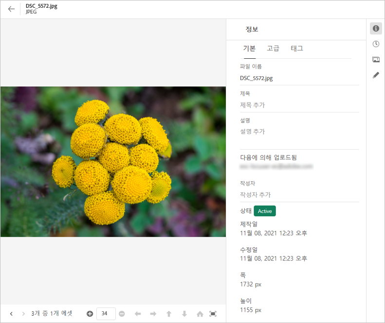
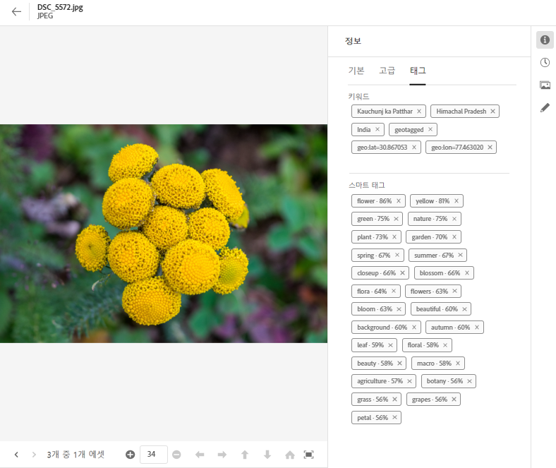
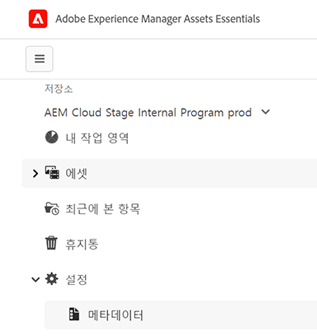
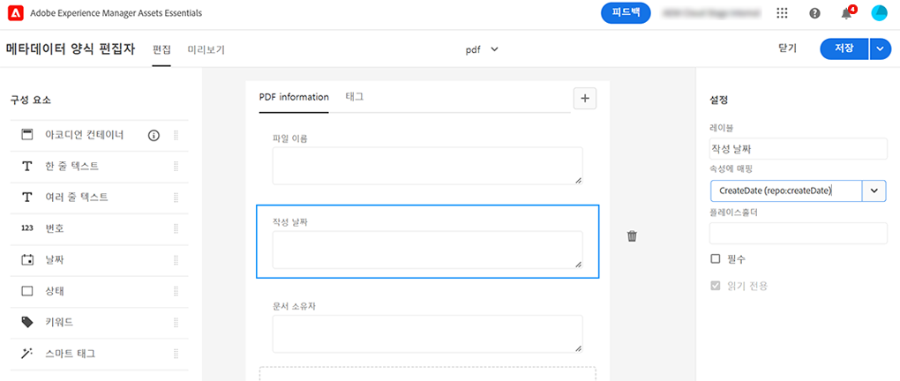

# [!DNL Assets Essentials]의 메타데이터 {#metadata}

메타데이터는 데이터 또는 데이터에 대한 설명을 의미합니다. 예를 들어 에셋 이미지에는 클릭한 카메라에 대한 정보나 저작권 정보가 포함될 수 있습니다. 이 정보는 해당 이미지의 메타데이터입니다. 메타데이터는 효율적인 에셋 관리에 있어 매우 중요합니다. 메타데이터는 에셋에 대해 사용 가능한 모든 데이터의 집합이지만 해당 에셋에 반드시 포함되지는 않을 수 있습니다.

메타데이터는 에셋을 보다 세부적으로 분류하는 데 도움이 되며 디지털 정보의 양이 증가할 때 유용합니다. 파일 이름, 미리보기 및 메모리 기준으로만 수백 개의 파일을 관리할 수 있습니다. 그러나 이 접근 방식은 확장할 수 없습니다. 관련된 사용자의 수와 관리하는 에셋의 수가 증가하면 효율성이 떨어질 수 있습니다.

메타데이터를 추가하면 에셋이 다음과 같이 되기 때문에 디지털 에셋의 가치가 증가합니다.

* 접근성 향상 - 시스템과 사용자가 쉽게 찾을 수 있습니다.
* 관리 용이성 - 동일한 속성 세트를 가진 에셋을 더 쉽게 찾고 변경 사항을 적용할 수 있습니다.
* 최대 효율 - 에셋은 더 많은 메타데이터로 더 많은 정보와 컨텍스트를 전달합니다.

이러한 이유로 에셋은 디지털 에셋에 대한 메타데이터를 생성하고, 관리하고, 교환할 수 있는 적절한 수단을 제공합니다.

## 메타데이터 보기 {#view-metadata}

에셋의 메타데이터를 보려면 툴바에서 해당 에셋을 찾아보거나 검색한 후 에셋을 선택하고 **[!UICONTROL 세부 정보]**&#x200B;를 클릭합니다.

*그림: 에셋과 해당 메타데이터를 보려면&#x200B;**[!UICONTROL 세부 정보]**를 클릭하거나 에셋을 더블 클릭합니다.*

[!UICONTROL 기본] 탭에서 제목, 설명 및 업로드 날짜와 같은 기본 메타데이터를 사용할 수 있습니다. [!UICONTROL 고급] 탭에는 카메라 모델, 렌즈 세부 정보 및 위치 정보 태그와 같은 고급 메타데이터가 포함되어 있습니다. [!UICONTROL 태그] 탭에는 이미지 내용에 따라 자동으로 적용된 태그가 포함되어 있습니다.

## 메타데이터 업데이트 {#update-metadata}

몇 가지 메타데이터 필드를 수동으로 업데이트할 수 있습니다. 필드에는 [!UICONTROL 제목], [!UICONTROL 설명], [!UICONTROL 작성자] 및 [!UICONTROL 키워드]가 포함됩니다.

## 태그 {#tags}

[!DNL Assets Essentials]는 [Adobe Sensei](https://www.adobe.com/kr/sensei.html)에서 제공되는 인공 지능을 사용하여 업로드된 모든 에셋에 관련 태그를 자동으로 적용합니다. 스마트 태그라고 명명된 이들 태그는 관련 에셋을 빠르게 찾을 수 있도록 지원하여 프로젝트의 콘텐츠 속도를 높입니다. 스마트 태그는 이미지에 포함되지 않은 메타데이터의 예입니다.

스마트 태그는 실시간에 가까운 속도로 적용되며 이미지의 내용을 기반으로 생성됩니다. 에셋을 업로드할 때 사용자 인터페이스는 에셋 썸네일에 잠시 동안 [!UICONTROL 처리 중]을 표시합니다. 처리가 완료되면 스마트 태그와 [메타데이터를 볼 수 있습니다](#view-metadata).

*그림: 에셋의 스마트 태그를 보려면&#x200B;**[!UICONTROL 세부 정보]**를 클릭하거나 에셋을 더블 클릭합니다.*

스마트 태그에는 신뢰도 점수도 백분율로 포함됩니다. 이는 적용된 태그와 관련된 신뢰도를 나타냅니다. 자동으로 적용되는 스마트 태그를 조정할 수 있습니다.

## 태그 추가 또는 업데이트 {#manually-tag}

[!DNL Adobe Sensei] 스마트 서비스를 사용하여 자동으로 추가되는 스마트 태그 외에도 에셋에 태그를 추가할 수 있습니다. 미리보기를 위해 에셋을 열고 [!UICONTROL 태그]를 클릭한 다음 [!UICONTROL 키워드] 필드에 원하는 키워드를 입력합니다. 태그를 추가하려면 Return 키를 누릅니다. [!DNL Assets Essentials]는 키워드를 실시간에 가깝게 세부 조정하며, 팀은 새 키워드를 사용하여 업데이트된 에셋을 곧 검색할 수 있습니다.

업로드된 모든 에셋에 [!DNL Assets Essentials]에서 자동으로 추가하는 태그를 [!UICONTROL 스마트 태그] 섹션에서 제거할 수도 있습니다.

## 메타데이터 Forms {#metadata-forms}

>[!CONTEXTUALHELP]
>id="assets_metadata_forms"
>title="메타데이터 Forms"
>abstract="Experience Manager Assets은 기본적으로 많은 표준 메타데이터 필드를 제공합니다. 조직에서는 추가 메타데이터가 필요하며 비즈니스별 메타데이터를 추가하려면 더 많은 메타데이터 필드가 필요합니다. 메타데이터 양식을 통해 기업은 에셋의 세부 정보 페이지에 사용자 정의 메타데이터 필드를 추가할 수 있습니다. 비즈니스별 메타데이터는 에셋의 거버넌스 및 검색 기능을 개선합니다."
>additional-url="https://experienceleague.adobe.com/docs/experience-manager-assets-essentials/help/metadata.html#metadata-forms" text="자세히 알아보기"

Assets Essentials는 기본적으로 많은 표준 메타데이터 필드를 제공합니다. 조직에서는 추가 메타데이터가 필요하며 비즈니스별 메타데이터를 추가하려면 더 많은 메타데이터 필드가 필요합니다. 메타데이터 양식을 통해 기업은 에셋의 [!UICONTROL 세부 정보] 페이지에 사용자 정의 메타데이터 필드를 추가할 수 있습니다. 비즈니스별 메타데이터는 에셋의 거버넌스 및 검색 기능을 개선합니다. 양식을 처음부터 만들거나 기존 양식의 용도를 변경할 수 있습니다.

다양한 유형의 에셋(다양한 MIME 유형)에 대한 메타데이터 양식을 구성할 수 있습니다. 파일의 MIME 유형과 동일한 양식 이름을 사용합니다. Essentials는 업로드된 에셋 MIME 유형을 양식 이름과 자동으로 일치시키고 양식 필드를 기반으로 업로드된 에셋의 메타데이터를 업데이트합니다.

예를 들어 이름이 `PDF` 또는 `pdf`인 메타데이터 양식이 있는 경우 업로드된 PDF 문서에는 양식에 정의된 메타데이터 필드가 포함됩니다.

Assets Essentials는 다음 순서를 사용하여 기존 메타데이터 양식 이름을 검색하여 특정 유형의 업로드된 에셋에 메타데이터 필드를 적용합니다.

MIME 하위 유형 > MIME 유형 > `default` 양식 > 기본 제공 양식

예를 들어 이름이 `PDF` 또는 `pdf`인 메타데이터 양식이 있는 경우 업로드된 PDF 문서에는 양식에 정의된 메타데이터 필드가 포함됩니다. 이름이 `PDF` 또는 `pdf`인 메타데이터 형식이 존재하지 않는 경우 Assets Essentials는 이름이 `application`인 메타데이터 형식이 있으면 일치합니다. 이름이 `application`인 메타데이터 양식이 있는 경우 업로드된 PDF 문서에는 양식에 정의된 메타데이터 필드가 포함됩니다. Assets Essentials가 일치하는 메타데이터 양식을 찾지 못하는 경우 양식에 정의된 메타데이터 필드를 업로드된 PDF 문서에 적용하기 위해 `default` 메타데이터 양식을 검색하십시오. 이러한 단계 중 어느 것도 작동하지 않는 경우 Assets Essentials는 기본 제공 양식에 정의된 메타데이터 필드를 업로드된 모든 PDF 문서에 적용합니다.

>[!IMPORTANT]
>
>특정 파일 형식에 대한 새 메타데이터 양식은 [!DNL Assets Essentials]에서 제공하는 기본 메타데이터 양식을 완전히 대체합니다. 메타데이터 양식을 삭제하거나 이름을 변경하면 새 에셋에 대한 기본 메타데이터 필드를 다시 사용할 수 있습니다.

메타데이터 양식을 만들려면 다음 단계를 따르십시오.

1. 왼쪽 레일에서 **[!UICONTROL 설정]** > **[!UICONTROL 메타데이터 양식]**&#x200B;을 클릭합니다.

   

1. 사용자 인터페이스의 오른쪽 상단에서 **[!UICONTROL 만들기]**&#x200B;를 클릭합니다.
1. 양식 이름을 입력하고 **[!UICONTROL 만들기]**&#x200B;를 클릭합니다.
1. 오른쪽 레일의 **[!UICONTROL 설정]**&#x200B;에서 탭의 이름을 입력합니다.
1. 왼쪽 레일에 있는 **[!UICONTROL 구성 요소]**&#x200B;에서 양식의 탭에 있는 필수 구성 요소를 드래그합니다. 원하는 순서대로 구성 요소를 드래그합니다.

   

   *그림: 구성 요소를 추가할 수 있는 옵션과 양식을 미리 볼 수 있는 옵션이 있는 메타데이터 양식 생성 인터페이스*

1. 각 구성 요소에 대해 오른쪽 레일의 **[!UICONTROL 설정]**&#x200B;에 이름을 입력하고 지원되는 속성이 포함된 매핑을 제공합니다.
1. 필요한 경우 구성 요소에 대해 메타데이터 필드를 필수 항목으로 만들려면 **[!UICONTROL 필수]**&#x200B;를 선택하고 에셋 [!UICONTROL 세부 정보] 페이지에서 필드를 편집할 수 없도록 하려면 **[!UICONTROL 읽기 전용]**&#x200B;을 선택하십시오.
1. 필요한 경우 **[!UICONTROL 미리보기]**&#x200B;를 클릭하여 생성 중인 양식을 미리 봅니다.
1. 필요한 경우 각 탭에 더 많은 탭과 필수 구성 요소를 추가합니다.
1. 양식이 완료되면 **[!UICONTROL 저장]**&#x200B;을 클릭합니다.

이 비디오를 통해 일련의 단계를 살펴보십시오.

>[!VIDEO](https://video.tv.adobe.com/v/341275)

작성된 양식은 사용자가 일치하는 MIME 유형의 에셋을 업로드할 때 자동으로 적용됩니다.

기존 양식을 재사용하여 새 양식을 만들려면 메타데이터 양식을 선택하고 도구 모음에서 **[!UICONTROL 복사]**&#x200B;를 클릭하고 이름을 입력한 다음 **[!UICONTROL 확인]**&#x200B;을 클릭합니다. 메타데이터 양식을 편집하여 변경할 수 있습니다. 양식을 변경하면 변경 후 업로드된 에셋에 적용됩니다. 기존 에셋은 변경되지 않습니다.

## 다음 단계 {#next-steps}

* [Assets Essentials의 메타데이터 양식 관리에 대한 비디오 보기](https://experienceleague.adobe.com/docs/experience-manager-learn/assets-essentials/configuring/metadata-forms.html)

* Assets Essentials 사용자 인터페이스에서 사용 가능한 [!UICONTROL 피드백] 옵션을 사용하여 제품 피드백 제공

* 오른쪽 사이드바에서 사용 가능한 [!UICONTROL 이 페이지 편집], , [!UICONTROL 문제 기록] 또는 을 사용하여 설명서 피드백 제공

* [고객 지원 센터](https://experienceleague.adobe.com/?support-solution=General#support) 문의

<!-- TBD: Cannot create a form using the second option. Documenting only the first option for now.
To reuse an existing form to create a new form, do one of these:

* Select a metadata form and click **[!UICONTROL Copy]** from the toolbar, provide a name, and click **[!UICONTROL Confirm]**.

* Click **[!UICONTROL Create]**, select **[!UICONTROL Use existing form structure as template]** option, and select an existing form. 
-->

<!-- TBD: Queries for PM and engg.

Can we edit the existing metadata in any form?

How to moderate smart tags?

Allow or deny list for smart tags?

What about Tags displayed just above Smart Tags in the UI?

Is there a detailed metadata tab. Where do the other details of an asset go?

How can one search based strictly on the metadata. Similar to AEM Assets GQL queries.
-->

<!-- TBD: Link to related articles if any.

>[!MORELIKETHIS]
>
>* [Search assets](search.md).
-->
