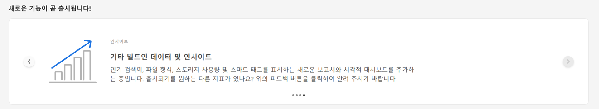
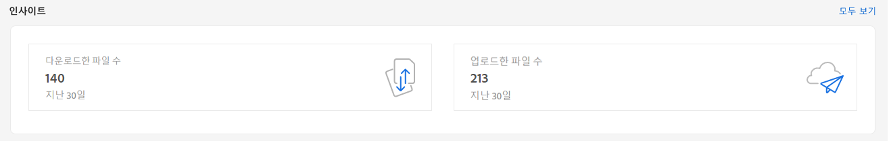
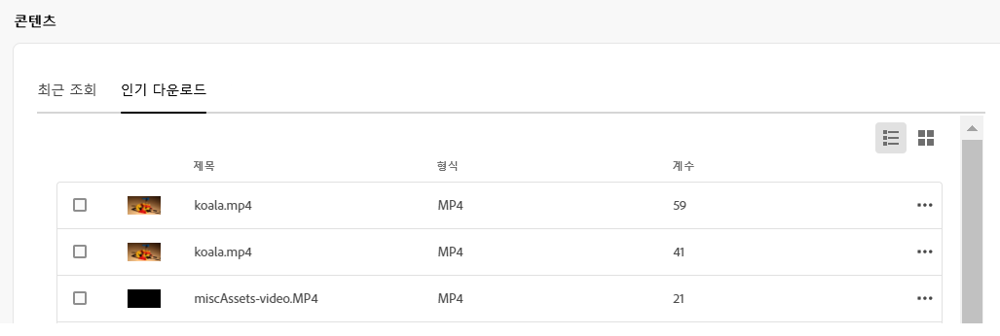
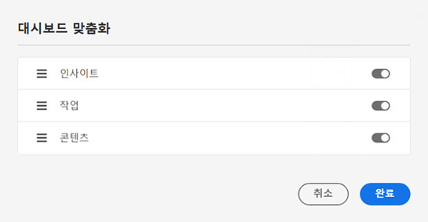

# 자산에 대한 내 작업 공간 {#my-workspace}

이제 자산에는 자산 사용자 인터페이스의 주요 영역과 가장 관련이 있는 정보에 편리하게 액세스할 수 있는 위젯을 제공하는 사용자 지정 가능한 작업 공간이 포함되어 있습니다. 이 페이지는 작업 항목에 대한 개요를 제공하고 주요 워크플로우에 빠르게 액세스할 수 있는 원스톱 솔루션 역할을 합니다. 이러한 옵션에 보다 간편하게 액세스하면 효율성과 컨텐츠 속도가 향상됩니다.

을 클릭하여 내 작업 공간에 액세스할 수 있습니다 **[!UICONTROL 내 작업 공간]** 왼쪽 탐색 창에서 사용할 수 있는 항목. 내 작업 공간에는 곧 출시될 새로운 기능, 통찰력, 작업 및 컨텐츠 위젯을 보여주는 다양한 위젯이 포함되어 있습니다. 환경 설정에 따라 작업 공간에 이러한 위젯이 표시되는 방식을 구성할 수 있습니다.

>[!NOTE]
>
>인사이트 위젯은 관리자만 볼 수 있습니다.

**곧 새로운 기능 제공**

자산에 대해 예정된 기능을 강조 표시합니다.

**인사이트**

관리자는 지난 30일 동안 자산 환경에서 수행된 다운로드 및 업로드 수에 대한 요약을 볼 수 있습니다. 을(를) 클릭합니다 **[!UICONTROL 모두 보기]** 를 클릭하여 보다 자세한 대시보드를 위한 통찰력 페이지로 빠르게 이동합니다.

**작업**

현재 사용자에게 할당된 작업 목록을 **[!UICONTROL 내 작업]** 탭에서 사용자가 만든 탭 **[!UICONTROL 할당된 작업]** 탭에서 작업을 수행하고, **[!UICONTROL 완료됨]** 탭. 작업을 선택하고 **[!UICONTROL 작업 완료]** 작업을 승인하거나 거부하려면 다음을 수행하십시오. 작업을 선택하고 **[!UICONTROL 작업 세부 정보 열기]** 작업을 보고 승인, 거부, 편집 또는 삭제하려면

>[!NOTE]
>
> 다음 **[!UICONTROL 작업 할당]** 자산을 선택하거나 자산 정보 보기를 열 때 자산에 대한 작업을 다른 사용자에게 할당하는 옵션을 사용할 수 있습니다.

**컨텐트**

최근에 본 자산 목록을 포함하여 자산의 여러 가지 보기를 표시합니다. 목록 보기, 그리드 보기, 갤러리 보기 또는 워터폴 보기에서 위젯에 자산을 표시하도록 선택하고, 이름, 크기 및 수정된 날짜별로 자산을 정렬할 수 있습니다. 자산을 선택하여 자산 세부 사항을 보거나 최근에 본 자산 목록에서 제거할 수도 있습니다.

## 내 작업 공간 사용자 지정 {#configure-widgets}

모든 위젯은 기본적으로 표시되지만 내 작업 공간에 표시되는 위젯을 활성화하거나 비활성화할 수 있습니다. 환경 설정은 각 사용자에 따라 다릅니다.

1. 클릭 **[!UICONTROL 내 작업 공간]** 왼쪽 탐색 창에서 사용할 수 있고 **[!UICONTROL 사용자 지정]**.

1. 작업 공간에 표시할 필요가 없는 위젯에 대한 토글 기능을 해제합니다. 위젯을 적절한 위치로 끌어다 놓아 Workspace에서 위젯의 표시 순서를 업데이트할 수도 있습니다.

1. 클릭 **[!UICONTROL 완료]** 변경 사항을 저장하려면 을 클릭합니다.

   
