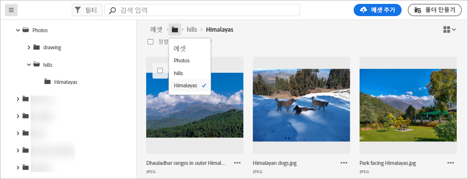
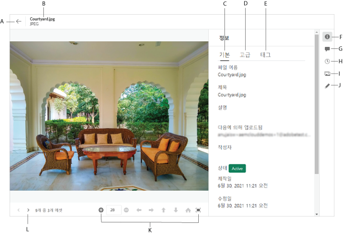

# 파일 및 폴더로 이동하고 자산을 봅니다 {#view-assets-and-details}

<!-- TBD: Give screenshots of all views with many assets. Zoom out to showcase how the thumbnails/tiles flow on the UI in different views. -->

<!-- TBD: The options in left sidebar may change. Shared with me and Shared by me are missing for now. Update this section as UI is updated. -->

## 이해 [!DNL Assets Essentials] 사용자 인터페이스 {#understand-interface-navigation}

[!DNL Assets Essentials] 은 직관적이고 사용자에게 친숙한 사용자 인터페이스를 제공합니다. 깨끗한 인터페이스를 통해 자산 및 관련 정보를 쉽게 찾고 기억할 수 있습니다.

로그인할 때 [!DNL Assets Essentials], 다음 인터페이스가 표시됩니다.

<!-- TBD: Update this screenshot. Remove top bar. Remove 2 labels from top bar. -->

![[!DNL Assets Essentials] 사용자 인터페이스](assets/essentials-interface1.png)

*그림: 로그인 후 첫 번째 화면과 주요 기능의 위치.*
    *A: 왼쪽 사이드바를 사용하여 저장소를 찾고 다른 몇 가지 옵션에 액세스할 수 있습니다.*
    *B: 왼쪽 사이드바를 표시하거나 축소하여 자산 보기 영역을 늘립니다.*
    *C: 검색 결과를 필터링합니다.*
    *D: 검색 상자.*
    *E: 자산을 정렬하는 옵션.*
    *F: 제품 피드백을 제공합니다.*
    *G: 사용자 환경 설정을 편집하거나 로그아웃합니다.*
    *H: 다른 보기 간에 전환합니다.*

<!-- TBD: Need an embedded video here with narration. It has to be hosted on MPC to be embeddable. -->

## 자산 및 폴더 찾아보기 및 보기 {#browse-repository}

기본 사용자 인터페이스 또는 왼쪽 사이드바에서 폴더를 찾을 수 있습니다. 탐색 시 인터페이스를 사용하여 자산 축소판을 보고 저장소를 시각적으로 찾아보거나 자산 세부 사항을 보고 원하는 자산을 빠르게 찾을 수 있습니다. 왼쪽 사이드바에서 사용할 수 있는 옵션은 다음과 같습니다.

* **자산**: 액세스 권한이 있는 트리 뷰의 모든 폴더 목록입니다.
* **최근에 본 항목**: 최근에 미리 본 자산 목록입니다. [!DNL Assets Essentials] 미리 보는 자산만 표시합니다. 저장소 파일 또는 폴더를 검색할 때 스크롤한 자산이 표시되지 않습니다.
* **휴지통**:

<!-- TBD: Not sure if we want to publish these right now. CC Libs are beta as per Greg.
* **Libraries**: Access to [!DNL Adobe Creative Cloud Team] (CCT) Libraries view. This view is visible only if the user is entitled to CCT Libraries.
-->

<!-- TBD: My Work Space shows task inbox and it is not visible on AEM Cloud Demos as of now. It is the source of truth server hence not documenting My Work Space option for now.
-->

왼쪽 사이드바를 열거나 축소하여 사용 가능한 자산 보기 영역을 늘릴 수 있습니다.

in [!DNL Assets Essentials]이렇게 하면 자산, 폴더 및 검색 결과를 4가지 유형의 레이아웃으로 볼 수 있습니다.

*  [!UICONTROL List View]
*  [!UICONTROL Grid View]
*  [!UICONTROL Gallery View]
*  [!UICONTROL Waterfall View]

자산을 찾으려면 자산을 의 오름차순이나 내림차순으로 정렬할 수 있습니다. `Name`, `Relevancy`, `Size`, `Modified`, 및 `Created`.

폴더로 이동하려면 폴더의 축소판을 두 번 클릭하거나 왼쪽 사이드바에서 폴더를 선택합니다. 폴더의 세부 사항을 보려면 해당 폴더를 선택하고 맨 위의 도구 모음에서 세부 정보 를 클릭합니다. 계층 구조를 위아래로 탐색하려면 왼쪽 사이드바를 사용하거나 맨 위에 있는 탐색 표시를 사용합니다.

*그림: 계층을 찾아보려면 왼쪽 사이드바의 탐색 표시를 사용합니다.*

## 자산 미리 보기 {#preview-assets}

자산을 사용, 공유 또는 다운로드하기 전에 보다 밀접하게 볼 수 있습니다. 미리 보기 기능을 사용하면 이미지뿐만 아니라 지원되는 몇 가지 다른 자산 유형을 볼 수 있습니다.

자산을 미리 보려면 자산을 선택하고 을(를) 클릭합니다 [!UICONTROL Details]  를 클릭합니다. 자산을 볼 수 있을 뿐만 아니라 세부 메타데이터를 보고 다른 작업을 수행할 수도 있습니다.

*A: 저장소의 현재 폴더 또는 현재 검색 결과로 돌아갑니다.*
*B: 미리 보고 있는 파일의 이름과 형식입니다.*
*C: 기본 메타데이터.*
*D: 고급 메타데이터.*
*E: 키워드 및 스마트 태그.*
*F: 자산을 미리 보고 메타데이터 정보를 참조하십시오.*
*G: 주석 및 주석 달기*
*H: 버전을 보고 관리합니다.*
*I: 이미지의 렌디션을 봅니다.*
*J: 이미지를 편집합니다.*
*K: 자세히 미리 봅니다. 확대/축소, 전체 화면 및 기타 옵션.*
*L: 폴더로 돌아가지 않고 현재 폴더의 이전 또는 다음 자산으로 진행합니다.*

비디오를 미리 볼 수도 있습니다.

자산을 명시적으로 미리 보는 경우, [!DNL Assets Essentials] 최근에 본 자산으로 표시합니다.

<!-- TBD: Describe the options.

Explicitly previewed assets are displayed as recently viewed assets. Give screenshot of this.
Other use cases after previewing.
-->

>[!MORELIKETHIS]
>
>* [자산의 버전 보기](/help/manage-organize.md#view-versions).

