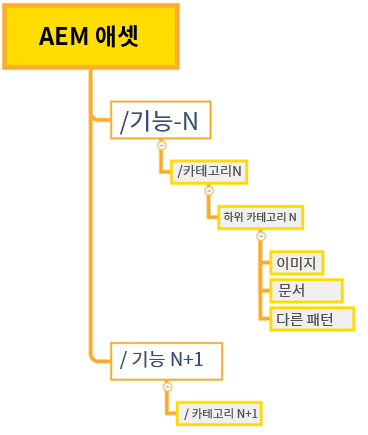
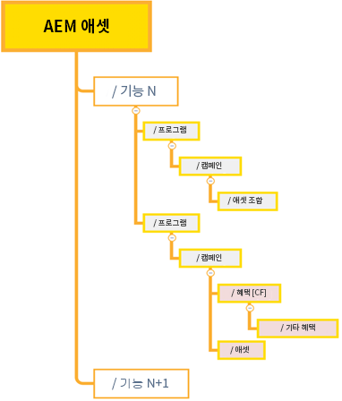
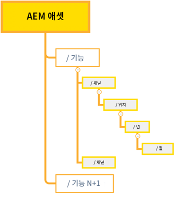

# 효율적인 권한 관리에 대한 모범 사례 {#best-practices-permissions-management}

Assets Essentials 저장소에 대한 폴더 권한을 관리하기에 앞서, 관리자는 관리자와 최종 사용자가 나중에 작업을 관리하는 동안 인프라를 직관적으로 사용할 수 있도록 구현할 수 있는 다양한 모범 사례를 확인할 수 있습니다.

다음과 같은 작업에서 이러한 모범 사례를 통합할 수 있습니다.

* [Admin Console에 사용자 그룹 생성](#admin-console-best-practices)

* [Assets Essentials 저장소에 폴더 구조 생성](#folder-structure-assets-essentials)

* [Assets Essentials 저장소에서 권한 관리](#folder-permissions)

## Admin Console {#admin-console-best-practices}

귀사의 사용자 그룹에 따라 액세스 요구 사항을 식별합니다. 귀사에 대한 사용자 그룹을 계획 및 생성하고 해당 사용자 그룹에 사용자를 할당합니다. 개인 사용자가 아닌 사용자 그룹을 기준으로 하면 폴더 권한을 더욱 손쉽게 관리할 수 있습니다.

## Assets Essentials 저장소에 대한 폴더 구조 {#folder-structure-assets-essentials}

Assets Essentials 저장소에 폴더 구조를 생성할 때에는 다음 사항을 고려하십시오.

* 향후 거버넌스: 관리자가 제어하는 폴더 및 [다른 사용자에게 소유자로 권한이 위임된](manage-permissions.md##manage-permissions-folders) 폴더

* 확장 가능성: 폴더 구조는 귀사의 향후 요구 사항을 준수해야 하며 확장이 용이해야 합니다.

* 크기: 폴더는 너무 많은 에셋을 포함할 수 없습니다. 그렇지 않으면 가용성 문제가 발생할 수 있으며 관리가 어려워질 수 있습니다.

* 직관성: 폴더 구조는 최종 사용자가 검색하기 쉽고 직관적이어야 합니다. 사용자는 폴더 구조에서 새 에셋을 업로드할 위치를 쉽게 식별할 수 있어야 합니다.

귀사에 사용할 수 있는 폴더 구조 유형에는 여러 가지가 있습니다. 다음은 일반적인 폴더 구조의 몇 가지 예입니다.

* 기능 및 분류 기반

   

* 캠페인 기반

   

* 오퍼 위치(또는 채널) 기반

   

## 폴더 권한 {#folder-permissions}

귀사에 대한 사용자 그룹을 생성하고, 해당 사용자 그룹에 사용자를 추가하고, Assets Essentials 저장소에 귀사의 요구 사항에 부합하는 폴더 구조를 선택 및 생성한 후에는 귀사에 대한 폴더 권한을 관리할 수 있습니다. 폴더 권한을 관리할 때에는 다음 사항을 고려하십시오.

* 개인 사용자가 아닌 사용자 그룹에 대한 권한을 적용합니다. 이렇게 하면 권한 구조를 더 간단하고 효율적으로 관리할 수 있습니다.

* 운영 효율성을 위해 권한 구조를 최대한 간단하게 합니다.

* 폴더 구조에 [액세스 거부] 권한을 신중하게 사용하고 되도록 긍정적인 권한(편집 가능, 보기 가능, 소유자)를 적용합니다.

폴더 구조를 효율적이고 간단하게 하는 방법에 대한 예는 [폴더 권한 관리](manage-permissions.md##manage-permissions-folders)를 참조하십시오.

## 다음 단계 {#next-steps}

* 을 사용하여 제품 피드백을 제공합니다. [!UICONTROL 피드백] Assets Essentials 사용자 인터페이스에서 사용할 수 있는 옵션

* 을 사용하여 설명서 피드백 제공 [!UICONTROL 이 페이지 편집]  또는 [!UICONTROL 문제 기록]  오른쪽 사이드바에서 사용할 수 있습니다.

* 연락처 [고객 지원 센터](https://experienceleague.adobe.com/?support-solution=General#support)
