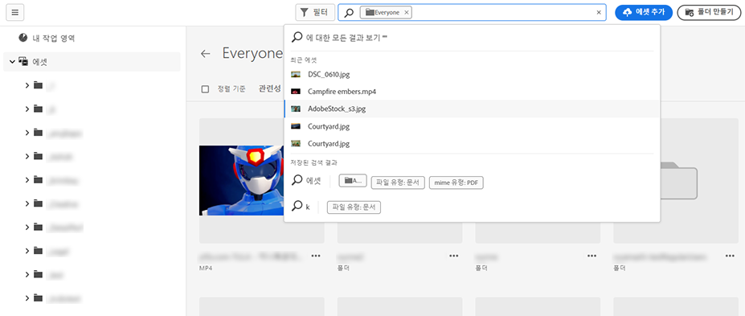
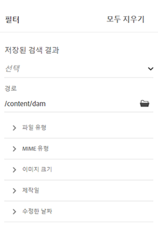
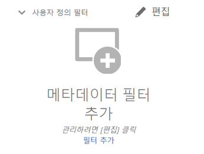
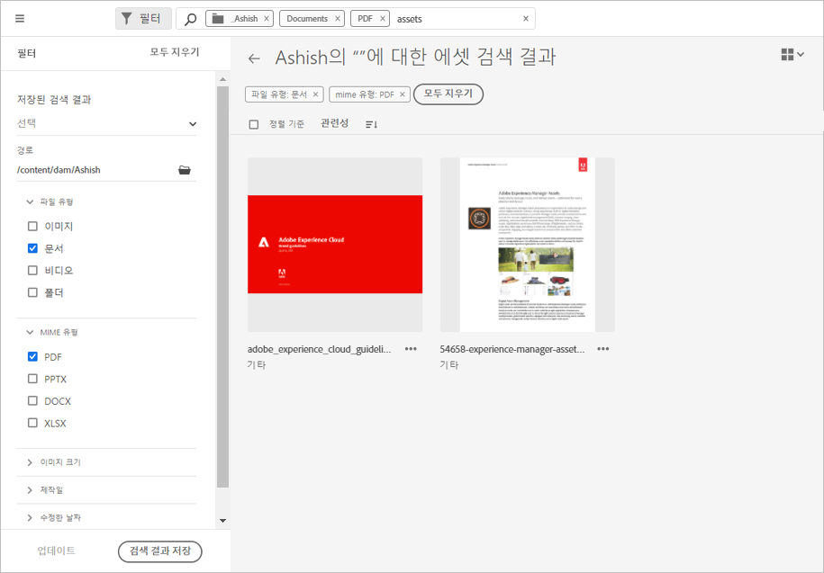

# [!DNL Assets Essentials]에서 에셋 검색 {#search-assets}

[!DNL Assets Essentials]는 기본적으로 작동하는 효과적인 검색 기능을 제공합니다. 검색 기능은 전체 텍스트 검색이므로 포괄적입니다. 강력한 검색 기능을 통해 적절한 에셋을 빠르게 찾고 콘텐츠 속도를 높일 수 있습니다. [!DNL Assets Essentials]는 스마트 태그, 제목, 생성 날짜 및 저작권과 같은 메타데이터를 통해 전체 텍스트 검색 및 다중 검색 기능을 제공합니다.

에셋을 검색하려면

* 페이지 상단의 검색 상자를 클릭합니다. 기본적으로 현재 탐색 중인 폴더 내에서 검색됩니다. 다음 중 하나를 수행하십시오.

   

   * 키워드를 사용하여 검색하고 필요한 경우 폴더를 변경합니다. Return 키를 누릅니다.

   * 직접 검색하여 최근에 본 에셋으로 작업을 시작하십시오. 검색 상자를 클릭하고 제안에서 최근에 본 에셋을 선택합니다.

## 검색 결과 필터링 {#refine-search-results}

다음 매개변수를 기반으로 검색 결과를 필터링할 수 있습니다.

*그림: 다양한 매개변수를 기반으로 검색된 에셋을 필터링합니다.*

* 에셋 상태: `Approved` 또는 `Rejected` 에셋 상태를 사용하여 검색 결과를 필터링합니다.

* 파일 형식: 지원되는 파일 형식(`Images`, `Documents` 및 `Videos`)으로 검색 결과를 필터링합니다.
* MIME 유형: 지원되는 파일 형식 중 하나 이상을 필터링합니다. <!-- TBD:  [supported file formats](/help/supported-file-formats.md). -->
* 이미지 크기: 이미지를 필터링할 최소 및 최대 크기 중 하나 이상을 제공합니다. 크기는 픽셀 단위의 치수로 제공되며 이는 이미지의 파일 크기가 아닙니다.
* 생성 날짜: 메타데이터에 입력된 에셋 생성 날짜입니다. 사용되는 표준 날짜 형식은 `yyyy-mm-dd`입니다.
* 수정 날짜: 에셋이 마지막으로 수정된 날짜입니다. 사용되는 표준 날짜 형식은 `yyyy-mm-dd`입니다.

검색된 에셋을 `Name`, `Relevancy`, `Size`, `Modified` 및 `Created`의 오름차순 또는 내림차순으로 정렬할 수 있습니다.

## 맞춤형 필터 관리 {#custom-filters}

**필요한 권한:**  `Can Edit`, `Owner` 또는 관리자.

Assets Essentials를 사용하면 사용자 인터페이스에 맞춤형 필터를 추가할 수도 있습니다. 그런 다음 [표준 필터](#refine-search-results) 외에 이러한 맞춤형 필터를 적용하여 검색 결과를 구체화할 수 있습니다.

Assets Essentials는 다음과 같은 맞춤형 필터를 제공합니다.

<table>
    <tbody>
     <tr>
      <th><strong>맞춤형 필터 이름</strong></th>
      <th><strong>설명</strong></th>
     </tr>
     <tr>
      <td>제목</td>
      <td>에셋 제목을 사용하여 에셋을 필터링합니다. 대/소문자 구분 검색 기준에 지정하는 제목은 결과에 표시할 에셋의 정확한 제목과 일치해야 합니다.</td>
     </tr>
     <tr>
      <td>이름</td>
      <td>에셋 필터 이름을 사용하여 에셋을 필터링합니다. 대/소문자 구분 검색 기준에 지정하는 이름은 결과에 표시할 에셋의 정확한 파일 이름과 일치해야 합니다.</td>
     </tr>
     <tr>
      <td>에셋 크기</td>
      <td>결과에 표시할 에셋의 검색 기준에서 크기 범위를 바이트 단위로 정의하여 에셋을 필터링합니다.</td>
     </tr>
     <tr>
      <td>예측된 태그</td>
      <td>에셋 스마트 태그를 사용하여 에셋을 필터링합니다. 대/소문자 구분 검색 기준에 지정하는 스마트 태그 이름은 결과에 표시할 에셋의 정확한 스마트 태그 이름과 일치해야 합니다. 검색 기준에 여러 스마트 태그를 지정할 수 없습니다.</td>
     </tr>    
    </tbody>
   </table>

### 맞춤형 필터 추가 {#add-custom-filters}

맞춤형 필터를 추가하려면:

1. **[!UICONTROL 필터]**&#x200B;를 클릭합니다.

1. **[!UICONTROL 맞춤형 필터]** 섹션에서 **[!UICONTROL 편집]** 또는 **[!UICONTROL 필터 추가]**&#x200B;를 클릭합니다.

   

1. **[!UICONTROL 맞춤형 필터 관리]** 대화 상자의 기존 필터 목록에서 추가해야 하는 필터를 선택합니다. **[!UICONTROL 맞춤형 필터]**&#x200B;를 선택하여 모든 필터를 선택합니다.

1. **[!UICONTROL 확인]**&#x200B;을 클릭하여 사용자 인터페이스에 필터를 추가합니다.

### 맞춤형 필터 제거 {#remove-custom-filters}

맞춤형 필터를 제거하려면:

1. **[!UICONTROL 필터]**&#x200B;를 클릭합니다.

1. **[!UICONTROL 맞춤형 필터]** 섹션에서 **[!UICONTROL 편집]**&#x200B;을 클릭합니다.

1. **[!UICONTROL 맞춤형 필터 관리]** 대화 상자의 기존 필터 목록에서 제거해야 하는 필터를 선택 취소합니다.

1. **[!UICONTROL 확인]**&#x200B;을 클릭하여 사용자 인터페이스에서 필터를 제거합니다.

## 저장된 검색 {#saved-search}

검색 기능은 [!DNL Assets Essentials]에서 사용하기 매우 간단합니다. 검색 상자 내에서 키워드를 입력하고 Return 키를 눌러 결과를 볼 수 있을 뿐만 아니라 한 번의 클릭으로 최근 검색한 키워드를 빠르게 다시 검색할 수 있습니다.

메타데이터 및 에셋 유형에 대한 특정 기준에 따라 검색 결과를 필터링할 수도 있습니다. 자주 사용하는 필터의 경우 검색 경험을 개선하기 위해 [!DNL Assets Essentials]을 사용하여 검색 매개변수를 저장할 수 있습니다. 그런 다음 저장된 검색을 선택하여 한 번의 클릭으로 필터를 검색하고 적용할 수 있습니다.

저장된 검색을 생성하려면 일부 에셋을 검색하고 하나 이상의 필터를 적용한 다음 [!UICONTROL 필터] 패널에서 [!UICONTROL 검색 저장]을 클릭하십시오.

<!-- TBD: Search behavior. Full-text search. Ranking and rank boosts. Hidden assets.
Report poor UX that users can only save a filtered search and not a simple search.
.
Are other supported files fully indexed and support full-text search? Eg. audio/videos files can at best have metadata indexed.
Anything about ranking of assets displayed in search results?

What about temporarily hiding an asset (suspending search on it) from the search results? If an asset is undergoing review collaboration, should it be used by others? Should it be hidden in search?

When userA is searching and userB add an asset that matches search results, will the asset display in search as soon as userA refreshes the page? Assuming indexing is near real-time. May not be so for bulk uploads.
-->

## 다음 단계 {#next-steps}

* [Assets Essentials에서 자산을 검색하려면 비디오를 시청하십시오](https://experienceleague.adobe.com/docs/experience-manager-learn/assets-essentials/basics/using.html)

* 을 사용하여 제품 피드백을 제공합니다. [!UICONTROL 피드백] Assets Essentials 사용자 인터페이스에서 사용할 수 있는 옵션

* 을 사용하여 설명서 피드백 제공 [!UICONTROL 이 페이지 편집]  또는 [!UICONTROL 문제 기록]  오른쪽 사이드바에서 사용할 수 있습니다.

* 연락처 [고객 지원 센터](https://experienceleague.adobe.com/?support-solution=General#support)
