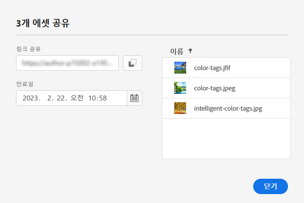
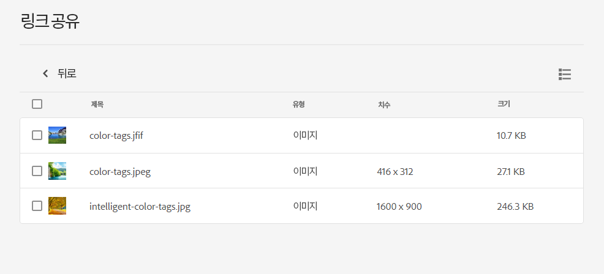

# 자산에 대한 링크 공유 {#share-links-assets}

[!DNL Assets Essentials] 링크를 생성하고 외부 이해 관계자와 자산을 공유할 수 있습니다 [!DNL Assets Essentials] 응용 프로그램. 다음을 항목을 정의할 수 있습니다.

* 링크의 만료 날짜

* 수신자가 링크에 액세스한 후 자산(원래 바이너리)을 다운로드할 수 있는 경우.

이러한 설정을 기반으로 링크의 수신자가 자산을 미리 보거나 다운로드하도록 선택할 수 있습니다.

## 자산에 대한 링크 생성 {#generate-link-for-assets}

자산 또는 자산이 들어 있는 폴더에 대한 링크를 생성하려면 다음을 수행합니다.

1. 자산이 들어 있는 자산 및/또는 폴더를 선택하고 을 클릭합니다 **[!UICONTROL Share Link]**.

1. 조정을 하려면 달력 아이콘을 클릭하여 링크를 사용하는 만료 날짜를 정의합니다 **[!UICONTROL Expiration Date]** 필드. 날짜를에서 직접 지정할 수도 있습니다 `yyyy-mm-dd` 형식 지정 기본적으로 링크의 만료 날짜는 공유일로부터 2주로 설정됩니다.

1. 선택 **[!UICONTROL Allow download]** 링크 수신자가 자산을 다운로드하도록 허용하기 위해.

1. 클릭 **[!UICONTROL Generate Link]**.

1. 클릭 **[!UICONTROL Copy Link]** 링크를 복사하려면 다음을 수행하십시오. 링크를 **[!UICONTROL Share Link]** 필드.

   

1. 클릭 **[!UICONTROL Close]** 전자 메일 또는 기타 공동 작업 도구를 사용하여 링크를 공유할 수 있습니다.

## 공유 자산에 액세스 {#access-shared-assets}

자산에 대한 공개 링크를 공유한 후 수신자는 링크를 클릭하여 로그인하지 않고도 웹 브라우저에서 공유 자산을 미리 보거나 다운로드할 수 있습니다 [!DNL Assets Essentials].

링크를 클릭하고 폴더를 클릭하여 자산으로 이동한 다음 자산을 클릭하여 미리 봅니다. 공유 자산을 목록 보기 또는 카드 보기에서 표시하도록 선택할 수 있습니다.

공유 자산 또는 공유 자산 폴더 위로 마우스를 가져가면 자산을 선택하거나 다운로드할 수 있습니다.

여러 자산을 선택하고 **[!UICONTROL Download]**. [!DNL Assets Essentials] 선택한 자산을 zip 파일로 다운로드합니다. [!DNL Assets Essentials] 다운로드할 각 자산에 대해 자산의 이름과 동일한 이름으로 상위 zip 파일에 하위 폴더를 만듭니다.

모든 자산을 한 번에 다운로드하려면 로 전환합니다. **[!UICONTROL List view]**&#x200B;를 클릭합니다. **[!UICONTROL Select all]** 을 클릭한 다음 **[!UICONTROL Download]**.

>[!NOTE]
>
>이 옵션을 활성화하지 않은 경우 [링크 생성](#share-links-assets) 자산에 대해 및 링크의 수신자가 자산을 다운로드하도록 선택하는 경우, [!DNL Assets Essentials] 빈 zip 파일을 다운로드합니다.

