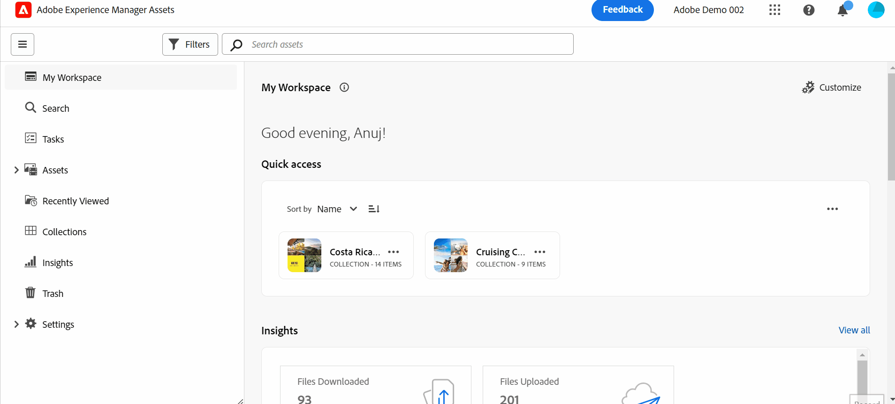

# 자산 보기 소개 {#assets-view}

실시간 콘텐츠 생성 및 전달이 필수적인 오늘날 디지털 중심의 빠른 환경에서는 다운스트림 마케팅 속도를 위해 설계된 DAM(디지털 에셋 관리) 경험이 무엇보다 중요합니다. Adobe은 마케팅 및 크리에이티브 전문가에게 권한을 부여하는 전문 지식을 활용하여 획기적인 새로운 Assets 보기 사용자 경험을 도입합니다. 이 워크플로우 우선 접근 방식은 기업이 동적 디지털 자산을 처리하는 방식을 혁신하여 마케터가 자산을 검색, 공동 작업, 개인화 및 전달하는 효율성을 극대화할 수 있도록 합니다. 이러한 간소화된 워크플로는 콘텐츠 속도를 가속화하고 마케팅 활동을 새로운 수준으로 향상시킵니다.

## 에셋 보기에 액세스하는 방법 {#access-assets-view}

다음과 같은 방법으로 자산 보기에 액세스할 수 있습니다.

* **관리자 보기에서 전환**

   * 에 로그인 [!DNL Experience Manager] cloud Manager 사용.
   * 다음으로 이동 **[!UICONTROL 에셋]** > **[!UICONTROL 파일]**.
   * 오른쪽 위 모서리에 있는 프로필 아이콘을 클릭합니다.
   * 클릭 **[!UICONTROL 보기 전환]** 다음에서 **[!UICONTROL 프로필 설정]** 섹션.
관리자 보기로 다시 전환하려면 이 단계를 반복합니다.

* **제품 전환기**
   * 에 로그인 [!DNL Experience Manager] 및 클릭
   * 선택 **[!UICONTROL Experience Manager Assets]** 을 클릭하여 자산 보기에 액세스합니다.
   * 선택 **[!UICONTROL Experience Manager]** 을 클릭하여 관리자 보기에 액세스합니다.

* **빠른 링크**
   * experience.adobe.com에 로그인합니다.
   * 클릭 **[!UICONTROL Experience Manager Assets]** 을 클릭하여 자산 보기에 액세스합니다.
   * 클릭 **[!UICONTROL Experience Manager Assets]** 을 클릭하여 자산 보기에 액세스합니다.

## 간소화된 경험을 제공하는 내 작업 영역 대시보드

다양한 조직 역할의 다양한 요구 사항을 이해하는 디지털 에셋 관리 솔루션에 대해 인사해 보십시오. 매끄러운 새 Assets 보기는 사용 편의성과 속도를 우선시하며 시각적 매력과 깔끔한 작업 공간에 대한 마케터의 선호도를 충족시킵니다. 마케터는 사용자 정의 가능한 사용자별 My Workspace 대시보드를 사용하여 탁월한 효율성으로 에셋을 빠르게 찾고, 미리 보고, 편집하고, 관리하고, 제공할 수 있습니다. 특정 자산을 찾는 데 오랜 시간이 소요된 것과 작별을 고하고 필요한 모든 것을 손쉽게 사용할 수 있는 간소화된 경험을 환영하십시오.

## 효율성 향상을 위한 검색 우선 접근 방식

최첨단 기능을 갖춘 검색의 힘으로 조직의 디지털 에셋 라이브러리의 잠재력을 최대한 활용하십시오. 수작업으로 수많은 파일과 폴더를 뒤지는 번거로움에 작별을 고할 수 있습니다. 모든 사용자는 멋진 마케팅 캠페인, 매력적인 프레젠테이션 및 매력적인 콘텐츠를 만드는 데 필요한 완벽한 이미지, 비디오 또는 문서를 즉시 찾을 수 있습니다. 당사의 검색 첫 번째 엔진을 사용하면 정확한 키워드를 알지 못하면서 자산 유형, 메타데이터, 스마트 태그 및 컨텐츠 자체까지 간편하게 탐색할 수 있습니다. Search-First를 통해 DAM의 미래를 수용하고 디지털 에셋 라이브러리의 모든 가능성을 최대한 활용하십시오.

## 데이터 기반 결정을 위한 통찰력 {#insights-data}

컨텐츠 속도에 발맞추기 위해서는 실행 가능한 통찰력이 필수적입니다. 새로운 자산 보기 경험은 내 작업 영역 내에서 고급 인사이트를 제공하며 자산 성능, 대상 사용 및 참여에 대한 중요한 데이터를 제공합니다. 마케터는 데이터 중심의 의사 결정을 내리고, 콘텐츠 전략을 최적화하고, 다운스트림 게재를 세분화하여 최적의 결과를 얻을 수 있습니다. 의미 있는 통찰력을 통해 기업이 경쟁에서 앞서나갈 수 있고 탁월한 결과를 이끌어낼 수 있습니다.

## 공동 작업 시간 단축 {#accelerate-collaboration}

새로운 경험은 내장된 Adobe Photoshop 기능, 버전 제어 및 주석 도구를 사용한 실시간 편집을 포함하여 강력한 협업 기능 세트를 제공합니다. 이를 통해 디자인, 크리에이티브, 브랜딩 및 마케팅 팀 간의 원활한 협업이 가능하므로 병목 현상을 극복하고 마케팅 운영 프로세스를 신속하게 진행할 수 있습니다. 이제 마케팅 담당자는 프로젝트 제공 시간을 단축하고 전반적인 생산성을 높일 수 있는 강력한 툴을 보유하게 되었습니다.

>[!VIDEO](https://video.tv.adobe.com/v/3420922)

