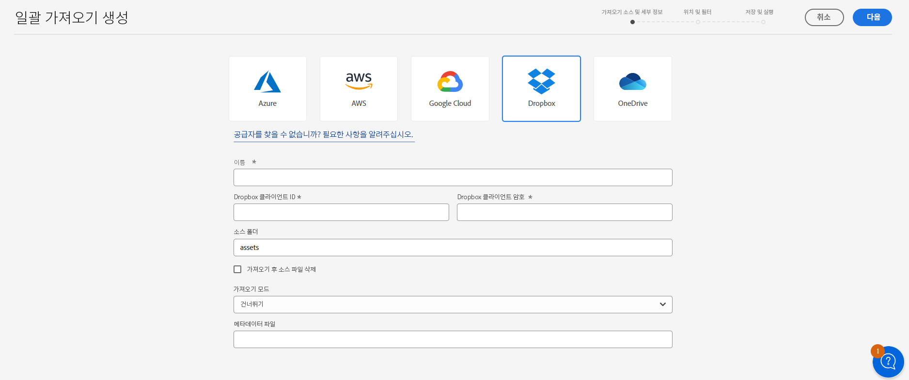

# Assets Essentials를 사용하여 자산 일괄 가져오기  {#bulk-import-essentials}

>[!CONTEXTUALHELP]
>id="assets_bulk_import"
>title="자산 일괄 가져오기"
>abstract="이제 관리자는 Assets Essentials를 사용하여 데이터 소스에서 Experience Manager Assets로 대량의 자산을 가져올 수 있습니다. 관리자는 더 이상 개별 자산 또는 폴더를 Experience Manager Assets에 업로드할 필요가 없습니다. 일괄 가져오기에 대해 지원되는 클라우드 스토리지 공급자로는 Azure, AWS, Google Cloud 및 Dropbox가 포함됩니다."

AEM Assets Essentials의 일괄 가져오기는 관리자에게 데이터 소스에서 AEM Assets로 수많은 자산을 가져올 수 있는 기능을 제공합니다. 관리자는 더 이상 개별 자산 또는 폴더를 AEM Assets에 업로드할 필요가 없습니다.

>[!NOTE]
>
>Assets Essentials 일괄 가져오기 도구는 Assets as a Cloud Service 일괄 가져오기 도구와 동일한 백엔드를 사용합니다. 그러나 Assets Essentials는 가져올 수 있는 더 많은 데이터 소스와 더욱 간소화된 사용자 경험을 제공합니다.

다음 데이터 소스에서 자산을 가져올 수 있습니다.

* Azure
* AWS
* Google Cloud
* Dropbox

## 사전 요구 사항 {#prerequisites}

| 데이터 소스 | 사전 요구 사항 |
|-----|------|
| Azure | <ul> <li>Azure 스토리지 계정 </li> <li> Azure Blob 컨테이너 <li> 인증 모드 기반의 Azure 액세스 키 또는 SAS 토큰 </li></ul> |
| AWS | <ul> <li>AWS 지역 </li> <li> AWS 버킷 <li> AWS 액세스 키 </li><li> AWS 액세스 암호 </li></ul> |
| Google Cloud | <ul> <li>GCP 버킷 </li> <li> GCP 서비스 계정 이메일 <li> GCP 서비스 계정 비공개 키</li></ul> |
| Dropbox | <ul> <li>Dropbox 클라이언트 ID </li> <li> Dropbox 클라이언트 보안</li></ul> |

데이터 소스 기반의 이러한 사전 요구 사항 외에도, AEM Assets로 가져와야 할 모든 자산이 포함된 데이터 소스에서 사용할 수 있는 소스 폴더 이름을 파악해야 합니다.

## 일괄 가져오기 구성 만들기 {#create-bulk-import-configuration}

일괄 가져오기 구성을 만들려면 다음 단계를 실행합니다.

1. **[!UICONTROL 설정]** > **[!UICONTROL 일괄 가져오기]**&#x200B;로 이동한 다음 **[!UICONTROL 가져오기 만들기]**&#x200B;를 클릭합니다.
1. 데이터 소스를 선택합니다. 사용 가능한 옵션에는 Azure, AWS, Google Cloud 및 Dropbox가 있습니다.
1. **[!UICONTROL 이름]** 필드에 일괄 가져오기 구성의 이름을 지정합니다.
1. [사전 요구 사항](#prerequisites)에서 언급한 대로 데이터 소스별 자격 증명을 지정합니다.
1. **[!UICONTROL 소스 폴더]** 필드에 데이터 소스의 자산이 포함된 루트 폴더의 이름을 입력합니다.
1. (선택사항) **[!UICONTROL 가져오기 후 소스 파일 삭제]** 옵션을 선택하여 파일을 Experience Manager Assets로 가져온 후에 소스 데이터 저장소에서 원본 파일을 삭제합니다.
1. **[!UICONTROL 가져오기 모드]**&#x200B;를 선택합니다. **[!UICONTROL 건너뛰기]**, **[!UICONTROL 바꾸기]** 또는 **[!UICONTROL 버전 만들기]**를 선택합니다. 건너뛰기 모드는 기본값이고, 자산이 이미 존재하는 경우 이 모드에서 수집기는 자산 가져오기를 건너뜁니다.
   

1. (선택 사항) 메타데이터 파일 필드에 CSV 형식으로 제공되는, 가져올 메타데이터 파일을 지정하고 **[!UICONTROL 다음]**&#x200B;을 클릭하여 **[!UICONTROL 위치 및 필터]**&#x200B;로 이동합니다.
1. **[!UICONTROL 자산 대상 폴더]** 필드를 사용하여 자산을 가져올 수 있는 DAM에 위치를 정의하려면 경로를 지정합니다. 예: `/content/dam/imported_assets`
1. (선택 사항) **[!UICONTROL 필터 선택]** 섹션에 자산의 최소 파일 크기(MB)를 제공하여 **[!UICONTROL 최소 크기로 필터링]** 필드의 수집 프로세스에 자산을 포함시킵니다.
1. (선택 사항) 자산의 최대 파일 크기(MB)를 제공하여 **[!UICONTROL 최대 크기로 필터링]** 필드의 수집 프로세스에 자산을 포함시킵니다.
1. (선택 사항) **[!UICONTROL MIME 유형 포함]** 필드를 사용하여 수집 프로세스에 포함할 MIME 유형을 선택합니다. 이 필드 내에서 여러 MIME 유형을 선택할 수 있습니다. 값을 정의하지 않은 경우 모든 MIME 유형이 수집 프로세스에 포함됩니다.

1. (선택 사항) **[!UICONTROL MIME 유형 제외]** 필드를 사용하여 수집 프로세스에 제외할 MIME 유형을 선택합니다. 이 필드 내에서 여러 MIME 유형을 선택할 수 있습니다. 값을 정의하지 않은 경우 모든 MIME 유형이 수집 프로세스에 포함됩니다.

   

1. **[!UICONTROL 다음]**&#x200B;을 클릭합니다. **[!UICONTROL 저장 및 가져오기 실행]**&#x200B;을 선택하여 구성을 저장하고 일괄 가져오기를 실행합니다. **[!UICONTROL 가져오기 저장]**&#x200B;을 선택하여 나중에 실행할 수 있도록 현재 구성을 저장합니다.

   

1. **[!UICONTROL 저장]**&#x200B;을 클릭하여 선택한 옵션을 실행합니다.

### 일괄 가져오기 도중 파일 이름 처리 {#filename-handling-bulkimport-assets-view}

자산이나 폴더를 대량으로 가져올 때 [!DNL Experience Manager Assets]는 가져오기 소스에 존재하는 전체 구조를 가져옵니다. [!DNL Experience Manager]는 자산 및 폴더 이름의 특수 문자에 대해 내장된 규칙을 따르므로 이러한 파일 이름을 정리해야 합니다. 폴더 이름과 자산 이름 모두 사용자가 정의한 제목은 변경되지 않으며 `jcr:title`에 저장됩니다.

일괄 가져오기 도중 [!DNL Experience Manager]는 자산과 폴더를 다시 가져오는 것을 방지하기 위해 기존 폴더를 찾고, 가져오기가 수행되는 상위 폴더에 적용된 정리 규칙도 확인합니다. 정리 규칙이 상위 폴더에 적용되면 가져오기 소스에도 동일한 규칙이 적용됩니다. 새로운 가져오기의 경우 자산 및 폴더의 파일 이름을 관리하기 위해 다음과 같은 정리 규칙이 적용됩니다.

허용되지 않는 이름, 자산 이름 처리, 일괄 가져오기 도중 폴더 이름 처리에 대한 자세한 내용은 [일괄 가져오기 도중 파일 이름 처리](https://experienceleague.adobe.com/docs/experience-manager-cloud-service/content/assets/manage/add-assets.html?lang=en#filename-handling-bulkimport)를 참조하십시오.

## 기존 일괄 가져오기 구성 보기 {#view-import-configuration}

구성을 만든 후 저장을 선택한 경우 구성이 **[!UICONTROL 저장된 가져오기]** 탭에 표시됩니다.

가져오기 저장 및 실행을 선택한 경우 가져오기 구성이 **[!UICONTROL 실행된 가져오기]** 탭에 표시됩니다.

가져오기를 예약한 경우 **[!UICONTROL 예약된 가져오기]** 탭에 표시됩니다.

## 일괄 가져오기 구성 편집 {#edit-import-configuration}

구성 세부 정보를 편집하려면 구성 이름에 해당하는 ...을 클릭하고 **[!UICONTROL 편집]**&#x200B;을 클릭합니다. 편집 작업을 수행하면서 구성 및 가져오기 데이터 소스의 제목을 편집할 수 없습니다. 실행된 가져오기 탭, 예약된 가져오기 탭 또는 저장된 가져오기 탭을 사용하여 구성을 편집할 수 있습니다.

## 일회성 가져오기 또는 반복 가져오기 예약 {#schedule-imports}

일회성 일괄 가져오기 또는 반복 일괄 가져오기를 예약하려면 다음 단계를 실행합니다.

1. **[!UICONTROL 실행된 가져오기]** 탭 또는 **[!UICONTROL 저장된 가져오기]** 탭에서 사용 가능한 구성 이름에 해당하는 ...을 클릭하고 **[!UICONTROL 예약]**&#x200B;을 클릭합니다. **[!UICONTROL 예약된 가져오기]** 탭으로 이동하고 **[!UICONTROL 예약]**&#x200B;을 클릭하여 기존 예약된 가져오기를 다시 예약할 수도 있습니다.

1. 일회성 수집을 설정하거나 매시간, 매일 또는 매주 단위로 일정을 예약합니다. **[!UICONTROL 제출]**&#x200B;을 클릭합니다.

   

## 가져오기 상태 검사 수행 {#import-health-check}

데이터 소스에 대한 연결을 확인하려면 구성 이름에 해당하는 ...을 클릭한 다음 **[!UICONTROL 확인]**&#x200B;을 클릭합니다. 정상적으로 연결되면 Experience Manager Assets에는 다음과 같은 메시지가 표시됩니다.

## 가져오기 실행 전에 시험 실행을 수행합니다. {#dry-run-bulk-import}

구성 이름에 해당하는 ...을 클릭하고 **[!UICONTROL 시험 실행]**&#x200B;을 클릭하여 일괄 가져오기 작업에 대한 테스트 실행을 호출합니다. Experience Manager Assets에는 일괄 가져오기 작업에 대한 다음 세부 정보가 표시됩니다.

## 일괄 가져오기 실행 {#run-bulk-import}

구성을 만드는 동안 가져오기를 저장한 경우 저장된 가져오기 탭으로 이동하고 구성 이름에 해당하는 ...을 클릭한 다음 **[!UICONTROL 실행]**&#x200B;을 클릭합니다.

마찬가지로 이미 실행된 가져오기를 실행해야 할 경우 실행된 가져오기 탭으로 이동하고 구성 이름에 해당하는 ...을 클릭한 다음 **[!UICONTROL 실행]**&#x200B;을 클릭합니다.

## 진행 중인 가져오기 중지 또는 예약 {#schedule-stop-ongoing-report}

가져오기 도중 일괄 가져오기 홈 페이지에 표시되는 일괄 가져오기 상태 대화 상자를 사용하여 진행 중인 일괄 가져오기를 예약하거나 중지할 수 있습니다.

또한 **[!UICONTROL 자산 보기]**&#x200B;를 클릭하여 대상 폴더에서 가져온 자산을 볼 수 있습니다.

## 일괄 가져오기 구성 삭제 {#delete-bulk-import-configuration}

**[!UICONTROL 실행된 가져오기]** 탭, **[!UICONTROL 예약된 가져오기]** 탭 또는 **[!UICONTROL 저장된 가져오기]** 탭에 있는 구성 이름에 해당하는 ...을 클릭하고 **[!UICONTROL 삭제]**&#x200B;를 클릭하여 일괄 가져오기 구성을 삭제합니다.

## 일괄 가져오기를 수행하고 자산으로 이동 {#view-assets-after-bulk-import}

일괄 가져오기 작업 실행 후 자산을 가져오는 자산 대상 위치를 보려면 구성 이름에 해당하는 ...을 클릭한 다음 **[!UICONTROL 자산 보기]**&#x200B;를 클릭합니다.
