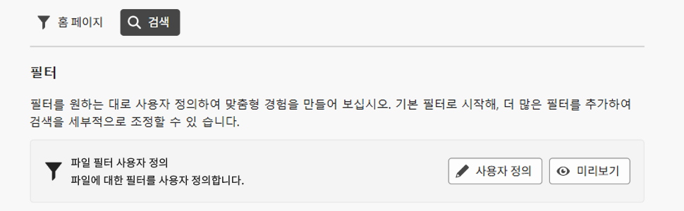
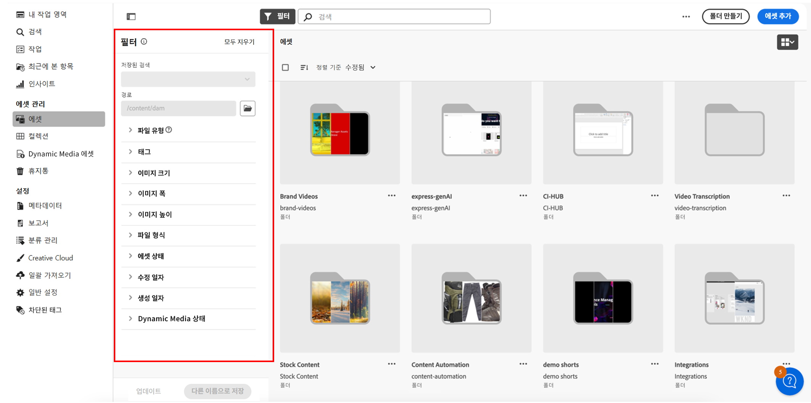

<table>
    <tr>
        <td>
            
            <a href="https://experienceleague.adobe.com/ko/docs/experience-manager-cloud-service/content/assets/dynamicmedia/dm-prime-ultimate"><b>Dynamic Media Prime 및 Ultimate</b></a>
        </td>
        <td>
            
            <a href="https://experienceleague.adobe.com/ko/docs/experience-manager-cloud-service/content/assets/assets-ultimate-overview"><b>AEM Assets Ultimate</b></a>
        </td>
        <td>
            
            <a href="http://experienceleague.adobe.com/en/docs/experience-manager-cloud-service/content/assets/integrate-aem-assets-edge-delivery-services"><b>Edge Delivery Services와 AEM Assets 통합</b></a>
        </td>
        <td>
            
            <a href="https://experienceleague.adobe.com/ko/docs/experience-manager-cloud-service/content/assets/assets-view/aem-assets-view-ui-extensibility"><b>UI 확장성</b></a>
        </td>
          <td>
            
            <a href="https://experienceleague.adobe.com/ko/docs/experience-manager-cloud-service/content/assets/dynamicmedia/dm-prime-ultimate"><b>Dynamic Media Prime 및 Ultimate 활성화</b></a>
        </td>
    </tr>
    <tr>
        <td>
            <a href="https://experienceleague.adobe.com/ko/docs/experience-manager-cloud-service/content/assets/best-practices/search-best-practices"><b>모범 사례 검색</b></a>
        </td>
        <td>
            <a href="https://experienceleague.adobe.com/ko/docs/experience-manager-cloud-service/content/assets/best-practices/metadata-best-practices"><b>메타데이터 모범 사례</b></a>
        </td>
        <td>
            <a href="https://experienceleague.adobe.com/ko/docs/experience-manager-cloud-service/content/assets/content-hub/product-overview"><b>Content Hub</b></a>
        </td>
        <td>
            <a href="https://experienceleague.adobe.com/ko/docs/experience-manager-assets-essentials/help/custom-search-filters"><b>OpenAPI 기능이 포함된 Dynamic Media</b></a>
        </td>
        <td>
            <a href="https://developer.adobe.com/experience-cloud/experience-manager-apis/"><b>AEM Assets 개발자 설명서</b></a>
        </td>
    </tr>
</table>

# 검색 필터 사용자 정의 {#customize-search-filters}

검색 필터를 사용하면 날짜, 파일 유형, 태그 및 관련성과 같은 다양한 매개변수를 기반으로 검색 결과를 구체화할 수 있으므로 검색 쿼리의 정확도가 높아집니다. 필터를 적용하면 가장 관련성이 높은 결과를 빠르게 빠르게 탐색할 수 있습니다. 이를 통해 시간을 절약할 수 있을 뿐만 아니라 결과를 특정 환경 설정 및 요구 사항에 맞게 맞춤화하여 전반적인 검색 경험을 향상할 수 있습니다.
[검색](search.md)에 대한 자세한 내용을 참조하십시오.

검색 필터 사용자 정의 AEM Assets은 검색 가능한 속성 인덱스의 항목에만 매핑될 수 있습니다. 사용자 정의 필터 경험을 구성하기 전에 모든 사용자 정의 메타데이터가 포함되어 있는지 확인해야 합니다. [!DNL Assets Essentials]는 검색 필터를 사용자 정의하여 검색 프로세스를 간소화하는 데 도움이 됩니다. AEM Assets 사용자 정의 검색 필터를 사용자 정의하려면 다음 단계를 수행합니다.

1. **[!UICONTROL 설정]** > **[!UICONTROL 일반 설정]**&#x200B;으로 이동합니다.
1. **[!UICONTROL 검색]** 탭으로 이동합니다. 검색 양식을 구성하려면 **[!UICONTROL 사용자 정의]**&#x200B;를 클릭합니다.

   

1. [!UICONTROL 필터 구성] 양식이 나타납니다. 템플릿에서 수정할 수 있도록 편집 모드에 있는지 확인합니다. 기존 검색 양식의 미리보기를 보려면 [!UICONTROL 미리보기 모드]로 전환할 수 있습니다.
1. 캔버스의 [사용자 정의 필터](#available-custom-filters)에서 필터 요소를 삭제합니다. 필요한 경우 구성 요소를 드래그하여 놓아 순서를 변경할 수 있습니다.

   >[!VIDEO](https://video.tv.adobe.com/v/3443080)

1. 변경 내용을 검토하려면 **[!UICONTROL 미리보기 모드]**&#x200B;를 클릭합니다.
1. **[!UICONTROL 확인]**&#x200B;을 클릭하여 저장합니다.

## 사용 가능한 사용자 정의 필터 {#available-custom-filters}

Assets Essentials는 요구 사항에 따라 재구성할 수 있는 다음과 같은 사용자 정의 필터를 제공합니다.

* [필터 요소](#filter-elements)
* [사전 구성된 필터](#preconfigured-filters)

### 필터 요소 {#filter-elements}

사용자 정의 필터 AEM Assets에서는 사용자 정의 검색 필터 캔버스에서 필터 요소의 컬렉션을 사용할 수 있습니다. 이러한 요소는 검색 속성의 속성값 활용 여부에 따라 재구성할 수 있습니다. 한편, 요구 사항에 따라 [필터 속성](#filter-properties)을 사용자 정의할 수도 있습니다. [!DNL Assets Essentials]에서 다음 필터 요소를 사용할 수 있습니다.

<table>
    <tr>
        <th>필터 요소</th>
        <th>설명</th>
        <th>속성</th>
    </tr>
    <tr>
        <td>텍스트</td>
        <td>텍스트 필드는 필터와 관련된 정보를 입력할 수 있는 입력 영역입니다.</td>
        <td>
            <ul>
                <li>레이블
                <li>메타데이터
                <li>값
                <li>설명
            </ul>
        </td>
    </tr>
    <tr>
        <td>옵션</td>
        <td>옵션은 사용 가능한 대안을 참조하여 목록에서 선호하는 항목을 선택합니다.</td>
        <td>
            <ul>
                <li>레이블
                <li>메타데이터
                <li>값
                <li>선택 사항
                <li>설명
            </ul>
        </td>
    </tr>
    <tr>
        <td>부울</td>
        <td>부울은 하나의 실제 값을 나타냅니다. 여러 옵션 중 특정 옵션 하나를 선택해야 할 때 사용할 수 있습니다.</td>
        <td>
            <ul>
                <li>레이블
                <li>메타데이터
                <li>설명
            </ul>
        </td>
    </tr>
    <tr>
        <td>숫자</td>
        <td>이 필터 요소를 사용하여 숫자 값을 나타냅니다.</td>
        <td>
            <ul>
                <li>레이블
                <li>메타데이터
                <li>선택 유형
                <li>스테퍼
                <li>스테퍼 값
                <li>설명
            </ul>
        </td>
    </tr>
    <tr>
        <td>드롭다운</td>
        <td>옵션 목록에 표시된 다양한 옵션 중에서 선택합니다.</td>
        <td>
            <ul>
                <li>레이블
                <li>메타데이터
                <li>선택 사항
                <li>값
                <li>설명
            </ul>
        </td>
    </tr>
    <tr>
        <td>날짜</td>
        <td>날짜를 지정하는 데 사용됩니다.</td>
        <td>
            <ul>
                <li>레이블
                <li>메타데이터
                <li>선택 유형
                <li>설명
            </ul>
        </td>
    </tr>
    <tr>
        <td>경로 브라우저</td>
        <td>Experience Manager 저장소의 파일 또는 폴더를 탐색하는 데 사용됩니다.</td>
        <td>
            <ul>
                <li>레이블
                <li>메타데이터
                <li>경로 탐색기
                <li>설명
            </ul>
        </td>
    </tr>
    <tr>
        <td>태그</td>
        <td>사용 가능한 옵션에서 태그를 선택하는 데 사용됩니다. 태그는 에셋에 대한 보다 구체적인 정보를 제공하고 검색 기능을 향상합니다. 선택한 에셋에 이미 적용된 태그는 <b>속성</b> 패널에 표시됩니다. 사용자 정의 메타데이터 속성에 태그를 저장하고 루트 경로를 사용하여 계층으로 제한하는 경우 검색 필터에서 동일한 구성을 활용할 수 있습니다. 관련 태그를 찾을 수 없는 경우 해당 태그를 만들어 선택한 에셋에 할당합니다. 에셋에 태그를 만들고 할당하는 방법에 대한 자세한 내용은 <a href = "/help/using/tagging-management.md">Assets Essentials의 태그 관리</a>를 참조하십시오.</td>
        <td>
            <ul>
                <li>레이블
                <li>메타데이터
                <li>태그 선택기
                <li>설명
            </ul>
        </td>
    </tr>
    <tr>
        <td>사용자</td>
        <td>관리자, 일반 사용자 및 소비자 사용자 간에 사용자 유형을 지정하는 데 사용됩니다.</td>
        <td>
            <ul>
                <li>레이블
                <li>메타데이터
                <li>설명
            </ul>
        </td>
    </tr>
</table>

### 사전 구성된 필터 {#preconfigured-filters}

사전 구성된 필터는 캔버스에서 직접 사용할 수 있도록 사전 설정된 설정입니다. 한편, 요구 사항에 따라 [필터 속성](#filter-properties)을 사용자 정의할 수도 있습니다. 다음 필터는 [!DNL Assets Essentials]에 사전 구성되어 있습니다.

<table>
    <tr>
        <th>사전 구성된 필터</th>
        <th>설명</th>
        <th>속성</th>
    </tr>
    <tr>
        <td>파일 유형</td>
        <td>지원되는 파일 유형인 '이미지', '문서', '비디오'를 기준으로 검색 결과를 필터링합니다.</td>
        <td>
            <ul>
                <li>레이블
                <li>메타데이터
                <li>선택 유형
                <li>선택 사항
                <li>값
                <li>설명
            </ul>
        </td>
    </tr>
    <tr>
        <td>파일 포맷</td>
        <td>Assets Essentials는 스토리지, 업로드, 복사, 이동, 삭제 및 메타데이터 추가와 같은 기본 서비스가 포함된 모든 바이너리 파일 유형을 지원합니다.</td>
        <td>
            <ul>
                <li>레이블
                <li>메타데이터
                <li>선택 유형
                <li>설명
            </ul>
        </td>
    </tr>
    <tr>
        <td>이미지 크기</td>
        <td>이미지를 필터링할 최소 및 최대 크기 중 하나 이상을 제공합니다. 크기는 픽셀 단위의 치수로 제공되며 이는 이미지의 파일 크기가 아닙니다.</td>
        <td>
            <ul>
                <li>레이블
                <li>메타데이터
                <li>선택 유형
                <li>스테퍼
                <li>스테퍼 값
                <li>설명
            </ul>
        </td>
    </tr>
    <tr>
        <td>이미지 폭</td>
        <td>이미지의 세로 치수입니다.</td>
        <td>
            <ul>
                <li>레이블
                <li>메타데이터
                <li>선택 유형
                <li>스테퍼
                <li>스테퍼 값
                <li>설명
            </ul>
        </td>
    </tr>
    <tr>
        <td>이미지 높이</td>
        <td>이미지의 가로 치수입니다.</td>
        <td>
            <ul>
                <li>레이블
                <li>메타데이터
                <li>선택 유형
                <li>스테퍼
                <li>스테퍼 값
                <li>설명
            </ul>
        </td>
    </tr>
    <tr>
        <td>생성된 일자</td>
        <td>에셋이 생성된 날짜 범위입니다.</td>
        <td>
            <ul>
                <li>레이블
                <li>메타데이터
                <li>선택 유형
                <li>설명
            </ul>
        </td>
    </tr>
    <tr>
        <td>수정일</td>
        <td>에셋이 수정된 날짜 범위입니다.</td>
        <td>
            <ul>
                <li>레이블
                <li>메타데이터
                <li>선택 유형
                <li>설명
            </ul>
        </td>
    </tr>
    <tr>
        <td>에셋 상태</td>
        <td>Assets Essentials를 사용하면 저장소에서 사용 가능한 에셋의 상태를 설정할 수 있습니다. 에셋 상태를 설정하여 디지털 에셋의 다운스트림 소비를 보다 효과적으로 관리합니다. <b>승인됨, 거부됨 또는 상태 없음</b> 중에서 선택합니다.</td>
        <td>
            <ul>
                <li>레이블
                <li>메타데이터
                <li>선택 유형
                <li>설명
            </ul>
        </td>
    </tr>
    <tr>
        <td>스마트 태그</td>
        <td>Experience Manager 저장소에 추가된 스마트 태그를 사용하여 에셋을 필터링합니다.</td>
        <td>
            <ul>
                <li>레이블
                <li>메타데이터
                <li>선택 유형
                <li>구분 문자 지원
                <li>설명
            </ul>
        </td>
    </tr>
    <tr>
        <td>Dynamic Media 상태</td>
        <td>게재됨 또는 게재 취소됨 중 에셋의 상태를 선택합니다.</td>
        <td>
            <ul>
                <li>레이블
                <li>메타데이터
                <li>선택 유형
                <li>선택 사항
                <li>값
                <li>설명
            </ul>
        </td>
    </tr>
    <tr>
        <td>만료일</td>
        <td>에셋이 더 이상 유효하지 않거나 필요하지 않은 날짜 범위를 지정하여 에셋을 필터링합니다. </td>
        <td>
            <ul>
                <li>레이블
                <li>메타데이터
                <li>선택 유형
                <li>설명
            </ul>
        </td>
    </tr>
    <tr>
        <td>태그(분류)</td>
        <td>태그를 사용하여 디지털 에셋을 정리 및 분류하는 시스템으로, 본질적으로 키워드의 계층 구조를 만들어 사용자가 각 에셋에 특정 태그를 적용함으로써 관련 콘텐츠를 쉽게 검색하고 찾을 수 있도록 지원합니다. </td>
        <td>
            <ul>
                <li>레이블
                <li>메타데이터
                <li>태그 선택기
                <li>설명
            </ul>
        </td>
    </tr>
</table>

#### 필터 속성 {#filter-properties}

각 필터 요소는 속성 세트와 연결됩니다. AEM Assets 검색 필터 사용자 정의는 필터 및 사전 구성된 요소에서 다음 속성을 사용합니다.

<table>
    <tr>
        <th>속성</th>
        <th>값</th>
        <th>설명</th>
    </tr>
    <tr>
        <td>레이블</td>
        <td>텍스트</td>
        <td>사용 중인 필터의 식별자입니다.</td>
    </tr>
    <tr>
        <td>메타데이터</td>
        <td>드롭다운</td>
        <td>메타데이터 속성은 Adobe Experience Manager Assets 저장소에서 승인된 메타데이터를 매핑하는 데 사용됩니다. 드롭다운 메뉴에서 필터 요소와 매핑해야 하는 메타데이터 값을 선택할 수 있습니다. </td>
    </tr>
    <tr>
        <td>선택 유형</td> 
        <td>단일, 다수, 정확 또는 범위 </td>
        <td>
            <ul>
                <li><b>단일 선택</b>을 통해 한 번에 하나의 항목을 선택할 수 있으므로 서로 다른 항목을 선택하는 데 적합합니다.
                <li><b>다수 선택</b>을 사용하면 여러 항목을 동시에 선택할 수 있으므로 여러 옵션을 선택하는 데 유용합니다. 
                <li><b>정확 선택</b>을 통해 다양한 옵션에서 정확한 단일 항목을 선택할 수 있습니다.
                <li><b>범위 선택</b>을 통해 정의된 범위 내에서 연속적인 값 집합을 선택할 수 있습니다. 날짜 범위 또는 숫자 값을 선택하는 데 유용합니다.
            </ul>
        </td>   
    </tr>
    <tr>
        <td>선택 사항</td>
        <td>수동, JSON 경로 또는 CSV 업로드</td>
        <td>
            <ul>
                <li>옵션을 수동으로 추가하려면 <b>수동</b>을 선택합니다. 
                <li>JSON 파일에서 옵션을 추가하려면 <b>JSON 경로</b>를 선택합니다. 
                <li>옵션에 추가할 값이 포함된 CSV 파일을 가져오려면 <b>CSV 업로드</b>를 선택합니다.
            </ul>
        </td>
    </tr>
    <tr>
       <td>값</td>
        <td>추가 또는 편집</td>
        <td>
        <ul>
        <li>새 값을 추가하려면 <b>추가</b>를 클릭합니다. 
        <li>레이블을 편집하려면 ✎을 클릭합니다. 
        <li>옵션 값을 삭제하려면 ??를 클릭합니다. 
        <li>편집 옵션을 수정하려면 <b>편집</b>을 클릭합니다. 
        <li>옵션을 유지한 채 옵션 순서를 변경할 수도 있습니다.
        </td>
    </tr>
    <tr>
        <td>구분 문자 지원</td>
        <td>활성화 또는 비활성화</td>
        <td>구분 문자는 텍스트에서 개별 요소를 구분하는 데 사용되는 기호입니다. 예를 들면 쉼표, 공백 또는 세미콜론이 있습니다.</td>
    </tr>
    <tr>
        <td>스테퍼</td>
        <td>값</td>
        <td>숫자 입력 필드에 스테퍼 버튼을 활성화하면 클릭할 때마다 값이 증가하거나 감소합니다. </td>
    </tr>
    <tr>
        <td>스테퍼 값 </td>
        <td>숫자</td>
        <td>스테퍼 버튼을 사용할 때 증가/감소 값을 나타냅니다.. 스테퍼가 활성화되면 나타납니다.</td>
    </tr>
    <tr>
        <td>설명</td>
        <td>텍스트</td>
        <td>자세한 설명을 추가하여 필터 요소에 대한 추가 정보를 제공합니다.</td>
    </tr>
</table>

## 필터 요소 삭제 {#delete-a-filter-element}

검색 필터를 삭제하려면 다음 단계를 수행합니다.

1. **[!UICONTROL 설정]** > **[!UICONTROL 일반 설정]**&#x200B;으로 이동합니다.
1. **[!UICONTROL 검색]** 탭으로 이동합니다. 검색 양식을 구성하려면 **[!UICONTROL 사용자 정의]**&#x200B;를 클릭합니다.
1. [!UICONTROL 필터 구성] 양식이 나타납니다. 템플릿에서 수정할 수 있도록 편집 모드에 있는지 확인합니다.
1. 삭제할 필터 요소를 선택합니다. 예를 들면 **[!UICONTROL 이미지 높이]**&#x200B;를 선택합니다.
1. 필터 요소를 삭제하려면 **[!UICONTROL 카테고리 삭제]**&#x200B;를 클릭합니다. **[!UICONTROL 이미지 높이]** 요소가 캔버스에서 제거되었습니다.
1. 양식을 저장하려면 **[!UICONTROL 확인]**&#x200B;을 클릭합니다.

## 사용자 정의 검색 필터 사용{#using-custom-search-filters}

검색 필터를 구성한 후 이를 사용하여 저장소 내의 에셋을 검색할 수 있습니다.

>[!MORELIKETHIS]
>
>* [에셋 검색](/help/using/search.md)
