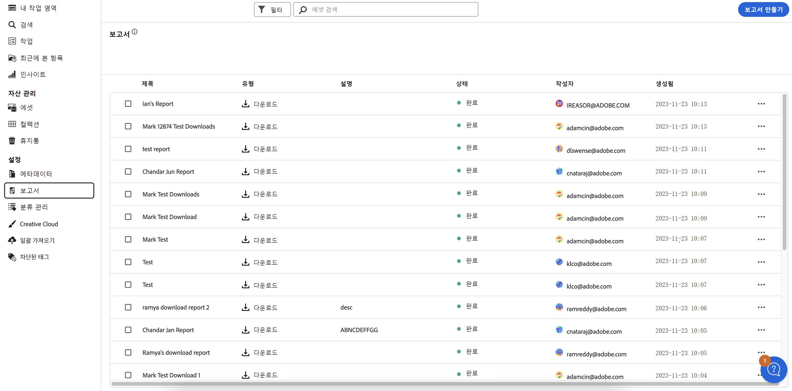
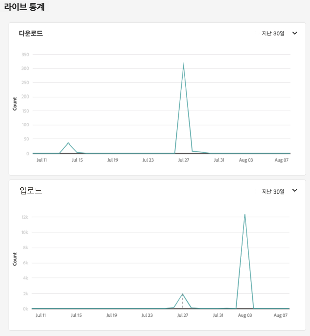
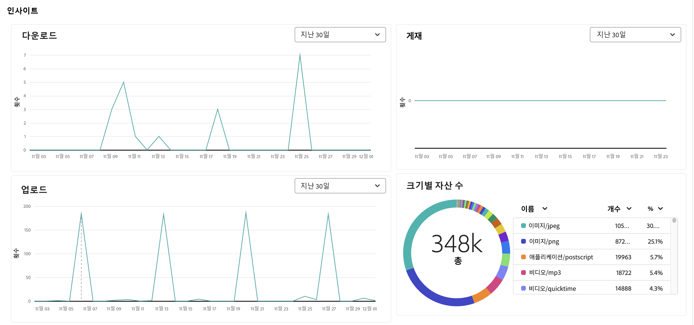
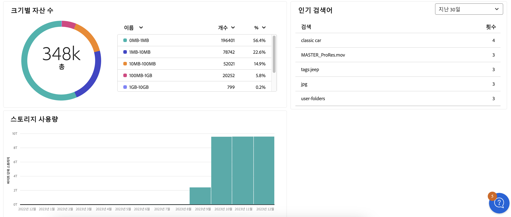

# 보고서 관리 {#manage-reports}

자산 보고는 관리자가 Adobe Experience Manager Assets Essentials 환경의 활동을 볼 수 있도록 합니다. 이 데이터는 사용자가 콘텐츠 및 제품과 상호 작용하는 방법에 대한 유용한 정보를 제공합니다. 모든 사용자는 인사이트 대시보드에 액세스할 수 있으며 관리자 제품 프로필에 할당된 사용자는 사용자 정의 보고서를 만들 수 있습니다.

## 보고서 액세스 {#access-reports}

[Assets Essentials 관리자 제품 프로필](deploy-administer.md)에 할당된 모든 사용자는 인사이트 대시보드에 액세스하거나 Assets Essentials에서 사용자 정의 보고서를 만들 수 있습니다.

보고서에 액세스하려면 **[!UICONTROL 설정]** 아래의 **[!UICONTROL 보고서]**&#x200B;로 이동합니다.

<!--
In the **[!UICONTROL Reports]** screen, various components are shown in the tabular format which includes the following:

* **Title**: Title of the report
* **Type**: Determines whether the report is uploaded or downloaded to the repository
* **Description**: Provide details of the report that was given during uploading/downloading the report
* **Status**: Determines whether the report is completed, under progress, or deleted.
* **Author**: Provides email of the author who has uploaded/downloaded the report.
* **Created**: Gives information of the date when the report was generated.
-->

## 보고서 만들기 {#create-report}

AEM Assets Essentials 환경은 보고서 대시보드를 통해 포괄적인 보고 기능을 제공합니다. 이 기능을 통해 사용자는 지정된 기간(일회성부터 매일, 매주, 매월 또는 매년까지) 내에서 자산 업로드 및 다운로드에 대한 세부 정보를 보여 주는 CSV 보고서를 생성하고 다운로드할 수 있습니다.

**보고서를 만들려면 다음 작업을 수행하십시오.**

1. **보고서**&#x200B;로 이동하고 **보고서 만들기**(오른쪽 상단)를 클릭합니다. **보고서 만들기** 대화 상자에 아래와 같은 필드가 표시됩니다.
   

   **구성 탭:**

   1. **보고서 유형:** [!UICONTROL 업로드] 또는 [!UICONTROL 다운로드] 보고서 유형 중에서 선택합니다.
   1. **제목:** 보고서에 제목을 추가합니다.
   1. **설명:** 원하는 경우 보고서에 설명을 추가합니다.
   1. **폴더 경로 선택:** 특정 폴더 내에서 업로드 및 다운로드된 자산에 대한 보고서를 생성할 폴더 경로를 선택합니다. 예를 들어 폴더에 업로드된 자산에 대한 보고서가 필요하다면 해당 폴더의 경로를 지정합니다.
   1. **날짜 간격 선택:** 폴더 내에서의 업로드 또는 다운로드 활동을 조회하려면 날짜 범위를 선택합니다.
    

   >[!NOTE]
   >
   > Assets Essentials는 모든 현지 시간대를 UTC(협정 세계시)로 변환합니다.

   **열 탭:** 보고서에 표시할 열 이름을 선택합니다. 다음 표에서는 모든 열의 사용에 대해 설명합니다.

   <table>
    <tbody>
     <tr>
      <th><strong>열 이름</strong></th>
      <th><strong>설명</strong></th>
      <th><strong>보고서 유형</strong></th>
     </tr>
     <tr>
      <td>제목</td>
      <td>자산의 제목입니다.</td>
      <td>업로드 및 다운로드</td>
     </tr>
     <tr>
      <td>경로</td>
      <td>Assets Essentials에서 자산을 사용할 수 있는 폴더 경로입니다.</td>
      <td>업로드 및 다운로드</td>
     </tr>
     <tr>
      <td>MIME 유형</td>
      <td>자산에 대한 MIME 유형입니다.</td>
      <td>업로드 및 다운로드</td>
     </tr>
     <tr>
      <td>크기</td>
      <td>자산의 크기입니다(바이트).</td>
      <td>업로드 및 다운로드</td>
     </tr>
     <tr>
      <td>다운로드한 사람</td>
      <td>자산을 다운로드한 사용자의 이메일 ID입니다.</td>
      <td>다운로드</td>
     </tr>
     <tr>
      <td>다운로드 날짜</td>
      <td>자산 다운로드 작업이 수행되는 날짜입니다.</td>
      <td>다운로드</td>
     </tr>
     <tr>
      <td>작성자</td>
      <td>자산의 작성자입니다.</td>
      <td>업로드 및 다운로드</td>
     </tr>
     <tr>
      <td>만든 날짜</td>
      <td>자산이 Assets Essentials에 업로드되는 날짜입니다.</td>
      <td>업로드 및 다운로드</td>
     </tr>
     <tr>
      <td>수정한 날짜</td>
      <td>자산을 마지막으로 수정한 날짜입니다.</td>
      <td>업로드 및 다운로드</td>
     </tr>
     <tr>
      <td>만료됨</td>
      <td>자산의 만료 상태입니다.</td>
      <td>업로드 및 다운로드</td>
     </tr>
     <tr>
      <td>사용자 이름으로 다운로드됨</td>
      <td>자산을 다운로드한 사용자의 이름입니다.</td>
      <td>다운로드</td>
     </tr>              
    </tbody>
   </table>

## 기존 보고서 조회 및 다운로드 {#View-and-download-existing-report}

기존 보고서는 **실행된 보고서** 탭에 표시됩니다. **보고서**&#x200B;를 클릭하고 **실행된 보고서**&#x200B;를 선택하여 다운로드할 준비가 되었음을 나타내는 **완료됨** 상태의 생성된 모든 보고서를 조회합니다. CSV 형식으로 보고서를 다운로드하거나 보고서를 삭제하려면 보고서 행을 선택하고 **CSV 다운로드** 또는 **삭제**를 선택합니다.

## 보고서 예약 {#schedule-report}

AEM Essentials UI에서 **보고서 예약** 기능을 사용하면 매일, 매주, 매월 또는 매년 등 지정된 간격으로 보고서를 자동 생성할 수 있습니다. 이 기능은 반복되는 보고 요구 사항을 간소화하고 시기적절한 데이터 업데이트를 보장하는 데 도움이 됩니다. 반면 **보고서 만들기** 기능은 지난 날짜에 대한 보고서를 생성합니다. 완료된 보고서는 **실행된 보고서**&#x200B;에 나열되고, 예정된 보고서는 **예약된 보고서**&#x200B;에서 찾을 수 있습니다.

보고서를 예약하려면 다음 단계를 수행하십시오.

1. 왼쪽 창에서 보고서를 클릭한 다음 보고서 만들기(오른쪽 상단)를 클릭합니다.
1. 보고서 대화 상자에 아래와 같은 정보가 표시됩니다.
   1. **보고서 유형:** 업로드와 다운로드 유형 중에서 선택합니다.
   1. **제목:** 보고서에 제목을 추가합니다.
   1. **설명**: 원하는 경우 보고서에 설명을 추가합니다.
   1. **폴더 경로 선택:** 나중에 특정 폴더에 업로드되거나 해당 폴더에서 다운로드될 자산에 대한 보고서를 생성하려면 폴더 경로를 선택합니다.
   1. **보고서 예약** 토글: 나중에 또는 반복해서 실행되도록 보고서를 예약합니다.
      

   1. **빈도 선택:** 보고서 생성 간격(예: 매일, 매주, 매월, 매년 또는 한 번)을 지정하고, 보고서를 실행할 날짜와 시간을 설정하고, 반복 실행 종료 일자를 설정합니다. 일회성 보고서의 경우에는 AEM 환경에서 선택한 활동 유형에 대한 보고서의 날짜 범위를 선택합니다. 예를 들어 특정 월의 10일부터 29일(미래 날짜)까지 다운로드된 자산에 대한 보고서가 필요하다면 **날짜 간격 선택** 필드에서 해당 날짜를 선택합니다.

   >[!NOTE]
   >
   > Assets Essentials는 모든 현지 시간대를 UTC(협정 세계시)로 변환합니다.

## 예약된 보고서 보기 {#view-scheduled-reports}

예약된 보고서는 **예약된 보고서** 탭에 체계적으로 정리되고 표시됩니다. 각각의 예약된 보고서에 대해 완료된 보고서는 모두 단일 보고서 폴더에 저장됩니다. 완료된 보고서를 보려면 를 클릭합니다. 예를 들어 일일 보고서를 예약한 경우 완료된 보고서는 모두 하나의 폴더에 그룹화됩니다. 이러한 구성은 보고서의 탐색과 검색 과정을 모두 간소화해 줍니다. 예약된 보고서를 보려면 **보고서**&#x200B;를 클릭한 다음 **예약된 보고서**를 클릭합니다. 모든 예약된 보고서는 진행 중 또는 완료됨 상태로 표시됩니다. 이제 완료된 보고서를 다운로드할 준비가 되었습니다.

## 예약된 보고서 편집 및 취소 {#edit-cancel-scheduled-reports}

1. **예약된 보고서** 탭으로 이동합니다.
1. 보고서 행을 선택합니다.
1. **편집**&#x200B;을 클릭합니다.
1. **예약 취소**&#x200B;를 클릭한 다음 **확인**을 클릭하면 예약된 보고서가 취소됩니다. 취소된 보고서의 경우 다음번 실행 시간은 비워지고 상태가 취소됨으로 표시됩니다.
   

### 예약 재개 {#resume-schedule}

취소된 예약을 재개하려면 보고서 행을 선택하고 **예약 재개**를 클릭합니다. 재개하면 다음 런타임 항목이 다시 표시되고 상태가 진행 중으로 표시됩니다.

>[!NOTE]
>
> 예약된 종료일 전에 취소된 보고서를 재개하는 경우 취소일부터 재개일까지의 보고서가 자동으로 생성됩니다.

## 인사이트 보기 {#view-live-statistics}

>[!CONTEXTUALHELP]
>id="assets_reports"
>title="보고서"
>abstract="인사이트 대시보드를 사용하면 지난 30일 또는 지난 12개월 동안 Experience Manager Assets 환경에 대한 실시간 이벤트 지표를 조회할 수 있습니다. 이벤트 목록에는 다운로드 수, 업로드 수, 인기 검색 등이 포함됩니다."

Assets Essentials를 사용하면 인사이트 대시보드를 사용하여 Assets Essentials 환경에 대한 실시간 데이터를 볼 수 있습니다. 지난 30일 동안 또는 지난 12개월 동안의 실시간 이벤트 지표를 볼 수 있습니다.

<!---->

자동 생성된 다음과 같은 차트를 보려면 왼쪽 탐색 창에 있는 **[!UICONTROL 인사이트]**&#x200B;를 클릭하십시오.

* **다운로드**: 지난 30일 또는 12개월 동안 Assets Essentials 환경에서 다운로드된 자산 수를 선 차트로 표시합니다.
  

* **업로드**: 지난 30일 또는 12개월 동안 Assets Essentials 환경에 업로드된 자산 수를 선 차트로 표시합니다.
  

<!--* **Asset Count by Size**: The division of count of assets based on their range of various sizes from 0 MB to 100 GB.-->

* **스토리지 사용량**: 막대 그래프를 사용하여 표현되는 Assets Essentials 환경의 스토리지 사용량(바이트 단위)입니다.
  
  <!--* **Delivery**: The graph depicts the count of assets as the delivery dates.-->

<!--* **Asset Count by Asset Type**: Represents count of various MIME types of the available assets. For example, application/zip, image/png, video/mp4, application/postscripte.-->

* **인기 검색어**: 지난 30일 또는 12개월 동안 Assets Essentials 환경에서 해당 용어가 검색된 횟수와 함께 가장 많이 검색된 용어를 표 형식으로 표시합니다.
  

  <!--
   
   
   -->

* **크기별 자산 수:** Assets Essentials 환경의 총 자산 수를 다양한 크기 범위로 세그먼트화하고 도넛 차트로 표시되는 각 크기 범위의 자산 수와 비율을 강조 표시합니다.
  

* **자산 유형별 자산 수:** Assets Essentials 환경의 총 자산 수를 세그먼트화하여 도넛 차트로 나타나는 파일 유형 기준 자산 수 및 비율을 강조 표시합니다.
  

