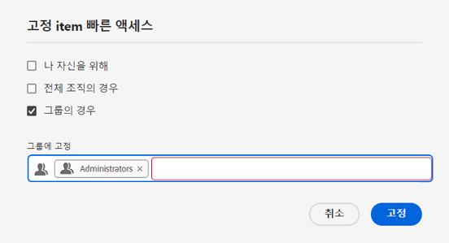
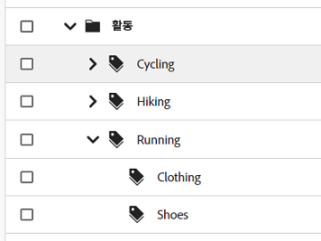
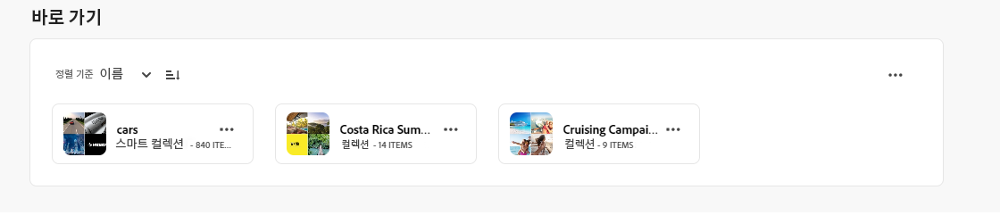
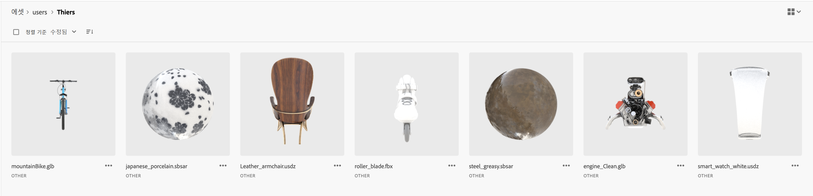
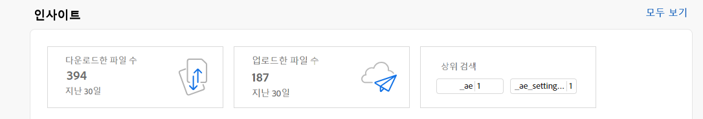
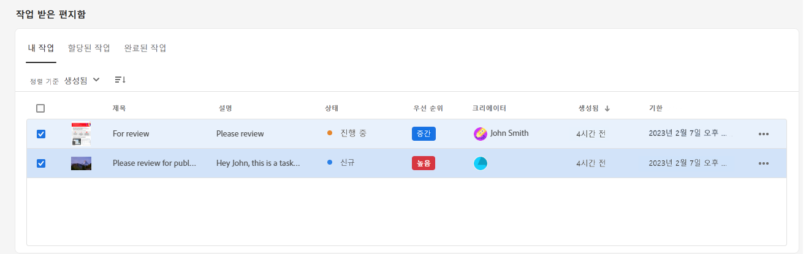
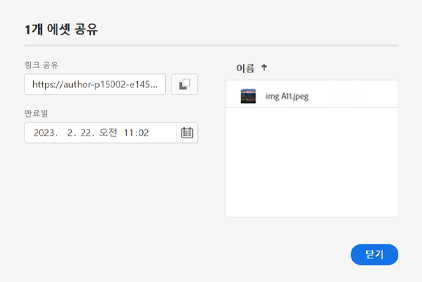

# [!DNL Assets Essentials]의 릴리스 정보 {#release-notes}

Assets Essentials의 최신 릴리스는 2023년 9월 21일에 출시되었습니다.

최근에 추가된 기능 목록은 다음과 같습니다.

**폴더에 메타데이터 양식 할당**

이제 Assets Essentials 배포 내의 특정 폴더에 메타데이터 양식을 할당할 수 있습니다. 하위 폴더의 에셋을 포함하여 폴더의 모든 에셋은 할당된 메타데이터 양식에 정의된 속성을 표시합니다.

**데이터 소스에서 자산 일괄 가져오기**

이제 관리자는 데이터 소스에서 AEM Assets로 수많은 자산을 가져올 수 있습니다. 관리자는 더 이상 개별 자산 또는 폴더를 AEM Assets에 업로드할 필요가 없습니다. 일괄 가져오기에 지원되는 데이터 소스에는 Azure, AWS, Google Cloud 및 Dropbox가 포함됩니다.

**Adobe Express에서 제공하는 이미지 편집 도구**

AEM Assets 내에서 바로 사용할 수 있는 Adobe Express 기반의 쉽고 직관적인 이미지 편집 도구를 사용하면 콘텐츠 재사용률과 콘텐츠 속도를 높일 수 있습니다.

**내 작업 영역 바로 가기 항목을 고정하면서 유연성 유지**

선택 사항을 기반으로 내 작업 영역의 바로 가기 섹션에 표시되도록 사용자, 조직 전체 또는 그룹 목록에 맞는 항목을 선택하고 고정할 수 있는 기능.

**고객 피드백을 기반으로 한 개선 사항**

고객 피드백에 따라 개선 사항이 적용되었으며 버그가 수정되었습니다.

## 알려진 문제 {#known-issues}

[!DNL Assets Essentials] 서비스의 알려진 문제 목록은 지속적으로 수정 및 업데이트됩니다.

<!--

* Assets Essentials does not support creating Private collections.

-->

* 비공개 컬렉션은 생성자 및 관리자 권한이 있는 사용자가 사용할 수 있습니다. 관리자는 다른 사용자에게 컬렉션에 액세스할 수 있는 권한을 위임할 수 없습니다.

* 관리자는 다른 사용자에게 컬렉션에 액세스할 수 있는 권한을 위임할 수 없습니다.

문제나 개선 요청이 있는 경우 팀에 [피드백을 제공](#provide-feedback)해 주십시오.

## 이전 릴리스 {#past-releases}

### 2023년 7월 릴리스 {#july2023-release}

**이미지 스마트 태그에 대해 개선된 인공 지능 프레임워크**

Experience Manager Assets는 이제 이미지 스마트 태그에 대해 향상된 인공 지능 프레임워크를 사용합니다. 이 콘텐츠 인텔리전스는 수집 시 모든 이미지 자산에 사용할 수 있는 스마트 태그의 관련성과 정확성을 향상시킵니다.

**자산 목록 보기에 대한 열 표시 구성**

이제 Assets Essentials가 상태, 형식, 차원, 크기 등과 같이 자산 목록 보기에 표시되는 열을 선택할 수 있는 기능을 제공합니다.

**관련성을 기준으로 검색 결과 정렬**

이제 Assets Essentials는 기본적으로 관련성을 기준으로 검색 결과를 정렬합니다. 검색된 자산을 `Name`, `Relevance`, `Size`, `Modified` 및 `Created`의 오름차순 또는 내림차순으로 정렬할 수 있습니다.

### 2023년 6월 릴리스 {#june2023-release}

**빠른 검색 경험을 위한 자산의 계층적 태그 지정**

제어된 어휘의 단순 목록은 시간이 지남에 따라 관리하기 까다로워집니다. 이제 Assets Essentials는 관련 메타데이터의 적용, 자산 분류, 검색 지원, 태그 재사용, 검색 기능 개선 등을 용이하게 하는 계층적 태그 지정 구조를 지원합니다.

**바로 가기를 위해 파일, 폴더 및 컬렉션 고정**

이제 나중에 필요할 때 파일, 폴더 및 컬렉션에 더 빠르게 액세스할 수 있도록 이러한 항목을 고정할 수 있습니다. 고정된 항목은 내 작업 영역의 **바로 가기** 섹션에 표시됩니다. 저장소 내에서 저장된 위치로 이동하는 대신 내 작업 영역을 사용하여 액세스할 수 있습니다.

**휴지통 폴더의 자산 필터링**

Assets Essentials에서는 이제 휴지통 폴더에서 자산을 필터링할 수 있습니다. 표준 또는 사용자 정의 필터를 적용하여 휴지통 폴더 내에서 적절한 자산을 검색해 복원하거나 영구적으로 삭제할 수 있습니다.

**3D 자산의 썸네일 미리보기**

Assets Essentials는 이제 gLB, USDz, FBX, 3DS, OBJ, SBSAR을 포함한 일반적인 3D 파일 형식에 대한 썸네일 미리보기를 생성합니다. 이러한 파일이 Assets Essentials에 업로드되면 기본적으로 썸네일이 시스템에서 자동으로 생성됩니다.

**가장 많이 검색된 용어 보기**

Assets Essentials는 이제 내 작업 영역의 **인사이트** 섹션을 사용하여 Assets Essentials 배포 내에서 가장 많이 검색된 용어 보기를 지원합니다. 세부 인사이트로 이동하여 지난 30일 또는 12개월 동안의 인기 검색어를 볼 수도 있습니다.

**메타데이터 양식 개선 사항**

Assets Essentials에서는 이제 다중 값 텍스트 및 드롭다운 목록 속성 구성 요소를 메타데이터 양식에 추가할 수 있습니다.

### 2023년의 여러 릴리스 {#multiple-releases-2023}

최근에 추가된 기능 목록은 다음과 같습니다.

**가장 많이 다운로드된 자산**

이제 내 작업 영역에 [!UICONTROL 콘텐츠] 섹션의 Assets Essentials 환경에 대해 가장 많이 다운로드된 자산 10개가 표시됩니다. 나열된 각 자산에 대한 포맷 유형 및 다운로드 수를 볼 수도 있습니다.

**자산 메타데이터에 대한 일괄 업데이트**

일괄 메타데이터 업데이트를 통해 사용자는 여러 자산에서 공통 메타데이터 업데이트를 동시에 수행할 수 있습니다. 사용자는 더 이상 레코드를 개별적으로 업데이트할 필요가 없으며 검색을 통해 액세스한 자산 또는 폴더에 속성을 빠르게 적용할 수 있습니다.

**구성 가능한 위젯이 포함된 내 작업 영역**

이제 Assets는 사용자에게 맞춤화된 작업 영역을 제공합니다. 맞춤화된 작업 영역은 Assets 사용자 인터페이스의 주요 영역과 사용자와 가장 관련성이 높은 정보에 편리하게 액세스할 수 있도록 하는 종합적인 솔루션 역할을 합니다. 이러한 옵션에 보다 빠르게 액세스하면 콘텐츠 속도와 프로젝트 효율성이 향상됩니다.

내 작업 영역에는 인사이트, 작업 및 콘텐츠에 대한 위젯이 포함되어 있습니다. 환경 설정에 따라 이러한 위젯이 작업 영역에 표시되는 방식을 구성할 수 있습니다.

**전용 작업 관리 UI**

이제 Assets Essentials를 통해 왼쪽 탐색 패널에서 사용 가능한 새로운 **[!UICONTROL 작업]** 옵션을 사용하여 현재 할당된 작업, 생성한 작업 및 이미 완료한 작업 목록을 중앙 집중식 위치에서 관리할 수 있습니다. 승인 또는 거부할 작업을 선택하거나 작업 세부 정보를 열어 승인, 거부, 편집 또는 삭제하여 적절한 작업을 수행할 수도 있습니다.

**자산 공유를 위한 자동 생성된 링크**

이제 Assets Essentials는 Assets Essentials 사용자 인터페이스를 사용하여 자산을 공유하도록 선택하는 즉시 자동으로 링크를 생성합니다. 생성된 링크는 만료일을 변경해도 유효합니다.

**고객 피드백을 기반으로 한 개선 사항**

고객 피드백에 따라 개선 사항이 적용되었으며 버그가 수정되었습니다.

### 2022.11.0 {#november-2022}

[!DNL Assets Essentials]의 11월 릴리스는 2022년 11월 17일에 출시되었습니다.

이 릴리스에는 다음과 같은 사항이 포함됩니다.

**Document Cloud 뷰어를 사용하여 문서 미리보기**

이제 Assets Essentials를 사용하여 지원되는 다른 포맷 유형의 문서를 업로드할 수 있으며 포함된 Document Cloud 뷰어를 사용하여 미리보기가 가능합니다. 지원되는 포맷 유형은 TXT, RTF, DOC, DOCX, PPT, PPTX, XLS, XLSX입니다.

<!--

**View Smart Tags moderation reports**

Asset reporting now provides administrators with visibility into the Smart Tags promoted or deleted for an asset. You can specify a folder path and the report lists the Smart Tags promoted or deleted for all assets available at the folder path.

-->

<!--
**Read-only access to large number of users**

Assets Essentials allows administrators to provide read-only access to a large number of users for selected assets or folders in the repository. 
You can easily synchronize the user groups available on the external identity management of an organization with Adobe Admin Console and then manage permissions in Admin Console and Assets Essentials to provide the users with read-only access for selected assets or folders.

-->

**새로운 메타데이터 저장 옵션**

더 나은 메타데이터 거버넌스를 위해 Assets Essentials 사용자 인터페이스에서 새로운 메타데이터 저장 옵션을 사용할 수 있습니다.

**고객 피드백을 기반으로 한 개선 사항**

고객 피드백에 따라 개선 사항이 적용되었으며 버그가 수정되었습니다.

**Adobe Asset Link 버전 3.3**

[Adobe Asset Link](https://helpx.adobe.com/kr/enterprise/using/adobe-asset-link.html) 버전 3.3은 2022년 12월 13일에 출시되었으며, 다음과 같은 기능이 포함되어 있습니다.

* 이전의 [Creative Cloud for enterprise](https://www.adobe.com/kr/creativecloud/business/enterprise.html)에 대한 지원과 더불어 이제 [Creative Cloud for teams](https://www.adobe.com/kr/creativecloud/business/teams.html)도 지원합니다.

* 최신 Adobe InDesign, Photoshop 및 Illustrator 2023 애플리케이션을 지원합니다.

* 프록시 서버가 있는 환경에서 Adobe Asset Link CEP 플러그인 사용을 지원합니다.

### 2022.8.0 {#august-2022}

[!DNL Assets Essentials]의 8월 릴리스는 2022년 8월 22일에 출시되었습니다.

이 릴리스에는 다음과 같은 사항이 포함됩니다.

**컬렉션에 대한 알림**

이제 Assets Essentials 알림을 사용하면 저장소에서 사용할 수 있는 컬렉션에서 수행된 작업을 모니터링할 수 있습니다. 알림을 받을 컬렉션을 선택하고 구독해야 합니다. 컬렉션에서 수행되는 삭제, 링크 공유, 이동, 이름 바꾸기 및 업데이트 작업과 같은 알림이 전송되는 작업을 구성할 수도 있습니다.

**스마트 컬렉션 편집**

Assets Essentials는 이제 스마트 컬렉션을 만드는 동안 사용되는 검색 기준을 편집하는 기능도 제공합니다.  컬렉션 콘텐츠를 동적으로 업데이트하려면 새 검색 기준을 저장하십시오.

**스토리지 계정에 대한 실시간 통계 보기**

이제 Assets Essentials를 사용하면 라이브 통계 대시보드를 사용하여 Assets Essentials 환경에 대한 실시간 스토리지 계정 데이터를 볼 수도 있습니다. 지난 30일 동안 또는 지난 12개월 동안의 실시간 이벤트 지표를 볼 수 있습니다.

**업로드 보고서 보기**

자산 보고는 이제 관리자가 Adobe Experience Manager Assets Essentials 배포에 업로드된 자산을 볼 수 있도록 합니다. 관리자는 이미 Assets Essentials 배포에서 다운로드된 자산에 대한 보고서를 생성할 수 있습니다. 이 데이터는 사용자가 콘텐츠 및 제품과 상호 작용하는 방법에 대한 유용한 정보를 제공합니다.

**고객 피드백을 기반으로 한 개선 사항**

고객 피드백에 따라 개선 사항이 적용되었으며 버그가 수정되었습니다.

### 2022.6.0 {#june-2022}

[!DNL Assets Essentials]의 6월 릴리스는 2022년 7월 14일에 출시되었습니다.

이 릴리스에는 다음과 같은 사항이 포함됩니다.

**스마트 컬렉션**

검색 결과를 스마트 컬렉션으로 저장하여 컬렉션 콘텐츠를 동적으로 업데이트합니다. [스마트 컬렉션을 생성](manage-collections.md#create-smart-collection)하는 동안 정의된 검색 기준에 맞는 Assets Essentials 저장소에 추가된 자산이 있는 경우 해당 스마트 컬렉션의 콘텐츠가 자동으로 업데이트됩니다.

**알림**

Assets Essentials 알림을 사용하면 [저장소에서 사용할 수 있는 자산 또는 폴더에서 수행된 작업을 모니터링](manage-notifications.md)할 수 있습니다. 알림을 받을 콘텐츠를 선택하고 구독해야 합니다. 알림을 받을 범주를 구성할 수도 있습니다.

**보고**

자산 보고를 사용하여 관리자는 Adobe Experience Manager Assets Essentials 내의 사용자 활동을 평가할 수 있습니다. 보고서 및 라이브 통계 대시보드는 사용자가 배포에서 사용할 수 있는 자산과 상호 작용하는 방법에 대한 유용한 정보를 제공합니다. [보고서의 정보를 사용](manage-reports.md)하여 기업 내 또는 고객에 의한 Assets의 채택률을 측정하기 위한 주요 성공 지표를 도출할 수 있습니다.

자산 다운로드 보고서 및 라이브 통계 대시보드 모듈을 보고 다운로드 중인 자산 및 다운로드 빈도를 확인할 수 있습니다.

### 2022.5.0 {#may-2022}

[!DNL Assets Essentials]의 5월 릴리스는 2022년 6월 16일에 출시되었습니다.

이 릴리스에는 다음과 같은 사항이 포함됩니다.

**자산 상태 개선 사항**

* 이제 Assets Essentials를 사용하여 [자산의 만료 날짜를 설정](manage-organize.md#set-asset-status)할 수 있습니다. 또한 `Expired` 자산 상태 및 만료 날짜 범위를 기반으로 [자산을 필터링](search.md#refine-search-results)할 수 있습니다.

* 이제 Trash에서 사용 가능한 모든 자산에 대한 자산 상태 표시기를 볼 수 있습니다. 결과적으로 자산 상태에 따라 자산의 복원 여부를 결정할 수 있습니다.

**검색 필터 개선 사항**

* Assets Essentials에서는 이제 `No Status` 자산 상태를 사용하여 [자산을 필터링](search.md#refine-search-results)할 수 있습니다.

<!--

* Assets Essentials now supports [using a wildcard operator (*) while using custom filters](search.md#custom-filters) to enable Assets Essentials to display assets in the results that partially match the search criteria.

-->

**컬렉션 개선 사항**

<!--

* Assets Essentials now enables you to [create Private collections](manage-collections.md#create-collection).

-->

* Assets Essentials는 이제 [컬렉션 다운로드](manage-collections.md)를 지원합니다.

* 이제 컬렉션에 대한 설명 메타데이터 필드를 편집할 수 있습니다.

**설명서 개선 사항**

* 이제 [Assets Essentials 개요 설명서](introduction.md)의 새 버전을 사용할 수 있습니다.

**고객 피드백을 기반으로 한 개선 사항**

* 고객 피드백에 따라 개선 사항이 적용되었으며 버그가 수정되었습니다.

### 2022.4.0 {#april-2022}

[!DNL Assets Essentials]의 최신 릴리스는 2022년 5월 12일에 출시되었습니다. 이 릴리스에는 다음과 같은 사항이 포함됩니다.

* [!DNL Assets Essentials]는 이제 [컬렉션 생성](manage-collections.md)을 지원합니다. 컬렉션은 Experience Manager Assets Essentials 내의 자산 세트입니다. 컬렉션을 사용하여 사용자 간에 자산을 공유합니다. 폴더와 달리 컬렉션에는 서로 다른 위치의 자산이 포함될 수 있습니다.

* 이제 Assets Essentials를 사용하여 사용자 인터페이스에 [맞춤형 필터를 추가](search.md#custom-filters)할 수도 있습니다. 그런 다음 표준 필터 외에 이러한 맞춤형 필터를 적용하여 검색 결과를 구체화할 수 있습니다.

* 이제 Assets Essentials를 사용하여 저장소에서 사용 가능한 자산의 [상태를 설정](manage-organize.md#set-asset-status)할 수 있습니다. 자산 상태를 설정하여 디지털 자산의 다운스트림 소비를 보다 효과적으로 관리합니다.

* 고객 피드백에 따라 개선 사항이 적용되었으며 버그가 수정되었습니다.

#### Chrome의 시크릿 모드 {#incognito-mode}

이 릴리스에서는 브라우저의 로컬 저장소 및 사용 가능한 서드파티 쿠키에 따라 Assets Essentials의 UI 게재 성능 및 특정 기능(자산 댓글 달기 및 이미지 편집)을 최적화하고 있습니다. Chrome 웹 브라우저의 시크릿 모드는 기본적으로 서드파티 쿠키를 차단합니다. 사용자는 모든 기능에 계속 액세스할 수 있는 여러 가지 옵션을 사용할 수 있습니다.

* 사용자가 브라우저 세션을 분리해야 하는 경우 시크릿 모드 대신 Chrome 프로필 사용

* Chrome의 시크릿 모드 화면에서 `Block third-party cookies` 끄기

### 2022.2.0 {#march-2022}

[!DNL Assets Essentials]는 다음 업데이트와 함께 2022년 3월 9일에 출시됩니다.

* 이제 [!DNL Assets Essentials]에서는 [링크를 생성하고 [!DNL Assets Essentials] 애플리케이션에 대한 액세스 권한이 없는 외부 관련자와 자산을 공유](share-links-for-assets.md)할 수 있습니다. 해당 링크에 대한 만료일을 정의한 다음 이메일 또는 메시징 서비스와 같이 선호하는 커뮤니케이션 수단을 사용하여 다른 사용자와 공유할 수 있습니다. 링크 수신자는 자산을 미리 보고 다운로드할 수 있습니다.

* 이제 [!DNL Assets Essentials]는 기존 기본 및 소비자 사용자 제품 프로필과 더불어 Admin Console의 [관리자 제품 프로필](deploy-administer.md#add-users-to-essentials)로 구성됩니다. 이제 관리자는 관리자 제품 프로필에 다른 사용자를 할당할 수 있습니다.

* 이제 Assets Essentials에서 관리자는 [저장소에서 사용할 수 있는 폴더에 대한 액세스 수준을 관리](manage-permissions.md)할 수 있습니다. 관리자는 사용자 그룹을 만든 다음 해당 그룹에 액세스 수준을 관리하도록 권한을 할당할 수 있습니다. 또한 폴더 수준에서 사용자 그룹에 권한 관리 권한을 위임할 수도 있습니다.

* 고객 피드백에 따라 개선 사항이 적용되었으며 버그가 수정되었습니다.

또한 패널 시작 시간 및 다운로드 속도에 대한 성능이 개선된 Creative Cloud용 [!DNL Adobe Asset Link] 확장 기능(Photoshop, Illustrator 및 InDesign)의 [신규 버전 3.2](https://exchange.adobe.com/creativecloud.details.106875.adobe-asset-link-cep.html)가 릴리스되었습니다.

### 2022.1.0 릴리스 {#january-2022}

[!DNL Assets Essentials]는 다음 업데이트와 함께 2022년 2월 3일에 릴리스됩니다.

* [!UICONTROL 폴더 생성] 작업의 성능이 향상되었습니다. <!-- CQ-4338818 -->

### 2021.11.0 릴리스 {#november-2021}

[!DNL Assets Essentials]는 다음 업데이트와 함께 2021년 12월 16일에 출시됩니다.

* Adobe는 프로비저닝 프로세스를 완료한 후 Assets Essentials를 자동으로 배포합니다. 관리자는 [!DNL Cloud Manager] 사용자 인터페이스를 사용하여 Assets Essentials를 배포하기 위해 추가 단계를 수행할 필요가 없습니다. 이 자동 배포는 2022년 1월 6일 이후에 프로비저닝된 환경에서 사용할 수 있습니다.
* Assets Essentials와 함께 작동하는 Creative Cloud 플러그인의 새 버전은 Adobe Exchange(Adobe XD용 [Adobe Asset Link v 2.1.0](https://exchange.adobe.com/creativecloud/plugindetails.html/app/cc/61d229b9) 및 [Adobe Asset Link for Photoshop/InDesign/Illustrator v 3.1.65](https://exchange.adobe.com/creativecloud.details.106875.adobe-asset-link-cep.html))에서 사용할 수 있습니다.
* 이전에 알려진 문제를 포함한 다양한 버그 수정 및 제품 개선 사항(업로드<!-- CQ-4337638 --> 후 폴더가 이제 왼쪽 탐색 트리에 올바르게 표시되며, 드래그 앤 드롭 업로드를 통해 사용자가 업로드<!-- CQ-4327753 -->를 위해 드롭할 때 현재 폴더 또는 하위 폴더를 선택할 수 있음)

### 2021.8.0 릴리스 {#august2021}

[!DNL Assets Essentials] 2021.8.0은 다음 업데이트와 함께 2021년 8월 30일에 출시됩니다.

* [!DNL Adobe Workfront]와의 통합을 통해 [!DNL Workfront] 사용자가 작업 관리의 맥락에서 디지털 자산을 관리할 수 있습니다.

### 2021.7.0 릴리스 {#july2021}

[!DNL Assets Essentials] 2021.7.0은 다음 업데이트와 함께 2021년 7월 29일에 출시됩니다.

* [!DNL Settings] 아래 [!UICONTROL 메타데이터 양식] 옵션의 자산 세부 정보 화면에서 사용자에게 메타데이터 속성을 표시하는 데 사용할 사용자 정의 메타데이터 양식을 만들고 관리할 수 있습니다. [메타데이터 양식](metadata.md#metadata-forms)을 참조하십시오.
* 여러 하위 폴더가 있는 중첩 폴더를 업로드할 때의 성능 향상되는 등 다양한 버그 수정 및 제품 개선 사항이 있습니다.

### 2021.6.0 릴리스 {#june2021}

2021년 6월 21일에 릴리스된 [!DNL Assets Essentials]의 첫 번째 릴리스는 가벼운 자산 관리 기능을 제공합니다. 다음과 같은 주요 기능과 CRUD(만들기, 읽기, 업데이트 및 삭제) 작업을 지원합니다.

* 중첩된 폴더를 포함하여 자산을 업로드하고 추가합니다. 자산 및 버전을 미리 봅니다.
* 전체 텍스트 검색, 정밀한 검색 필터 및 저장된 검색을 통해 빠른 자산 검색을 수행할 수 있습니다.
* 메타데이터 업데이트, 삭제, 다운로드 및 관리와 같은 기본 자산 관리 작업을 지원합니다.
* [!DNL Assets Essentials]는 [!DNL Adobe Journey Optimizer] 사용자가 메시지를 작성할 때 자산을 관리하는 데 사용할 수 있습니다.
