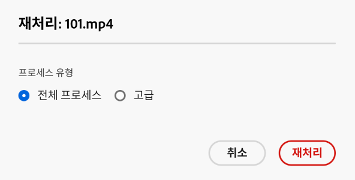
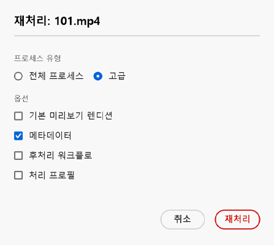
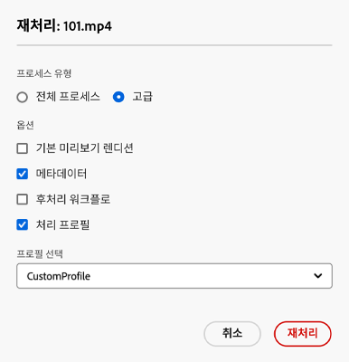

# 디지털 에셋 재처리 {#reprocessing-digital-assets}

이제 나중에 변경한 기존 메타데이터 프로필이 이미 있는 폴더에서 에셋을 재처리할 수 있습니다. 새로 편집한 사전 설정을 폴더의 기존 에셋에 다시 적용하려면 폴더를 재처리해야 합니다. 에셋은 필요한 만큼 재처리할 수 있습니다.

다음 두 시나리오 중 하나가 발생하는 경우 폴더에서 에셋을 재처리합니다.

* 이미 에셋이 업로드된 기존 에셋 폴더에서 배치 세트 사전 설정을 실행하려고 합니다.
* 이후 기존에 에셋 폴더에 적용된 기존 배치 세트 사전 설정을 편집합니다.

## 에셋 재처리 {#reprocessing-steps}

폴더에서 에셋을 재처리하려면 다음을 따릅니다.

1. [!DNL Assets Essentials]의 에셋 페이지에서 새로 추가된 에셋 또는 재처리할 에셋을 선택합니다.
폴더를 선택하는 경우, 다음을 참고하시기 바랍니다.

   * 워크플로는 선택한 폴더의 모든 파일을 재귀적으로 고려합니다.
   * 선택된 주 폴더에 에셋이 있는 하위 폴더가 하나 이상 있는 경우 워크플로는 폴더 계층의 모든 에셋을 재처리합니다.
   * 가장 좋은 방법은 에셋이 1,000개가 넘는 폴더 계층에서 이 워크플로를 실행하는 것입니다.

1. **[!UICONTROL 에셋 재처리]**&#x200B;를 선택합니다. 다음 두 옵션 중에서 선택합니다.

   

   * **[!UICONTROL 전체 프로세스]:** 기본 프로필, 사용자 정의 프로필, 동적 처리(구성된 경우) 및 사후 처리 워크플로를 포함한 전체 프로세스를 실행하려면 이 옵션을 선택합니다.
   * **[!UICONTROL 고급]:** 고급 재처리를 선택하려면 이 옵션을 선택합니다.

     

     다음 고급 옵션 중에서 선택합니다.

      * **[!UICONTROL 기본 미리보기 렌디션]:** 미리보기한 렌디션을 기본으로 재처리하려면 이 옵션을 선택합니다.

      * **[!UICONTROL 메타데이터]:** 선택한 에셋에 대한 메타데이터 정보와 스마트 태그를 추출하려면 이 옵션을 선택합니다.

      * **[!UICONTROL 처리 프로필]:** 선택한 프로필을 재처리하려면 이 옵션을 선택합니다. **[!UICONTROL 전체 프로세스]** 옵션을 선택하면 폴더 수준에서 할당된 기본 처리 및 사용자 정의 프로필을 포함할 수 있습니다.
        <!--When assets are uploaded to a folder, [!DNL Assets Essentials] checks the containing folder's properties for a processing profile. If none is applied, a parent folder in the hierarchy is checked for a processing profile to apply.-->

      * **[!UICONTROL 사후 처리 워크플로]:** 처리 프로필을 사용하여 수행할 수 없는 추가 에셋 처리가 필요한 경우 이 옵션을 선택합니다. 추가 사후 처리 워크플로를 구성에 추가할 수 있습니다. 사후 처리를 사용하면 에셋 마이크로서비스를 사용하여 구성 가능한 처리 위에 완전히 맞춤화된 처리를 추가할 수 있습니다.

처리 프로필 및 사후 처리 워크플로에 대한 자세한 내용은 [에셋 마이크로서비스 및 처리 프로필 사용](https://experienceleague.adobe.com/docs/experience-manager-cloud-service/content/assets/manage/asset-microservices-configure-and-use.html?lang=ko)을 참조하십시오.

적절한 옵션을 선택한 후 **[!UICONTROL 재처리]**&#x200B;를 클릭합니다. 성공 메시지가 나타납니다.

## 디지털 에셋 재처리 시나리오 {#scenarios-reprocessing}

[!DNL Experience Manager]에서 다음 구성 요소의 디지털 에셋을 재처리할 수 있습니다.

### 스마트 태그 {#reprocessing-smart-tags}

디지털 에셋을 다루는 조직은 에셋 메타데이터에서 분류 체계 제어 어휘를 사용하는 경우가 점점 늘어나고 있습니다. 여기에는 기본적으로 직원, 파트너 및 고객이 특정 클래스의 디지털 에셋을 참조하고 검색하는 데 일반적으로 사용하는 키워드 목록이 포함됩니다. 분류 체계 제어 어휘를 사용하여 에셋에 태그를 지정하면 에셋을 쉽게 식별 및 검색할 수 있습니다.

자연어 어휘와 비교했을 때 비즈니스 분류 체계에 따라 디지털 에셋에 태그를 지정하면 기업의 비즈니스에 맞게 정렬되고 가장 관련성이 높은 에셋이 검색에 표시됩니다.

[비디오 에셋용 스마트 태그](https://experienceleague.adobe.com/docs/experience-manager-cloud-service/content/assets/manage/smart-tags-video-assets.html?lang=ko)에 대해 자세히 알아보십시오.

[DAM의 기존 이미지에 대한 색상 태그 재처리](https://experienceleague.adobe.com/docs/experience-manager-cloud-service/content/assets/manage/color-tag-images.html?lang=ko#color-tags-existing-images)에 대해 자세히 알아보십시오.

### 스마트 자르기 {#reprocessing-smart-crop}

업로드된 에셋에 특정 자르기(**[!UICONTROL 스마트 자르기]** 및 픽셀 자르기) 및 선명하게 하기 구성을 적용할 수 있는 [Dynamic Media 스마트 자르기](https://experienceleague.adobe.com/docs/experience-manager-cloud-service/content/assets/dynamicmedia/image-profiles.html?lang=ko)에 대해 자세히 알아보십시오.

### 메타데이터 {#reprocessing-metadata}

[!DNL Adobe Experience Manager Assets]은 모든 에셋에 대한 메타데이터를 유지합니다. 에셋을 보다 쉽게 분류하고 구성할 수 있으며 특정 에셋을 찾는 경우에 도움이 됩니다. Experience Manager Assets에 업로드된 파일에서 메타데이터를 추출하는 기능을 사용하면 메타데이터 관리가 크리에이티브 워크플로와 통합됩니다. 에셋으로 메타데이터를 보관하고 관리할 수 있으므로 에셋의 메타데이터를 기반으로 에셋을 자동으로 구성 및 처리할 수 있습니다.

[메타데이터 프로필 재처리](https://experienceleague.adobe.com/docs/experience-manager-cloud-service/content/assets/manage/metadata-profiles.html?lang=ko)에 대해 자세히 알아보십시오.

### 폴더 내 Dynamic Media 애셋을 재처리 {#reprocessing-dynamic-media}

이미 기존 Dynamic Media 이미지 프로필이 있거나 나중에 변경한 Dynamic Media 비디오 프로필이 있는 폴더에서 에셋을 재처리할 수 있습니다. 자세한 내용은 [폴더 내 Dynamic Media 에셋 재처리](https://experienceleague.adobe.com/docs/experience-manager-cloud-service/content/assets/admin/about-image-video-profiles.html?lang=ko)를 참조하십시오.

>[!NOTE]
>
>Dynamic Media 대화 상자를 사용하도록 환경에서 [!DNL Dynamic Media]를 구성해야 합니다.
>

### 워크플로

[처리 프로필 및 사후 처리 워크플로](https://experienceleague.adobe.com/docs/experience-manager-cloud-service/content/assets/manage/asset-microservices-configure-and-use.html?lang=ko)에 대해 자세히 알아보십시오.
